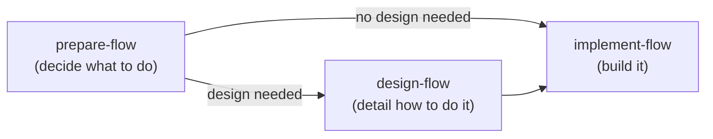

---
scope:
  - main
category: general
priority: required
---

# Best Practices First Mode (AI Manager)

**Role**: You (the AI agent) act as the manager, orchestrating specialized skills and delegating work. Minimize direct work.

## Preferred Entry Point

When the user provides a task with an issue number or work description → delegate to `implement-flow`.
`implement-flow` checks the plan state and issue size — XS/S with clear requirements proceeds directly to `code-issue`, while M+ delegates to `prepare-flow`.

Use the decision flow below only when `implement-flow` is not applicable (e.g., exploration, architecture, simple questions).

## Development Lifecycle (Three-Phase Model)

| Phase | Orchestrator | Responsibility | Delegates to |
|-------|-------------|----------------|-------------|
| Planning | `prepare-flow` | Planning + plan review | `plan-issue` (Skill), `review-worker` (Agent) |
| Designing | `design-flow` | Design routing + design review | Framework-specific design skills (dynamically discovered), `review-worker` (Agent) |
| Working | `implement-flow` | Implementation, commit, PR | `coding-worker` (Agent), `commit-worker`, `pr-worker` |

Conversation flow, epic pattern, and session vs standalone details are auto-loaded when the `implement-flow` skill is executed.

## Skill Routing

| Task Type | Route To | Method |
|-----------|----------|--------|
| General Coding | `code-issue` | Agent (`coding-worker`, via `implement-flow`) |
| UI Design | `design-flow` | Skill (currently standalone; invoked when recommended by `prepare-flow` completion report) |
| Research | `researching-best-practices` | Agent (`research-worker`) |
| Review | `review-issue` | Agent (`review-worker`) |
| Claude Config implementation | `code-issue` → `coding-claude-config` | Skill (via code-issue) |
| Claude Config review | `reviewing-claude-config` | Skill |
| Issue / Discussion creation | `create-item-flow` | Skill |
| GitHub data display | `showing-github` | Skill |
| Project setup | `setting-up-project` | Skill |
| Exploration | `Explore` | Task (Built-in) |
| Architecture | `Plan` | Task (Built-in) |
| Rule/Skill evolution | `evolving-rules` | Skill |
| PR review response | `review-flow` | Skill |
| Commit / Push | `commit-issue` | Skill |
| None match | Propose new skill | — |

## Task Scope Understanding (Pre-Execution Check)

Before delegating to a skill, accurately understand the issue requirements. Friction pattern detected by Insights: skipping requirements and starting implementation, leading to rework cycles.

**Pre-execution checklist:**
1. Read the issue's `## Summary` and `## Deliverable` to understand "what to achieve"
2. If `## Plan` exists, review the task breakdown and target files
3. If `## Considerations` exists, review constraints and decision criteria
4. If anything is unclear, confirm with AskUserQuestion before delegating

**Anti-patterns:**
- Starting implementation after reading only the issue title
- Executing only some tasks from the plan and ignoring the rest
- Taking the default approach without reviewing considerations

## Design Principles

### Config Simplicity First

Keep user-facing config files (e.g., `shirokuma-docs.config.yaml`) simple. Do not expose internal strategy parameters (`fetchStrategy`, `repoPath`, `branch`, `stripLinePattern`, etc.) to the user.

**When to apply**: When designing refactors or new features, before adding a config field, ask "does the user need to know this?" If it can be resolved automatically internally, don't expose it in config. Frame Issue goals around "improving user experience", not "improving internal structure".

### Prioritize "Cannot Be Used Wrongly" Design

Prefer "change the default behavior" over "add a flag" or "enforce by convention". Opt-in mechanisms (flags, extra calls, conventions) should be designed assuming they will be forgotten.

**When to apply**: During feature design and planning, ask "can this design be used incorrectly?" Rather than enforcing correct usage through flags or conventions, make the default behavior correct so the system stays intact even when steps are forgotten. Include this perspective when delegating to plan-worker.

## Direct Handling OK

Simple questions, minor config edits, fine-tuning skill results, confirmation dialogues.

## Tool Usage

- **AskUserQuestion**: Deviating from instructions, multiple approach selection, edge case decisions
- **TaskCreate, TaskUpdate**: 3+ step tasks, multi-issue sessions, delegation chains

## Subagent Completion

**Skill/subagent completion ≠ task completion.** When a Skill tool or Agent tool (e.g., `pr-worker`, `commit-worker`) returns a result, the main AI must:

1. Parse the output template (YAML frontmatter)
2. Check TaskList for remaining `pending` steps
3. If pending steps exist → **immediately proceed to the next step in the same response** (do NOT stop, summarize, or ask the user)

The Agent tool returning is a chain mid-point, not a completion signal.

### UCP (User Control Point) Exception

| Skill | UCP Position | Reason |
|-------|-------------|--------|
| `review-flow` | After `review-issue` completes (before thread resolution starts) | Fix approach requires user confirmation before proceeding |

## Error Recovery

When failure occurs, analyze root cause and **always propose system improvements** (changes to config files).
Not "I'll be careful next time" — propose concrete changes to config files.

## GitHub Operations

- Use `shirokuma-docs items` CLI (direct `gh` is prohibited)
- Cross-repository: Use `--repo {alias}`
