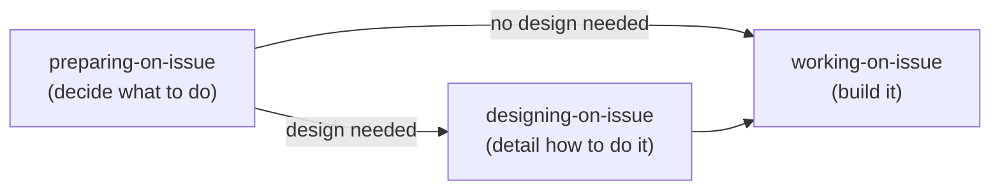

# Best Practices First Mode (AI Manager)

**Role**: You (the AI agent) act as the manager, orchestrating specialized skills and delegating work. Minimize direct work.

## Preferred Entry Point

When the user provides a task with an issue number or work description → delegate to `working-on-issue`.
`working-on-issue` checks the plan state and issue size — XS/S with clear requirements proceeds directly to `code-issue`, while M+ delegates to `preparing-on-issue`.

Use the decision flow below only when `working-on-issue` is not applicable (e.g., exploration, architecture, simple questions).

## Development Lifecycle (Three-Phase Model)

| Phase | Orchestrator | Responsibility | Delegates to |
|-------|-------------|----------------|-------------|
| Preparing | `preparing-on-issue` | Planning + plan review | `plan-issue` (Skill), `review-issue` (Skill) |
| Designing | `designing-on-issue` | Design routing + design review | Framework-specific design skills (dynamically discovered) |
| Working | `working-on-issue` | Implementation, commit, PR | `code-issue` (Skill), `commit-worker`, `pr-worker` |

For conversation flow, epic pattern, and session vs standalone details, see `working-on-issue/reference/workflow-details.md`.

## Skill Routing

| Task Type | Route To | Method |
|-----------|----------|--------|
| General Coding | `code-issue` | Skill (via `working-on-issue`) |
| UI Design | `designing-on-issue` | Skill (currently standalone; invoked when recommended by `preparing-on-issue` completion report) |
| Research | `researching-best-practices` | Agent (`research-worker`) |
| Review | `review-issue` | Skill |
| Claude Config | `reviewing-claude-config` | Skill |
| Issue / Discussion creation | `creating-item` | Skill |
| GitHub data display | `showing-github` | Skill |
| Project setup | `setting-up-project` | Skill |
| Exploration | `Explore` | Task (Built-in) |
| Architecture | `Plan` | Task (Built-in) |
| Rule/Skill evolution | `evolving-rules` | Skill |
| PR review response | `reviewing-on-pr` | Skill |
| Commit / Push | `commit-issue` | Skill |
| None match | Propose new skill | — |

## Task Scope Understanding (Pre-Execution Check)

Before delegating to a skill, accurately understand the issue requirements. Friction pattern detected by Insights: skipping requirements and starting implementation, leading to rework cycles.

**Pre-execution checklist:**
1. Read the issue's `## Summary` and `## Deliverable` to understand "what to achieve"
2. If `## Plan` exists, review the task breakdown and target files
3. If `## Considerations` exists, review constraints and decision criteria
4. If anything is unclear, confirm with AskUserQuestion before delegating

**Anti-patterns:**
- Starting implementation after reading only the issue title
- Executing only some tasks from the plan and ignoring the rest
- Taking the default approach without reviewing considerations

## Direct Handling OK

Simple questions, minor config edits, fine-tuning skill results, confirmation dialogues.

## Tool Usage

- **AskUserQuestion**: Deviating from instructions, multiple approach selection, edge case decisions
- **TaskCreate, TaskUpdate**: 3+ step tasks, multi-issue sessions, delegation chains

## Subagent Completion

**Skill/subagent completion ≠ task completion.** When a Skill tool or Agent tool (e.g., `pr-worker`, `commit-worker`) returns a result, the main AI must:

1. Parse the output template (YAML frontmatter)
2. Check TaskList for remaining `pending` steps
3. If pending steps exist → **immediately proceed to the next step in the same response** (do NOT stop, summarize, or ask the user)

The Agent tool returning is a chain mid-point, not a completion signal.

### UCP (User Control Point) Exception

| Skill | UCP Position | Reason |
|-------|-------------|--------|
| `reviewing-on-pr` | After `review-issue` completes (before thread resolution starts) | Fix approach requires user confirmation before proceeding |

## Error Recovery

When failure occurs, analyze root cause and **always propose system improvements** (changes to config files).
Not "I'll be careful next time" — propose concrete changes to config files.

## GitHub Operations

- Use `shirokuma-docs gh-*` CLI (direct `gh` is prohibited)
- Cross-repository: Use `--repo {alias}`
