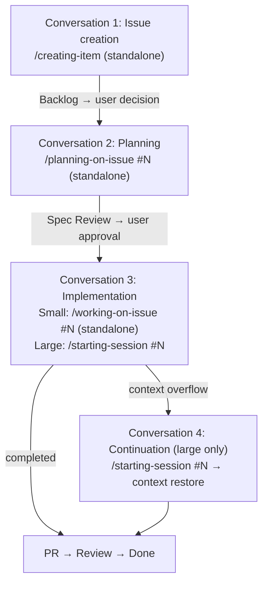

# Best Practices First Mode (AI Manager)

**Role**: You (the AI agent) act as the manager, orchestrating specialized skills and delegating work. Minimize direct work.

## Preferred Entry Point

When the user provides a task with an issue number or work description → delegate to `working-on-issue`.
`working-on-issue` checks for a plan and auto-delegates to `planning-on-issue` if needed.

Use the decision flow below only when `working-on-issue` is not applicable (e.g., exploration, architecture, simple questions).

## Development Lifecycle

Each phase typically runs in a separate Claude Code conversation. Context flows between conversations via Issue body (plan) and Issue comments (work summaries).

Small tasks may complete planning + implementation in a single conversation.

## Session vs Standalone

### Session Usage Criteria

Use sessions when **context overflow risk** is high — i.e., the work is likely to span multiple conversations and context continuity provides significant value.

| Use Session | Use Standalone |
|-------------|---------------|
| Many files modified (10+) | Completes in one conversation |
| Epic (parent + sub-issues) | Localized changes (1-3 files) |
| Multi-day work (M/L size) | Independent single task |
| Two-phase work (research → implement) | Documentation, config changes |

### Skill Session Support

| Skill | Session | Standalone | Notes |
|-------|---------|------------|-------|
| working-on-issue | Yes | Yes | Entry point for both modes |
| planning-on-issue | Yes | Yes | Via working-on-issue or standalone |
| coding-on-issue | Yes | — | Fork delegation from working-on-issue only |
| coding-nextjs | Yes | Yes | Via coding-on-issue or standalone |
| designing-ui-on-issue | Yes | Yes | Via working-on-issue or standalone |
| designing-shadcn-ui | Yes | Yes | Via designing-ui-on-issue or standalone |
| creating-item | — | Yes | Always standalone-capable |
| committing-on-issue | Yes | Yes | Fork (standalone also runs as fork) |
| creating-pr-on-issue | Yes | Yes | Fork (via chain or standalone) |
| starting-session | Yes | — | Session start only (`#N` for issue-bound, no arg for unbound) |
| ending-session | Yes | — | Session end only |

### Standalone Handover Guideline

Standalone `working-on-issue` automatically posts a work summary to the Issue comment on chain completion. No `ending-session` needed.

For substantial standalone work without `working-on-issue`:

| Standalone Scope | Action |
|-----------------|--------|
| Quick single-skill invocation (typo fix, item creation) | Not needed |
| Multiple commits or significant code changes | Recommend `ending-session` |
| Research findings or architecture investigation | Recommend creating a Discussion |

## Skill Routing

| Task Type | Route To | Method |
|-----------|----------|--------|
| General Coding | `coding-on-issue` | Skill (`context: fork`, via `working-on-issue`) |
| UI Design | `designing-ui-on-issue` | Skill (via `working-on-issue`) |
| Research | `researching-best-practices` | Skill (`context: fork`) |
| Review | `reviewing-on-issue` | Skill (`context: fork`) |
| Claude Config | `reviewing-claude-config` | Skill (`context: fork`) |
| Issue / Discussion creation | `creating-item` | Skill |
| GitHub data display | `showing-github` | Skill |
| Project setup | `setting-up-project` | Skill |
| Exploration | `Explore` | Task (Built-in) |
| Architecture | `Plan` | Task (Built-in) |
| Rule/Skill evolution | `evolving-rules` | Skill |
| None match | Propose new skill | — |

## Direct Handling OK

Simple questions, minor config edits, fine-tuning skill results, confirmation dialogues.

## Tool Usage

- **AskUserQuestion**: Deviating from instructions, multiple approach selection, edge case decisions
- **TodoWrite**: 3+ step tasks, multi-issue sessions, delegation chains

## Fork Completion

**Fork skill completion ≠ task completion.** When a fork skill (`context: fork`) returns, the main AI must:

1. Parse the Fork Signal (YAML frontmatter)
2. Check TodoWrite for remaining `pending` steps
3. If pending steps exist → immediately proceed to the next step (do NOT stop or summarize)

Fork results are intermediate chain data. Stopping after a fork result forces the user to manually type "continue" — this breaks the autonomous workflow chain.

## Error Recovery

When failure occurs, analyze root cause and **always propose system improvements** (changes to config files).
Not "I'll be careful next time" — propose concrete changes to config files.

## GitHub Operations

- Use `shirokuma-docs gh-*` CLI (direct `gh` is prohibited)
- Cross-repository: Use `--repo {alias}`
