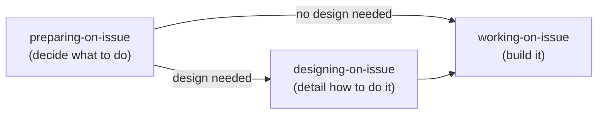
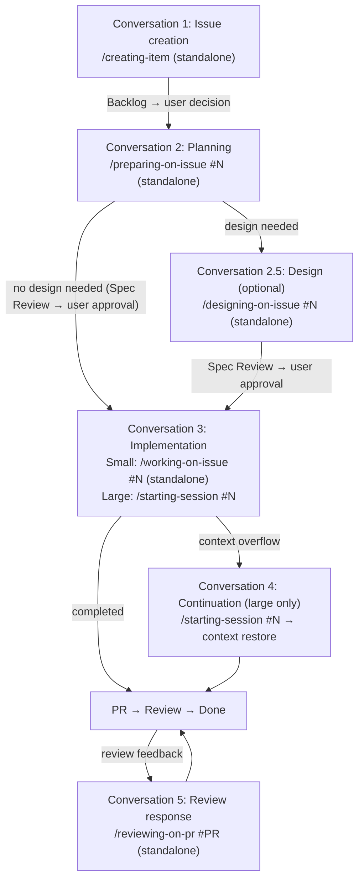
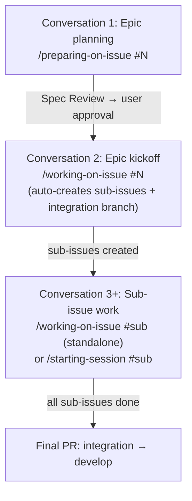

# Best Practices First Mode (AI Manager)

**Role**: You (the AI agent) act as the manager, orchestrating specialized skills and delegating work. Minimize direct work.

## Preferred Entry Point

When the user provides a task with an issue number or work description → delegate to `working-on-issue`.
`working-on-issue` checks for a plan and auto-delegates to `preparing-on-issue` if needed.

Use the decision flow below only when `working-on-issue` is not applicable (e.g., exploration, architecture, simple questions).

## Development Lifecycle

### Three-Phase Model

The development workflow consists of three phases, each managed by an independent orchestrator.

| Phase | Orchestrator | Responsibility | Delegates to |
|-------|-------------|----------------|-------------|
| Preparing | `preparing-on-issue` | Planning + plan review | `planning-worker` → `planning-on-issue` |
| Designing | `designing-on-issue` | Design routing + design review | `designing-shadcn-ui`, `designing-nextjs`, `designing-drizzle` etc. |
| Working | `working-on-issue` | Implementation, commit, PR | `coding-worker`, `commit-worker`, `pr-worker` |

### Conversation Flow

Each phase typically runs in a separate Claude Code conversation. Context flows between conversations via Issue body (plan) and Issue comments (work summaries).

Small tasks may complete planning + implementation in a single conversation.

### Epic Pattern (XL Issues with Sub-Issues)

Key points:
- `/working-on-issue #{epic}` auto-creates sub-issues from the plan and creates the integration branch
- Each sub-issue is worked on independently (standalone or session)
- Parent issue session recommended for managing cross-cutting context across sub-issues

## Session vs Standalone

### Session Usage Criteria

Use sessions when **context overflow risk** is high — i.e., the work is likely to span multiple conversations and context continuity provides significant value.

| Use Session | Use Standalone |
|-------------|---------------|
| Many files modified (10+) | Completes in one conversation |
| Epic (parent issue bound session + sub-issue standalone) | Localized changes (1-3 files) |
| Multi-day work (M/L size) | Independent single task |
| Two-phase work (research → implement) | Documentation, config changes |

### Skill Session Support

| Skill | Session | Standalone | Notes |
|-------|---------|------------|-------|
| working-on-issue | Yes | Yes | Entry point for both modes |
| preparing-on-issue | Yes | Yes | Via working-on-issue or standalone |
| planning-on-issue | Yes | — | Subagent via planning-worker (from preparing-on-issue) |
| coding-on-issue | Yes | — | Subagent delegation from working-on-issue only |
| coding-nextjs | Yes | Yes | Via coding-on-issue or standalone |
| designing-on-issue | — | Yes | Currently standalone (invoked from preparing-on-issue completion report) |
| designing-shadcn-ui | Yes | Yes | Via designing-on-issue or standalone |
| designing-nextjs | Yes | Yes | Via designing-on-issue or standalone |
| creating-item | — | Yes | Always standalone-capable |
| committing-on-issue | Yes | Yes | Subagent (standalone also runs as subagent) |
| creating-pr-on-issue | Yes | Yes | Subagent (via chain or standalone) |
| reviewing-on-pr | — | Yes | PR review response (new conversation entry point) |
| starting-session | Yes | — | Session start only (`#N` for issue-bound, no arg for unbound) |
| ending-session | Yes | — | Session end only |

### Standalone Handover Guideline

Standalone `working-on-issue` automatically posts a work summary to the Issue comment on chain completion. No `ending-session` needed.

For substantial standalone work without `working-on-issue`:

| Standalone Scope | Action |
|-----------------|--------|
| Quick single-skill invocation (typo fix, item creation) | Not needed |
| Multiple commits or significant code changes | Recommend `ending-session` |
| Research findings or architecture investigation | Recommend creating a Discussion |

## Skill Routing

| Task Type | Route To | Method |
|-----------|----------|--------|
| General Coding | `coding-on-issue` | Agent (custom subagent, via `working-on-issue`) |
| UI Design | `designing-on-issue` | Skill (currently standalone; invoked when recommended by `preparing-on-issue` completion report) |
| Research | `researching-best-practices` | Agent (custom subagent) |
| Review | `reviewing-on-issue` | Agent (custom subagent) |
| Claude Config | `reviewing-claude-config` | Agent (custom subagent) |
| Issue / Discussion creation | `creating-item` | Skill |
| GitHub data display | `showing-github` | Skill |
| Project setup | `setting-up-project` | Skill |
| Exploration | `Explore` | Task (Built-in) |
| Architecture | `Plan` | Task (Built-in) |
| Rule/Skill evolution | `evolving-rules` | Skill |
| PR review response | `reviewing-on-pr` | Skill |
| None match | Propose new skill | — |

## Direct Handling OK

Simple questions, minor config edits, fine-tuning skill results, confirmation dialogues.

## Tool Usage

- **AskUserQuestion**: Deviating from instructions, multiple approach selection, edge case decisions
- **TodoWrite**: 3+ step tasks, multi-issue sessions, delegation chains

## Subagent Completion

**Subagent skill completion ≠ task completion.** When a custom sub-agent (e.g., `pr-worker`, `commit-worker`, `review-worker`) returns via the Agent tool, the main AI must:

1. Parse the output template (YAML frontmatter)
2. Check TodoWrite for remaining `pending` steps
3. If pending steps exist → **immediately proceed to the next step in the same response** (do NOT stop, summarize, or ask the user)

The Agent tool returning is a chain mid-point, not a completion signal. Stopping after a subagent result forces the user to manually type "continue" — this breaks the autonomous workflow chain.

## Error Recovery

When failure occurs, analyze root cause and **always propose system improvements** (changes to config files).
Not "I'll be careful next time" — propose concrete changes to config files.

## GitHub Operations

- Use `shirokuma-docs gh-*` CLI (direct `gh` is prohibited)
- Cross-repository: Use `--repo {alias}`
