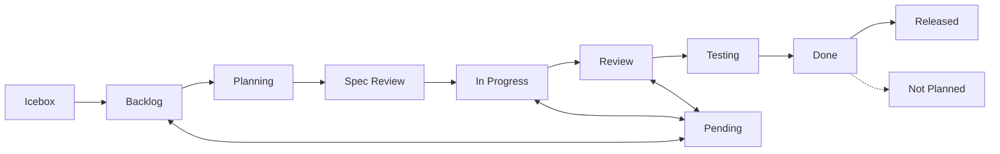

# Project Items Rule

## Required Fields

Every project item MUST have:

| Field | Required | Options |
|-------|----------|---------|
| Status | Yes | See workflow below |
| Priority | Yes | Critical / High / Medium / Low |
| Size | Recommended | XS / S / M / L / XL |
| Type | Yes | Organization Issue Types (manual setup) |

## Status Workflow



| Status | Description |
|--------|-------------|
| Icebox | Low priority, shelved. May be promoted to Backlog later |
| Backlog | Planned work. Requirements may still need refinement |
| Planning | Plan is being created by `planning-on-issue` (pre-work status) |
| Spec Review | Gate for requirements review before work begins |
| In Progress | Currently working on |
| Pending | Blocked (document reason) |
| Review | Code review |
| Testing | QA testing |
| Done | Completed |
| Not Planned | Explicitly not planned (set by `issues cancel`) |
| Released | Deployed to production |

### Idea → Issue Flow

Ideas and proposals start as **Discussions** (Research or Knowledge category), not Issues.

| Stage | Location | When to Move |
|-------|----------|--------------|
| Idea / exploration | Discussion | When the idea is first raised |
| Decided to do | Issue (Backlog) | When the team agrees to implement |
| Requirements firm | Issue (Spec Review) | When requirements need formal review |

- Backlog tolerates varying levels of requirement detail
- Do NOT create Issues for ideas that have not been decided on
- Spec Review is the approval gate before implementation starts

## Size Estimation

| Size | Time | Example |
|------|------|---------|
| XS | ~1h | Typo fix, config change |
| S | ~4h | Small feature, bug fix |
| M | ~1d | Medium feature |
| L | ~3d | Large feature |
| XL | 3d+ | Epic (should be split) |

## Body Template

```markdown
## Purpose
{who} can {what}. {why}.

## Summary
{What this item does}

## Background
{Current problems, relevant constraints and dependencies}

## Tasks
- [ ] Task 1
- [ ] Task 2

## Deliverable
{What "done" looks like}
```

> For type-specific templates (bug reproduction steps, research investigation items, etc.), see the `create-item` reference.

## Status Update Triggers

AI MUST update issue status at these points:

| Trigger | Action | Owner | Command |
|---------|--------|-------|---------|
| Planning started | → Planning + assign | `planning-on-issue` | `issues update {n} --field-status "Planning"` + `gh issue edit {n} --add-assignee @me` |
| Plan created | → Spec Review | `planning-on-issue` | `issues update {n} --field-status "Spec Review"` |
| User approves plan, starts work | → In Progress + branch | `working-on-issue` | `issues update {n} --field-status "In Progress"` |
| Self-review complete | → Review | `creating-pr-on-issue` | `issues update {n} --field-status "Review"` (Status MUST remain In Progress **during** self-review. Transition to Review only after self-review completes) |
| PR merged | → Done | `committing-on-issue` (via `issues merge`) | Automatic |
| Blocked by dependency | → Pending | Manual | `issues update {n} --field-status "Pending"` + comment |
| Complete (no PR needed) | → Done | `ending-session` | `session end --done {n}` |
| Cancelled | → Not Planned | `issues cancel` | `issues cancel {n}` |
| Session end | → Review or Done | `ending-session` (safety net) | `session end --review/--done {n}` |

### Planning Usage

The `planning-on-issue` skill transitions from Backlog → Planning when starting plan creation.

- **Purpose**: Visibility that planning is in progress; records planning start timestamp
- **Entry**: `planning-on-issue` sets this status after fetching the issue
- **Exit**: Plan complete → Spec Review (set by `planning-on-issue`)
- **Pre-work status**: Not included in `WORK_STARTED_STATUSES` (same treatment as Spec Review)

### Spec Review Usage

The `planning-on-issue` skill writes a plan to the issue body and transitions Planning → Spec Review.

- **Purpose**: User approval gate before implementation
- **Entry**: `planning-on-issue` appends `## Plan` section and sets this status
- **Exit**: User approves → `working-on-issue` starts implementation → In Progress
- **Applies to**: All issues (plan depth scales with content: lightweight/standard/detailed)

### Rules

1. **One In Progress at a time** - Move previous item out before starting new one (exception: batch mode allows multiple simultaneous In Progress per `batch-workflow` rule)
2. **Branch per issue** - Create a feature branch when starting work (see `branch-workflow` rule; exception: batch mode shares one branch per `batch-workflow` rule)
3. **Event-driven**: Status changes happen immediately when events occur (`creating-pr-on-issue` sets Review after self-review completion, `issues merge` sets Done)
4. **Session end safety net** - `ending-session` catches any missed status updates
5. **Pending requires reason** - Add a comment explaining the blocker
6. **Idempotency** - If status is already correct, skip the update (no error)

## Built-in Automations

GitHub Projects V2 provides built-in automation workflows that complement the CLI-based status updates.

### Recommended Automations

| Workflow | Trigger | Action | Status |
|----------|---------|--------|--------|
| Item closed | Issue is closed | Set Status → Done | **Enable** |
| Pull request merged | PR merged | Set Status → Done | **Enable** |

### How to Enable

Built-in automations are configured via the GitHub UI (not API):

1. Navigate to your GitHub Project's **Settings > Workflows**
2. Enable "Item closed" → set target status to **Done**
3. Enable "Pull request merged" → set target status to **Done**

### CLI Compatibility

| CLI Feature | Behavior with Automations |
|-------------|--------------------------|
| `session end --review` | Sets Review. When PR merges, automation moves to Done |
| `session end --review` (PR already merged) | Auto-promotes to Done via `findMergedPrForIssue()` — idempotent with automation |
| `session end --done` | Sets Done directly — idempotent with automation |
| `session check` | Reports disabled recommended automations as warnings |
| `session check --fix` | Fixes inconsistencies — compatible with automation |
| `issues cancel` | Sets Not Planned after close. May race with "Item closed → Done" automation — CLI update usually wins. Use `session check --fix` to detect/correct. |

### Checking Automation Status

```bash
shirokuma-docs projects workflows
```

Reports all workflows with their enabled/disabled status and recommendations.

## Labels

Labels indicate **where** work applies (cross-cutting attribute). Work type classification uses Issue Types (Type field).

| Label type | Role | Example |
|------------|------|---------|
| Area labels | Scope of impact | `area:cli`, `area:plugin` |
| Operational labels | Triage | `duplicate`, `invalid`, `wontfix` |

### Label Rules

1. **Area labels are optional** - Use when the affected area is not obvious from the title
2. **Multiple area labels allowed** - Cross-cutting issues may have multiple areas
3. **Operational labels for triage** - `duplicate`, `invalid`, `wontfix` are set when closing or redirecting

### Label Categories

| Prefix | Purpose | Examples |
|--------|---------|---------|
| `area:` | Codebase area affected | `area:cli`, `area:plugin`, `area:github` |
| (none) | Operational / triage | `duplicate`, `invalid`, `wontfix` |

## Item Body Maintenance (Issues / Discussions / PRs)

**The body is the source of truth.** Comments serve as historical record; body must always be the latest consolidated version. For detailed procedures, see `managing-github-items/reference/item-maintenance.md`.

> **Comment-first rule**: Always post a comment before updating the body. Comments must have independent value as primary records of work.

## Creating Items

When creating new items:

1. Set all required fields immediately
2. Use the body template
3. XL items should be split into smaller items
4. Link related items in body if applicable

### Initial Status Guidelines

`issues create` automatically sets Status to **Backlog** by default. Override with `--field-status` when needed:

| Scenario | Status |
|----------|--------|
| Default (planned work) | Backlog |
| Starting immediately | In Progress |
| Low priority / future idea | Icebox |
| Needs requirements review | Spec Review |
