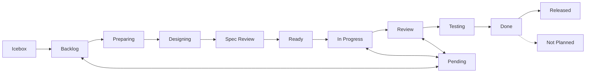

# Project Items Rule

## Required Fields

Every project item MUST have:

| Field | Required | Options |
|-------|----------|---------|
| Status | Yes | See workflow below |
| Priority | Yes | Critical / High / Medium / Low |
| Size | Recommended | XS / S / M / L / XL |
| Type | Yes | Organization Issue Types (manual setup) |

## Status Workflow


```mermaid
graph LR
  Icebox --> Backlog --> Preparing --> Designing --> SpecReview[Spec Review]
  SpecReview --> Ready --> InProgress[In Progress] --> Review --> Testing --> Done --> Released
  InProgress <--> Pending
  Review <--> Pending
  Backlog <--> Pending
  Done -.-> NotPlanned[Not Planned]
```

| Status | Description |
|--------|-------------|
| Icebox | Low priority, shelved. May be promoted to Backlog later |
| Backlog | Planned work. Requirements may still need refinement |
| Preparing | Plan is being created by `preparing-on-issue` (pre-work status) |
| Designing | Design is being created by `designing-on-issue` (pre-work status) |
| Spec Review | Gate for requirements review before work begins |
| Ready | Ready to start. Plan approved, awaiting implementation |
| In Progress | Currently working on |
| Pending | Blocked (document reason) |
| Review | Code review |
| Testing | QA testing |
| Done | Completed |
| Not Planned | Explicitly not planned (set by `issues cancel`) |
| Released | Deployed to production |

### Idea → Issue Flow

Ideas and proposals start as **Discussions** (Research or Knowledge category), not Issues.

| Stage | Location | When to Move |
|-------|----------|--------------|
| Idea / exploration | Discussion | When the idea is first raised |
| Decided to do | Issue (Backlog) | When the team agrees to implement |
| Requirements firm | Issue (Spec Review) | When requirements need formal review |

## Size Estimation

| Size | Time | Example |
|------|------|---------|
| XS | ~1h | Typo fix, config change |
| S | ~4h | Small feature, bug fix |
| M | ~1d | Medium feature |
| L | ~3d | Large feature |
| XL | 3d+ | Epic (should be split) |

## Body Template

```markdown
## Purpose
{who} can {what}. {why}.

## Summary
{What this item does}

## Background
{Current problems, relevant constraints and dependencies}

## Considerations
- {Perspectives and constraints for the planning phase}

## Deliverable
{What "done" looks like}
```

> For type-specific templates (bug reproduction steps, research investigation items, etc.), see the `create-item` reference.

## Status Update Triggers

AI MUST update issue status at these points:

| Trigger | Action | Owner | Command |
|---------|--------|-------|---------|
| Preparing started | → Preparing + assign | `preparing-on-issue` | `issues update {n} --field-status "Preparing" --add-assignee @me` |
| Plan created | → Spec Review | `preparing-on-issue` | `issues update {n} --field-status "Spec Review"` |
| User approves plan, starts work | → In Progress + branch | `working-on-issue` | `issues update {n} --field-status "In Progress"` |
| PR creation complete | → Review | `open-pr-issue` | `issues update {n} --field-status "Review"` |
| PR merged | → Done | `commit-issue` (via `pr merge`) | Automatic |
| Blocked by dependency | → Pending | Manual | `issues update {n} --field-status "Pending"` + comment |
| Complete (no PR needed) | → Done | `ending-session` | `session end --done {n}` |
| Cancelled | → Not Planned | `issues cancel` | `issues cancel {n}` |
| Session end | → Review or Done | `ending-session` (safety net) | `session end --review/--done {n}` |

### Preparing Usage

- **Purpose**: Visibility that planning is in progress; records planning start timestamp
- **Entry**: `preparing-on-issue` sets this status before delegating to `planning-worker`
- **Exit**: Plan complete → Designing (if design needed) or Spec Review

### Designing Usage

- **Purpose**: Visibility that design work is in progress
- **Entry**: `preparing-on-issue` sets this status when design phase is needed
- **Exit**: Design complete → Spec Review

### Spec Review Usage

- **Purpose**: User approval gate before implementation
- **Entry**: `preparing-on-issue` sets this status after plan review passes
- **Exit**: User approves → `working-on-issue` starts implementation → In Progress

### Ready Usage

- **Purpose**: Visibility that the issue is ready to start, plan approved
- **Entry**: User approves plan in Spec Review, or manual setting
- **Exit**: `working-on-issue` starts implementation → In Progress

### Rules

1. **One In Progress at a time** - Move previous item out before starting new one (exception: batch mode, epics)
2. **Branch per issue** - Create a feature branch when starting work (exception: batch, epics)
3. **Event-driven**: Status changes happen immediately when events occur
4. **Session end safety net** - `ending-session` catches any missed status updates
5. **Pending requires reason** - Add a comment explaining the blocker
6. **Idempotency** - If status is already correct, skip the update (no error)

For epic status management, built-in automations, label details, item body maintenance, and item creation guidelines, see `managing-github-items/reference/project-items-details.md`.
