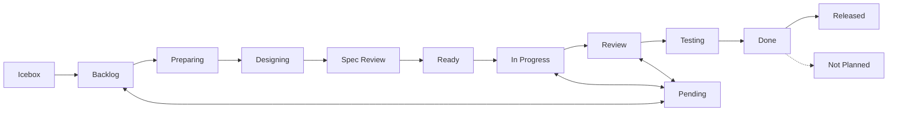

# Project Items Rule

## Required Fields

Every project item MUST have:

| Field | Required | Options |
|-------|----------|---------|
| Status | Yes | See workflow below |
| Priority | Yes | Critical / High / Medium / Low |
| Size | Recommended | XS / S / M / L / XL |
| Type | Yes | Organization Issue Types (manual setup) |

## Status Workflow


```mermaid
graph LR
  Icebox --> Backlog --> Preparing --> Designing --> SpecReview[Spec Review]
  SpecReview --> Ready --> InProgress[In Progress] --> Review --> Testing --> Done --> Released
  InProgress <--> Pending
  Review <--> Pending
  Backlog <--> Pending
  Done -.-> NotPlanned[Not Planned]
```

| Status | Description |
|--------|-------------|
| Icebox | Low priority, shelved. May be promoted to Backlog later |
| Backlog | Planned work. Requirements may still need refinement |
| Preparing | Plan is being created by `prepare-flow` (pre-work status) |
| Designing | Design is being created by `design-flow` (pre-work status) |
| Spec Review | Gate for requirements review before work begins |
| Ready | Ready to start. Plan approved, awaiting implementation |
| In Progress | Currently working on |
| Pending | Blocked (document reason) |
| Review | Code review |
| Testing | QA testing |
| Done | Completed |
| Not Planned | Explicitly not planned (set by `issues cancel`) |
| Released | Deployed to production |

### Idea → Issue Flow

Ideas and proposals start as **Discussions** (Research or Knowledge category), not Issues.

| Stage | Location | When to Move |
|-------|----------|--------------|
| Idea / exploration | Discussion | When the idea is first raised |
| Decided to do | Issue (Backlog) | When the team agrees to implement |
| Requirements firm | Issue (Spec Review) | When requirements need formal review |

## Size Estimation

| Size | Time | Example |
|------|------|---------|
| XS | ~1h | Typo fix, config change |
| S | ~4h | Small feature, bug fix |
| M | ~1d | Medium feature |
| L | ~3d | Large feature |
| XL | 3d+ | Epic (should be split) |

## Body Template

```markdown
## Purpose
{who} can {what}. {why}.

## Summary
{What this item does}

## Background
{Current problems, relevant constraints and dependencies}

## Considerations
- {Perspectives and constraints for the planning phase}

## Deliverable
{What "done" looks like}
```

> For type-specific templates (bug reproduction steps, research investigation items, etc.), see the `create-item` reference.

## Status Update Triggers

AI MUST update issue status at these points:

| Trigger | Action | Owner | Command |
|---------|--------|-------|---------|
| Preparing started | → Preparing + assign | `prepare-flow` | `items pull {n}` → edit frontmatter → `items push {n}` + `--add-assignee @me` |
| Plan created | → Spec Review | `prepare-flow` | frontmatter `status: "Spec Review"` → `items push {n}` |
| User approves plan, starts work | → In Progress + branch | `implement-flow` | frontmatter `status: "In Progress"` → `items push {n}` |
| PR creation complete | → Review | `open-pr-issue` | frontmatter `status: "Review"` → `items push {n}` |
| PR merged | → Done | `commit-issue` (via `pr merge`) | Automatic |
| Blocked by dependency | → Pending | Manual | frontmatter `status: "Pending"` → `items push {n}` + comment |
| Complete (no PR needed) | → Done | Manual | `session end --done {n}` |
| Cancelled | → Not Planned | `issues cancel` | `issues cancel {n}` |

### Preparing Usage

- **Purpose**: Visibility that planning is in progress; records planning start timestamp
- **Entry**: `prepare-flow` sets this status before delegating to `plan-issue`
- **Exit**: Plan complete → Designing (if design needed) or Spec Review

### Designing Usage

- **Purpose**: Visibility that design work is in progress
- **Entry**: `prepare-flow` sets this status when design phase is needed
- **Exit**: Design complete → Spec Review

### Spec Review Usage

- **Purpose**: User approval gate before implementation
- **Entry**: `prepare-flow` sets this status after plan review passes
- **Exit**: User approves → `implement-flow` starts implementation → In Progress

### Ready Usage

- **Purpose**: Visibility that the issue is ready to start, plan approved
- **Entry**: User approves plan in Spec Review, or manual setting
- **Exit**: `implement-flow` starts implementation → In Progress

### Rules

1. **One In Progress at a time** - Move previous item out before starting new one (exception: batch mode, epics)
2. **Branch per issue** - Create a feature branch when starting work (exception: batch, epics)
3. **Event-driven**: Status changes happen immediately when events occur
4. **Pending requires reason** - Add a comment explaining the blocker
5. **Idempotency** - If status is already correct, skip the update (no error)

## Plan Comment-Link Body Structure

Plan details are posted as a comment, and only a summary link is written to the Issue body (comment-link pattern). This prevents Issue body bloat while keeping the full plan accessible in the comment thread.

### `## Plan` Section Structure in Issue Body

```markdown
## Plan

> Details: {comment URL}

### Approach
{1-2 line description of the approach}
```

### Application Rules

| Plan Level | Body | Comment |
|-----------|------|---------|
| Lightweight | Summary link only | Plan details (approach) |
| Standard | Summary link only | Plan details (approach, target files, task breakdown) |
| Detailed / Epic | Summary link only | Plan details (approach, target files, task breakdown, risks, etc.) |

> `review-issue` accesses the detailed plan from the link in the body retrieved via `shirokuma-docs show {number}`.

### Getting the Comment URL

Use the `comment_url` field returned by `shirokuma-docs items add comment`.

```bash
PLAN_RESULT=$(shirokuma-docs items add comment {number} --file /tmp/plan.md)
PLAN_COMMENT_URL=$(echo "$PLAN_RESULT" | jq -r '.comment_url')
```

## Plan-Implementation Deviation: Issue Body Update

The Issue body is the reviewer's primary source of truth. When implementation deviates from the plan, update the Issue body to reflect reality.

### When Update Is Needed

| Criteria | Update needed | No update needed |
|----------|--------------|-----------------|
| File structure | Added/removed files not in the plan | Modified only planned files |
| Approach | Adopted a different implementation approach | Implemented as planned |
| Scope | Added/removed/split tasks | Completed planned tasks as-is |

### What to Update

1. **Task checklist**: Update `- [ ]` to `- [x]` in `## Plan` / `### Task Breakdown` for completed items
2. **Plan change annotation**: Add strikethrough and change reason at modified sections

```markdown
### Approach

~~Summarize and consolidate into flat files~~
→ Copy into subdirectories (changed during implementation: to avoid knowledge loss risk)
```

### Timing

Not automated as part of the chain. AI judges and executes at these points:

- When a direction change is confirmed during implementation
- During self-review after PR creation
- When a reviewer points out the discrepancy

Follow the comment-first principle: record the deviation reason as a comment before updating the body. The comment must be a primary record containing rationale, alternatives considered, and "why" — not just "what changed".

### Command

```bash
shirokuma-docs items push {number}
```

Epic status management, built-in automations, label details, item body maintenance, and item creation guidelines are auto-loaded when the `managing-github-items` skill is executed.

## Comment Retrieval Convention When Reviewing Issues/PRs/Discussions

### `show` vs Direct Subcommand Usage

| Command | Returns | Use case |
|---------|---------|----------|
| `shirokuma-docs show {number}` | Body + all comments | Content review, pre-implementation research |
| `shirokuma-docs issues show {number}` | Body only | Checking field values (Status/Priority, etc.) |
| `shirokuma-docs pr show {number}` | Body only | PR metadata (branches, change counts, etc.) |
| `shirokuma-docs discussions show {number}` | Body only | Discussion body only |

### Workflow That Assumes Full Comment Loading

When AI reviews the content of an Issue/PR/Discussion, **use `shirokuma-docs show {number}` to retrieve all comments in one call**. This gives you:

- Issue: body + all comments (plan details, discussion history, blocker information)
- PR: body + review comments + review threads + regular comments
- Discussion: body + all comments + replies (thread structure)

### Comment Writing Convention

| Purpose | Include in comment |
|---------|-------------------|
| Plan details | Approach, task breakdown, risks (referenced from body via comment-link pattern) |
| Direction change during implementation | Reason for change, alternatives considered, "why" as primary record |
| Blocker notification | Blocker description, scope of impact, resolution conditions |
| Response to review feedback | What was changed, where, and remaining issues |

Comments must contain "why" as a primary record. Avoid comments that only describe "what was done".

### When to Update the Body

Update the body when comments reflect a state that diverges from the Issue/PR's current description. Follow the **comment-first principle**: record in a comment first, then update the body.

| Update needed | No update needed |
|--------------|-----------------|
| Adopted a different approach than planned | Completed implementation as planned |
| Scope (tasks or files) changed | Only implementation details changed |
| Definition of "done" changed | Bug fix or minor adjustment only |
