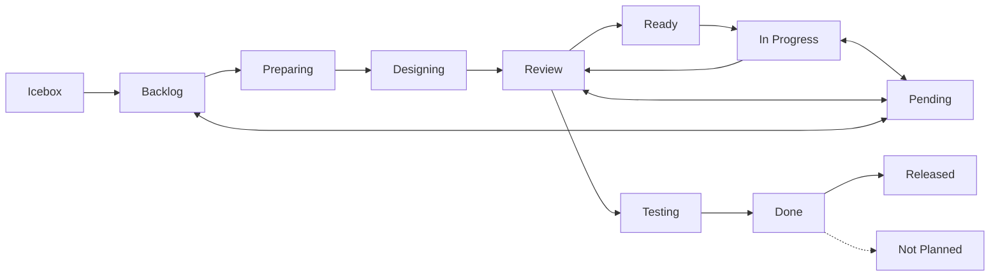

# Project Items Rule

## Required Fields

Every project item MUST have:

| Field | Required | Options |
|-------|----------|---------|
| Status | Yes | See workflow below |
| Priority | Yes | Critical / High / Medium / Low |
| Size | Recommended | XS / S / M / L / XL |
| Type | Yes | Organization Issue Types (manual setup) |

## Status Workflow


```mermaid
graph LR
  Icebox --> Backlog --> Preparing --> Designing --> Review
  Review --> Ready --> InProgress[In Progress] --> Review --> Testing --> Done --> Released
  InProgress <--> Pending
  Review <--> Pending
  Backlog <--> Pending
  Done -.-> NotPlanned[Not Planned]
```

| Status | Description |
|--------|-------------|
| Icebox | Low priority, shelved. May be promoted to Backlog later |
| Backlog | Planned work. Requirements may still need refinement |
| Preparing | Plan is being created by `prepare-flow` (pre-work status) |
| Designing | Design is being created by `design-flow` (pre-work status) |
| Ready | Ready to start. Plan approved, awaiting implementation |
| In Progress | Currently working on |
| Pending | Blocked (document reason) |
| Completed | Implementation done on issue side, PR created. Reverts to In Progress if PR is closed |
| Review | AI work complete, human review possible (plan approval gate or code review pending) |
| Testing | QA testing |
| Done | Completed |
| Not Planned | Explicitly not planned (set by `items cancel`) |
| Released | Deployed to production |

### PR Status Workflow

PRs use the same Status field as Issues, operating on a subset of the Issue workflow. Detailed review state is managed by GitHub's native PR `review_decision` (APPROVED / CHANGES_REQUESTED / REVIEW_REQUIRED).

| Status | Description | Transition Trigger |
|--------|-------------|-------------------|
| Review | Immediately after PR creation | Auto-set by `items pr create` when adding PR to Projects |
| Done | After merge | Auto-set by `items pr merge` |

**Unused statuses**: Backlog, Preparing, Designing, Ready, Icebox, In Progress, Testing, Released, Pending, and Not Planned do not apply to PRs.

> `items integrity` detects PR status inconsistencies (OPEN PR with Done status, MERGED/CLOSED PR with active status, issue-only statuses on PRs).

### Two-Layer Status Model (Epics / Sub-Issues)

Epic Issue status is **auto-derived** from sub-issue states. Manual updates are generally unnecessary.

| Sub-Issue State | Effect on Parent Issue |
|----------------|----------------------|
| All sub-issues Done | Parent auto-transitions to Done |
| All sub-issues Completed or Done/Released | Parent auto-transitions to Review |
| Some In Progress / Review / Completed | Parent stays In Progress |
| Some Done + rest Backlog / Preparing | Parent stays In Progress (treated as in-progress) |
| All sub-issues Not Planned | Parent auto-reverts to Backlog |

**Reactive auto-derivation**: The CLI detects sub-issue status changes during `items push`, `items close` (including `items cancel`), `items update-status`, and `items pr merge`, then auto-derives and updates the parent status. Explicit `items integrity --fix` is not required (still available for batch consistency checks).

### Plan Reset Flow

To reset an epic's plan from scratch (when sub-issues already exist):

1. Set all sub-issues to Not Planned via `items cancel {sub-numbers}` (CLI auto-transitions parent to Backlog)
2. Re-plan with `prepare-flow`

### Idea → Issue Flow

Ideas and proposals start as **Discussions** (Research or Knowledge category), not Issues.

| Stage | Location | When to Move |
|-------|----------|--------------|
| Idea / exploration | Discussion | When the idea is first raised |
| Decided to do | Issue (Backlog) | When the team agrees to implement |
| Requirements firm | Issue (Review) | When requirements need formal review |

## Size Estimation

| Size | Time | Example |
|------|------|---------|
| XS | ~1h | Typo fix, config change |
| S | ~4h | Small feature, bug fix |
| M | ~1d | Medium feature |
| L | ~3d | Large feature |
| XL | 3d+ | Epic (should be split) |

## Body Template

```markdown
## Purpose
{who} can {what}. {why}.

## Summary
{What this item does}

## Background
{Current problems, relevant constraints and dependencies}

## Considerations
- {Perspectives and constraints for the planning phase}

## Deliverable
{What "done" looks like}
```

> For type-specific templates (bug reproduction steps, research investigation items, etc.), see the `create-item` reference.

## Status Update Triggers

AI MUST update issue status at these points:

| Trigger | Action | Owner | Command |
|---------|--------|-------|---------|
| Preparing started | → Preparing + assign | `prepare-flow` | `items pull {n}` → edit frontmatter `status` + `assignees` → `items push {n}` |
| Plan created | → Review | `prepare-flow` | frontmatter `status: "Review"` → `items push {n}` |
| User approves plan, starts work | → In Progress + branch | `implement-flow` | frontmatter `status: "In Progress"` → `items push {n}` |
| implement-flow chain complete | → Review | `implement-flow` | frontmatter `status: "Review"` → `items push {n}` (after PR creation, simplify, security-review, work summary) |
| PR merged | → Done | `commit-issue` (via `pr merge`) | Automatic |
| Blocked by dependency | → Pending | Manual | frontmatter `status: "Pending"` → `items push {n}` + comment |
| Complete (no PR needed) | → Done | Manual | `items update-status --done {n}` |
| Cancelled | → Not Planned | `items cancel` | `items cancel {n}` |
| Plan approved | → Done (plan issue) | `implement-flow` | frontmatter `status: "Done"` → `items push {plan-n}` |

> **GitHub Projects built-in automation**: When the `Pull request linked to issue` workflow is enabled, linking a PR to an Issue automatically adds both to the Project. Date fields (Start DATE / Review Start DATE / End DATE) on the PR are set automatically by `items integrity`. See the "GitHub Projects Workflow Configuration" section in `github-commands.md` for setup instructions.

### Preparing Usage

- **Purpose**: Visibility that planning is in progress; records planning start timestamp
- **Entry**: `prepare-flow` sets this status before delegating to `plan-issue`
- **Exit**: Plan complete → Designing (if design needed) or Review

### Designing Usage

- **Purpose**: Visibility that design work is in progress
- **Entry**: `prepare-flow` sets this status when design phase is needed
- **Exit**: Design complete → Review

### Review Usage (AI Work Complete, Human Review Possible)

Review means "AI work is complete and human review is possible". Used in two contexts:

**1. Plan Approval Gate (plan issues / regular issues)**
- **Entry**: `prepare-flow` sets this status after plan review passes
- **Exit**: User approves → `implement-flow` starts implementation → In Progress

**2. Code Review Pending (after implementation)**
- **Entry**: Set by `implement-flow` after entire chain completes (implementation, tests, PR creation, simplify, security-review, work summary)
- **Exit**: Review complete → Testing or Done

> **Important**: Review is NOT set at PR creation time. AI work steps (`/simplify`, security review) remain after PR creation, so the transition happens only after all steps complete.

### Ready Usage

- **Purpose**: Visibility that the issue is ready to start, plan approved
- **Entry**: User approves plan in Review, or manual setting
- **Exit**: `implement-flow` starts implementation → In Progress

### Rules

1. **One In Progress at a time** - Move previous item out before starting new one (exception: batch mode, epics)
2. **Branch per issue** - Create a feature branch when starting work (exception: batch, epics)
3. **Event-driven**: Status changes happen immediately when events occur
4. **Pending requires reason** - Add a comment explaining the blocker
5. **Idempotency** - If status is already correct, skip the update (no error)

### CLI and GitHub Projects Workflows Responsibility Division

GitHub Projects has built-in Workflows (e.g., `Item closed` → set Status to Done), and the CLI's `items close` also sets Status to Done. This can result in the same Status update being executed twice.

| Operation | CLI Responsibility | Workflows Responsibility | Duplicate Execution |
|-----------|-------------------|--------------------------|---------------------|
| Issue close | `items close` sets Status → Done | `Item closed` sets Status → Done | Yes (idempotent) |
| PR merge | `items pr merge` sets Status → Done | `Pull request merged` sets Status → Done | Yes (idempotent) |
| Issue reopen | `items reopen` restores Status | `Item reopened` sets Status → Backlog | Potential conflict |

**Principles:**
- CLI performs **authoritative Status updates** (including timestamp updates and parent issue derivation)
- Workflows act as a **backstop** (covering manual operations that bypass the CLI)
- Duplicate execution is harmless due to idempotency
- On reopen, CLI's Status restore and Workflows' Backlog setting may conflict; Workflows may overwrite after CLI execution. If conflicted, correct with `shirokuma-docs items update-status {number} --status {correct-status}`

## Plan Issue Approach

Plans are created as child issues of the parent issue (issues with titles starting with "Plan:" or "計画:"). This allows plans to be managed as independent issues, making phase progress visible on GitHub Projects.

### Plan Issue Structure

- **Title**: `Plan: {parent issue title}`
- **Status**: `Review`
- **Labels**: `area:plan`
- **Body**: Full plan content (approach, target files, task breakdown, risks, etc.)

### Plan Issue Status Transitions

Plan issues represent the lifecycle of the plan itself and do not participate in work progress tracking.

| Status | Description | Transition Trigger |
|--------|-------------|-------------------|
| Review | Plan created, awaiting review / code review | Set by `prepare-flow` after plan creation (plan issue) or `implement-flow` chain end (PR) |
| Done | Plan approved | Set when `implement-flow` starts implementation, or on manual approval |

**`items integrity` aggregation exclusion**: When auto-deriving parent Issue status, plan issues with the `area:plan` label are excluded from sub-issue status aggregation. This prevents a plan issue remaining in Review from affecting the parent's In Progress derivation.

> `classifyParentStatusInconsistencies` excludes plan issues with the `area:plan` label from sub-issue status aggregation. `syncParentStatus` (reactive derivation) applies the same exclusion.

### Referencing a Plan Issue

Identify the child issue with a title starting with "Plan:" from `subIssuesSummary`, then fetch its body via `items pull {plan-issue-number}`.

```bash
shirokuma-docs items pull {parent-number}
# → Identify child issue with title starting with "Plan:" from subIssuesSummary
shirokuma-docs items pull {plan-issue-number}
# → Read .shirokuma/github/{org}/{repo}/issues/{plan-issue-number}/body.md
```

> **Backward compatibility**: When no plan issue exists but the Issue body contains a `## Plan` section (legacy approach), use it as a fallback.

## Plan-Implementation Deviation: Issue Body Update

The Issue body is the reviewer's primary source of truth. When implementation deviates from the plan, update the Issue body to reflect reality.

### When Update Is Needed

| Criteria | Update needed | No update needed |
|----------|--------------|-----------------|
| File structure | Added/removed files not in the plan | Modified only planned files |
| Approach | Adopted a different implementation approach | Implemented as planned |
| Scope | Added/removed/split tasks | Completed planned tasks as-is |

### What to Update

1. **Task checklist**: Update `- [ ]` to `- [x]` in `## Plan` / `### Task Breakdown` for completed items
2. **Plan change annotation**: Add strikethrough and change reason at modified sections

```markdown
### Approach

~~Summarize and consolidate into flat files~~
→ Copy into subdirectories (changed during implementation: to avoid knowledge loss risk)
```

### Timing

Not automated as part of the chain. AI judges and executes at these points:

- When a direction change is confirmed during implementation
- During self-review after PR creation
- When a reviewer points out the discrepancy

Follow the comment-first principle: record the deviation reason as a comment before updating the body. The comment must be a primary record containing rationale, alternatives considered, and "why" — not just "what changed".

### Command

```bash
shirokuma-docs items push {number}
```

Epic status management, built-in automations, label details, item body maintenance, and item creation guidelines are auto-loaded when the `managing-github-items` skill is executed.

## Comment Retrieval Convention When Reviewing Issues/PRs/Discussions

### `items pull` vs Direct Subcommand Usage

| Command | Returns | Use case |
|---------|---------|----------|
| `shirokuma-docs items pull {number}` | Body + all comments (cached) | Content review, pre-implementation research |
| `shirokuma-docs items pull {number}` | Body only | Checking field values (Status/Priority, etc.) |
| `shirokuma-docs items pr show {number}` | Body only | PR metadata (branches, change counts, etc.) |
| `shirokuma-docs items discussions show {number}` | Body only | Discussion body only |

### Workflow That Assumes Full Comment Loading

When AI reviews the content of an Issue/PR/Discussion, **use `shirokuma-docs items pull {number}` to cache comments, then read `.shirokuma/github/{org}/{repo}/issues/{number}/body.md` with the Read tool**. This gives you:

- Issue: body + all comments (plan details, discussion history, blocker information)
- PR: body + review comments + review threads + regular comments
- Discussion: body + all comments + replies (thread structure)

### Comment Writing Convention

| Purpose | Include in comment |
|---------|-------------------|
| Plan decision rationale | Reasoning for selected approach, alternatives considered, constraints discovered (posted as comment on plan issue) |
| Direction change during implementation | Reason for change, alternatives considered, "why" as primary record |
| Blocker notification | Blocker description, scope of impact, resolution conditions |
| Response to review feedback | What was changed, where, and remaining issues |

Comments must contain "why" as a primary record. Avoid comments that only describe "what was done".

### When to Update the Body

Update the body when comments reflect a state that diverges from the Issue/PR's current description. Follow the **comment-first principle**: record in a comment first, then update the body.

| Update needed | No update needed |
|--------------|-----------------|
| Adopted a different approach than planned | Completed implementation as planned |
| Scope (tasks or files) changed | Only implementation details changed |
| Definition of "done" changed | Bug fix or minor adjustment only |
