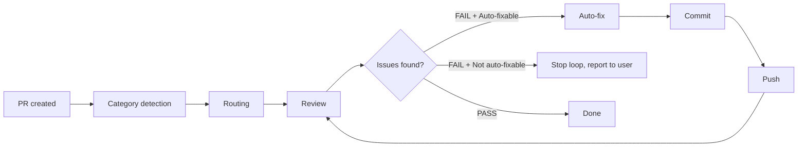

# Creating Pull Request

Create a GitHub pull request from the current feature branch.

## Workflow

### Step 1: Verify Branch State

PRs target `develop` for daily work (see `branch-workflow` rule):

```bash
git branch --show-current
git status --short
git log --oneline develop..HEAD
```

**Pre-checks:**
- Must be on a feature branch (not `develop` or `main`)
- All changes should be committed
- Branch should have commits ahead of `develop`

If on `develop` or `main`, inform user to create a feature branch first.

### Step 2: Push Branch

Ensure the branch is pushed and up to date:

```bash
git push -u origin {branch-name}
```

### Step 3: Analyze Changes

Review all commits on the branch to draft PR content:

```bash
git log --oneline develop..HEAD
git diff --stat develop..HEAD
```

Understand the full scope of changes, not just the latest commit.

### Step 4: Create PR

```bash
gh pr create --base develop --title "{title}" --body "$(cat <<'EOF'
## Summary
- {bullet point 1}
- {bullet point 2}

## Related Issues
{Closes #N or Refs #N}

## Test plan
- [ ] {test item 1}
- [ ] {test item 2}
EOF
)"
```

**Title rules:**
- Under 70 characters
- Conventional commit prefixes (`feat:`, `fix:`, `chore:`, `docs:`, etc.) are always in English
- **Text after the prefix must be in English**
- No issue number in title (goes in body)

**Title examples:**

```
feat: add branch workflow rules
fix: resolve cross-repo Projects lookup
docs: update CLAUDE.md command table
chore: update dependencies
```

**Bad examples (non-English text in EN plugin):**

```
feat: ブランチワークフロールールを追加    ← Wrong: not English
docs: CLAUDE.md のコマンド一覧を更新      ← Wrong: not English
```

**Body rules:**
- Summary: 1-3 bullet points of what changed
- Related Issues: `Closes #N` for completed items, `Refs #N` for related
- Test plan: checklist of verification steps

### Step 5: Completion Report

```markdown
## Pull Request Created

**PR:** {url}
**Branch:** {branch} → develop
**Commits:** {count}

### Summary
{brief description}

### Linked Issues
- #{number} - {title}
```

### Step 6: Self-Review Chain

After PR creation, **always auto-execute** self-review.

#### 6a. File Category Detection

Get changed files via `git diff --name-only develop..HEAD` and classify:

| Category | Condition |
|----------|-----------|
| config | Files under `.claude/skills/`, `.claude/rules/`, `.claude/agents/`, `.claude/output-styles/`, `.claude/commands/`, `plugin/` |
| code | `.ts`, `.tsx`, `.js`, `.jsx` files |
| docs | `.md` files (excluding config paths above) |

**Routing:**

| File Composition | Review Method |
|-----------------|---------------|
| config only | Invoke `reviewing-claude-config` only |
| code/docs only (no config) | Invoke `reviewing-on-issue` only (as before) |
| mixed (config + code/docs) | Invoke `reviewing-on-issue` → `reviewing-claude-config` sequentially → merge results |

**Result merging rules (mixed case):**
- Status: either FAIL → FAIL
- Critical/Warning: sum of both
- Files with issues: merge
- Auto-fixable: either no → no

#### 6b. Self-Review Loop



**Loop limit**: Maximum 3 iterations (initial review + up to 2 fix-and-review cycles)

**Steps:**

1. Detect category and invoke appropriate skill(s) (pass PR number as context)
2. Check the Self-Review Result:
   - **PASS**: End loop, report completion
   - **FAIL + Auto-fixable: yes**: Auto-fix based on findings → `git add` → `git commit` → `git push` → re-review
   - **FAIL + Auto-fixable: no**: Stop loop, report issues requiring manual intervention
3. After 3 iterations still FAIL: stop loop, report remaining issues

**Safety measures:**
- If issue count increases between iterations (fixes introduced new problems), stop loop and report
- Accumulate feedback from each iteration (via `reviewing-on-issue` feedback accumulation)

**Progress reporting:**

```text
Self-review [1/3]: Category detection → config + code (mixed)
  Running reviewing-on-issue...
  Running reviewing-claude-config...
  → Merged result: 2 critical issues detected, auto-fixing...
  → Fix complete, commit & push

Self-review [2/3]: Re-reviewing...
  → No issues. Self-review complete.
```

### Step 7: Update Status

After the self-review chain completes (PASS or loop stopped), update Status to Review if invoked with an issue number:

```bash
shirokuma-docs issues update {number} --field-status "Review"
```

If no issue number was provided, skip this step (`ending-session` safety net covers it).

## Arguments

If invoked with an issue number (e.g., `/creating-pr-on-issue 39`):
- Include `Closes #39` in the PR body
- Derive PR title from the issue context

## Language

PR titles and bodies must be in English. Conventional commit prefixes (`feat:`, `fix:`, etc.) are always in English.

## Edge Cases

| Situation | Action |
|-----------|--------|
| On develop or main | Error: must be on a feature branch |
| Uncommitted changes | Warn user, suggest committing first |
| No commits ahead of base | Error: nothing to create PR for |
| PR already exists for branch | Show existing PR URL instead |
| Push fails | Show error, suggest `git pull --rebase` |

## Next Steps (Standalone Invocation Only)

When invoked from the `working-on-issue` chain, the chain continues automatically after self-review; this section does not apply. Only suggest the next workflow step when invoked standalone:

```
PR created. Next step:
→ `/ending-session` to save handover and update issue statuses
```

## Notes

- Always push before creating PR
- Never create PRs from `develop` or `main`
- Daily work PRs target `develop`; only hotfixes target `main`
- Direct PRs to `main` are prohibited (exception: hotfixes only)
- If no branch exists or changes are uncommitted, use AskUserQuestion to suggest committing or creating a branch
- Include issue references for automatic linking
- PR body should be informative but concise
- Self-review always runs automatically after PR creation
- Do not include AI attribution lines (e.g. "🤖 Generated with Claude Code") in PR body
