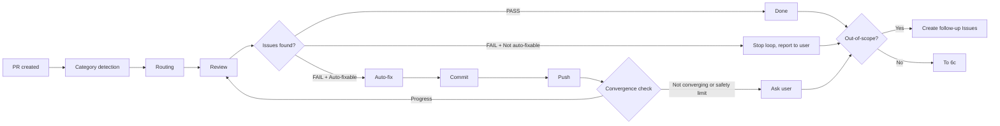

# Creating Pull Request

Create a GitHub pull request from the current feature branch.

## Workflow

### Step 1: Verify Branch State

PRs target `develop` for daily work (see `branch-workflow` rule):

```bash
git branch --show-current
git status --short
git log --oneline develop..HEAD
```

**Pre-checks:**
- Must be on a feature branch (not `develop` or `main`)
- All changes should be committed
- Branch should have commits ahead of `develop`

If on `develop` or `main`, inform user to create a feature branch first.

### Step 2: Push Branch

Ensure the branch is pushed and up to date:

```bash
git push -u origin {branch-name}
```

### Step 3: Analyze Changes

Review all commits on the branch to draft PR content:

```bash
git log --oneline develop..HEAD
git diff --stat develop..HEAD
```

Understand the full scope of changes, not just the latest commit.

### Step 4: Create PR

```bash
gh pr create --base develop --title "{title}" --body "$(cat <<'EOF'
## Summary
- {bullet point 1}
- {bullet point 2}

## Related Issues
{Closes #N or Refs #N}

## Test plan
- [ ] {test item 1}
- [ ] {test item 2}
EOF
)"
```

**Title rules:**
- Under 70 characters
- Conventional commit prefixes (`feat:`, `fix:`, `chore:`, `docs:`, etc.) are always in English
- **Text after the prefix must be in English**
- No issue number in title (goes in body)

**Title examples:**

```
feat: add branch workflow rules
fix: resolve cross-repo Projects lookup
docs: update CLAUDE.md command table
chore: update dependencies
```

**Bad examples (non-English text in EN plugin):**

```
feat: ブランチワークフロールールを追加    ← Wrong: not English
docs: CLAUDE.md のコマンド一覧を更新      ← Wrong: not English
```

**Body rules:**
- Summary: 1-3 bullet points of what changed
- Related Issues: `Closes #N` for completed items, `Refs #N` for related
- Test plan: checklist of verification steps

### Step 5: Completion Report

```markdown
## Pull Request Created

**PR:** {url}
**Branch:** {branch} → develop
**Commits:** {count}

### Summary
{brief description}

### Linked Issues
- #{number} - {title}
```

### Step 6: Self-Review Chain

After PR creation, **always auto-execute** self-review.

> **⚠️ Do NOT change Status**: During self-review (while Step 6 is executing), do NOT change the Issue Status. Status MUST remain **In Progress**. Transition to Review happens only in Step 7.

#### 6a. File Category Detection

Get changed files via `git diff --name-only develop..HEAD` and classify:

| Category | Condition |
|----------|-----------|
| config | Files under `.claude/skills/`, `.claude/rules/`, `.claude/agents/`, `.claude/output-styles/`, `.claude/commands/`, `plugin/` |
| code | `.ts`, `.tsx`, `.js`, `.jsx` files |
| docs | `.md` files (excluding config paths above) |

**Routing:**

| File Composition | Review Method |
|-----------------|---------------|
| config only | Invoke `reviewing-claude-config` only |
| code/docs only (no config) | Invoke `reviewing-on-issue` only (as before) |
| mixed (config + code/docs) | Invoke `reviewing-on-issue` → `reviewing-claude-config` sequentially → merge results |

**Result merging rules (mixed case):**
- Status: either FAIL → FAIL
- Critical: sum of both
- Fixable-warning: sum of both
- Out-of-scope: sum of both
- Files with issues: merge
- Auto-fixable: either no → no
- Out-of-scope items: merge

#### 6b. Self-Review Loop



**PASS/FAIL criteria:**
- **PASS**: critical = 0 and fixable-warning = 0 (out-of-scope only is still PASS)
- **FAIL**: critical > 0 or fixable-warning > 0

**Convergence check (numeric):** Compare the total count of `critical + fixable-warning` against the previous iteration.

| State | Logic | Action |
|-------|-------|--------|
| Total decreased from previous | Progress | Continue |
| Total same as previous | Grace period | Continue once (fix may have introduced different issues) |
| Total not decreased for 2 consecutive iterations | Not converging | Ask user |
| Total increased from previous | Worsening | Ask user immediately |
| Total = 0 | Complete | PASS |
| Safety limit (5) reached | Failsafe | Ask user |

**Safety limit rationale (5 iterations)**: Up to 2 for critical fixes + up to 2 for fixable-warning fixes + 1 buffer.

**Safety limit fallback**: Convert remaining fixable-warnings to follow-up Issues and treat as PASS after user confirmation.

**Steps:**

1. Detect category and invoke appropriate skill(s) (pass PR number as context)
2. Check the Self-Review Result and verify that the review report was posted as a PR comment. If not posted, manually post via `shirokuma-docs issues comment {PR#} --body /tmp/shirokuma-docs/{number}-review-summary.md`:
   - **PASS**: End loop, proceed to out-of-scope processing (6c)
   - **FAIL + Auto-fixable: yes**: Auto-fix (critical + fixable-warning) based on findings → `git add` → `git commit` → `git push` → convergence check → re-review
   - **FAIL + Auto-fixable: no**: Stop loop, report issues requiring manual intervention, proceed to out-of-scope processing (6c)
3. Not converging or safety limit reached: ask user, proceed to out-of-scope processing (6c)

**Safety measures:**
- Triple guard: convergence check (numeric, 2 consecutive non-decrease → stop) + safety limit of 5
- Safety limit fallback: convert remaining fixable-warnings to follow-up Issues for guaranteed termination
- Accumulate feedback from each iteration (via `reviewing-on-issue` feedback accumulation)

**Progress reporting:**

```text
Self-review [1/5]: Category detection → config + code (mixed)
  Running reviewing-on-issue...
  Running reviewing-claude-config...
  → Merged result: 1 critical, 2 fixable-warning detected, auto-fixing...
  → Fix complete, commit & push

Self-review [2/5]: Re-reviewing...
  → 0 critical, 1 fixable-warning detected (decreased), auto-fixing...

Self-review [3/5]: Re-reviewing...
  → PASS (0 critical, 0 fixable-warning, 1 out-of-scope)
  → Creating follow-up Issues...
```

#### 6c. Out-of-Scope Follow-up Issue Creation

After the self-review loop completes (PASS, loop stopped, or safety limit reached), if the final iteration's Self-Review Result contains `Out-of-scope items`, create follow-up Issues.

**Deduplication**: Only use the out-of-scope list from the final iteration. Results from each iteration are preserved in PR comments so no information is lost.

**Steps:**

1. Extract the `Out-of-scope items` list from the Self-Review Result
2. Create an Issue for each out-of-scope item via `shirokuma-docs issues create`
3. Include `Refs #{N}` referencing the main Issue in the body
4. Fields (Status: Backlog, Priority/Size/Type) are determined by the AI based on the nature of each finding

```bash
shirokuma-docs issues create \
  --title "{finding title}" \
  --body "$(cat <<'EOF'
## Purpose
{purpose of the finding}

## Summary
{detailed description of the finding}

## Background
Out-of-scope finding detected during self-review (PR #{PR-number}).

Refs #{main-issue-number}

## Tasks
- [ ] {fix task}

## Deliverable
{definition of done}
EOF
)" \
  --field-status "Backlog" \
  --field-priority "{AI-determined}" \
  --field-size "{AI-determined}"
```

**Conditional execution**: Skip this step if out-of-scope count is 0.

#### 6d. Reflect Review Results in Issue Body

After the self-review loop completes (PASS or loop stopped), if review findings require Issue body updates (e.g., task list additions, security fix notes):

1. **No additional comment needed**: The `reviewing-on-issue` review comment itself serves as the comment-first "comment". A new comment is not required — the review comment functions as the primary record (per `item-maintenance.md`).
2. **Update Issue body**: Integrate review findings into the relevant section of the Issue body (task list, deliverables, etc.). Follow the patterns described in the "Review Results to Body Update" section of `item-maintenance.md`.

**Conditional execution**: If the review is PASS with no findings, skip this step — no body update is needed.

After 6d completes, proceed to Step 7 (Update Status).

### Step 7: Update Status

> **Precondition**: Step 6 (self-review chain) must be fully complete. Do NOT execute this step while self-review is still running.

After the self-review chain completes (PASS or loop stopped), update Status to Review if invoked with an issue number:

```bash
shirokuma-docs issues update {number} --field-status "Review"
```

If no issue number was provided, skip this step (`ending-session` safety net covers it).

## Batch Mode

When on a batch branch or when batch context (multiple issue numbers) is provided:

### Batch PR Body

Extract issue numbers from the batch branch commit log and generate an issue-by-issue change summary:

```bash
git log --oneline develop..HEAD
```

**PR body format:**

```markdown
## Summary
{Overall batch description}

## Changes by Issue

### #{N1}: {title}
- {change summary from commits}

### #{N2}: {title}
- {change summary from commits}

## Related Issues
Closes #{N1}, #{N2}, #{N3}

## Test Plan
- [ ] {verification steps}
```

### Batch Status Update (Step 7)

Update all linked issues to Review status:

```bash
shirokuma-docs issues update {n} --field-status "Review"
# (repeat for each issue)
```

## Arguments

If invoked with an issue number (e.g., `/creating-pr-on-issue 39`):
- Include `Closes #39` in the PR body
- Derive PR title from the issue context

## Language

PR titles and bodies must be in English. Conventional commit prefixes (`feat:`, `fix:`, etc.) are always in English.

Review reports output by `reviewing-on-issue` during self-review must also follow the `output-language` rule.

## Edge Cases

| Situation | Action |
|-----------|--------|
| On develop or main | Error: must be on a feature branch |
| Uncommitted changes | Warn user, suggest committing first |
| No commits ahead of base | Error: nothing to create PR for |
| PR already exists for branch | Show existing PR URL instead |
| Push fails | Show error, suggest `git pull --rebase` |

## Next Steps (Standalone Invocation Only)

When invoked from the `working-on-issue` chain, the chain continues automatically after self-review; this section does not apply. Only suggest the next workflow step when invoked standalone:

```
PR created. Next step:
→ `/ending-session` to save handover and update issue statuses
```

## Notes

- Always push before creating PR
- Never create PRs from `develop` or `main`
- Daily work PRs target `develop`; only hotfixes target `main`
- Direct PRs to `main` are prohibited (exception: hotfixes only)
- If no branch exists or changes are uncommitted, use AskUserQuestion to suggest committing or creating a branch
- Include issue references for automatic linking
- PR body should be informative but concise
- Self-review always runs automatically after PR creation
- Do not include AI attribution lines (e.g. "🤖 Generated with Claude Code") in PR body
