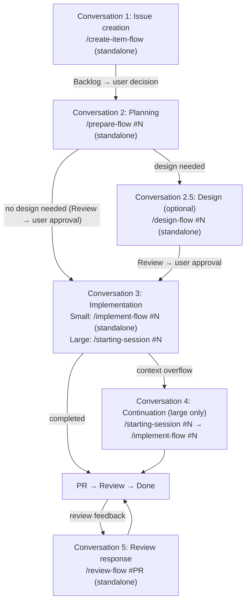
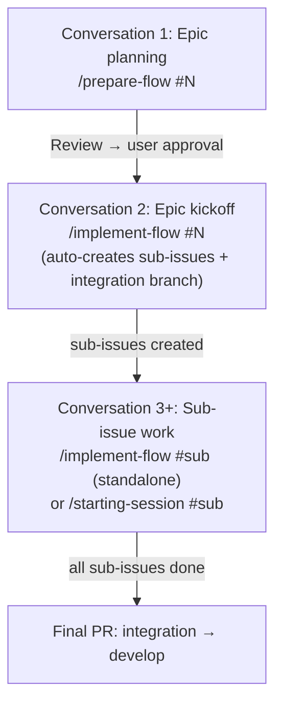

# Workflow Details

Supplementary details for the `best-practices-first` rule. Covers conversation flow, epic pattern, and session vs standalone details.

## Conversation Flow

Each phase typically runs in a separate Claude Code conversation. Context flows between conversations via Issue body (plan) and Issue comments (work summaries).

Small tasks may complete planning + implementation in a single conversation.

## Epic Pattern (XL Issues with Sub-Issues)

Key points:
- `/implement-flow #{epic}` auto-creates sub-issues from the plan and creates the integration branch
- Each sub-issue is worked on independently (standalone or session)
- Parent issue session recommended for managing cross-cutting context across sub-issues

## Session vs Standalone

### Session Usage Criteria

Use sessions when **context overflow risk** is high — i.e., the work is likely to span multiple conversations and context continuity provides significant value.

| Use Session | Use Standalone |
|-------------|---------------|
| Many files modified (10+) | Completes in one conversation |
| Epic (parent issue bound session + sub-issue standalone) | Localized changes (1-3 files) |
| Multi-day work (M/L size) | Independent single task |
| Two-phase work (research → implement) | Documentation, config changes |

### Skill Session Support

| Skill | Session | Standalone | Notes |
|-------|---------|------------|-------|
| implement-flow | Yes | Yes | Entry point for both modes |
| prepare-flow | Yes | Yes | Via implement-flow or standalone |
| plan-issue | Yes | — | Via Skill tool (from prepare-flow) |
| code-issue | Yes | — | Via Skill tool (from implement-flow) |
| Framework-specific skills | Yes | Yes | Via code-issue / design-flow or standalone (dynamically discovered) |
| design-flow | — | Yes | Currently standalone (invoked from prepare-flow completion report) |
| create-item-flow | — | Yes | Always standalone-capable |
| commit-issue | Yes | Yes | Subagent (standalone also runs as subagent) |
| open-pr-issue | Yes | Yes | Subagent (via chain or standalone) |
| review-flow | — | Yes | PR review response (new conversation entry point) |
| starting-session | Yes | — | Conversation init only (`#N` for issue-bound, no arg for project state display) |

### Standalone Handover Guideline

Standalone `implement-flow` automatically posts a work summary to the Issue comment on chain completion.

For substantial standalone work without `implement-flow`:

| Standalone Scope | Action |
|-----------------|--------|
| Quick single-skill invocation (typo fix, item creation) | Not needed |
| Multiple commits or significant code changes | Update issue status manually via `items update-status` CLI |
| Research findings or architecture investigation | Recommend creating a Discussion |
