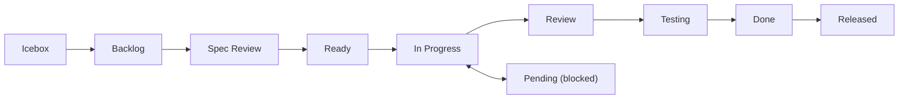

# GitHub Operations Reference

Shared reference for session/GitHub skills. Single source of truth for CLI commands, workflows, and conventions.

## Architecture: Issues + Projects Hybrid

| Component | Purpose |
|-----------|---------|
| **Issues** | Task management, `#123` references, history |
| **Projects** | Status/Priority/Type/Size field management |
| **Labels** | Type identification only (`feature`, `bug`, `chore`) |
| **Discussions** | Handovers, specs, decisions, Q&A |

**Status is managed via Projects fields** (not labels).

Project naming convention: Project name = repository name (e.g., `blogcms` repo -> `blogcms` project).

## Prerequisites

- `gh` CLI installed and authenticated
- GitHub Project configured (run `/project-setup` if not)
- Discussions enabled (categories: Handovers, Ideas, Q&A) (optional)

## DraftIssue vs Issue

| Feature | DraftIssue | Issue |
|---------|-----------|-------|
| `#number` | None | Available (`#123`) |
| External references | Not possible | Possible |
| Comments | Not possible | Possible |
| Create command | `projects create` | `issues create` |
| Use case | Lightweight notes | Full tasks |

**Recommended**: Use `issues create` by default for `#number` support.

## shirokuma-docs CLI Reference

Prefer shirokuma-docs CLI over direct `gh` commands. Configuration in `shirokuma-docs.config.yaml`.

### Issues (Primary Interface)

```bash
shirokuma-docs issues list                          # List open issues
shirokuma-docs issues list --all                    # Include closed
shirokuma-docs issues list --status "In Progress"   # Status filter
shirokuma-docs issues show {number}                  # Details
shirokuma-docs issues create \
  --title "Title" --body "Body" \
  --labels feature \
  --field-status "Backlog" --priority "Medium" --type "Feature" --size "M"
shirokuma-docs issues update {number} --field-status "In Progress"
shirokuma-docs issues comment {number} --body "..."
shirokuma-docs issues close {number}
shirokuma-docs issues reopen {number}
```

### Projects (Low-Level Access)

```bash
shirokuma-docs projects list                        # List project items
shirokuma-docs projects fields                      # Show field options
shirokuma-docs projects add-issue {number}          # Add issue to project
shirokuma-docs projects create \
  --title "Title" --body "Body" \
  --field-status "Backlog" --priority "Medium"               # DraftIssue
shirokuma-docs projects get PVTI_xxx                # Get by item ID
shirokuma-docs projects update {number} --field-status "Done"
```

### Discussions

```bash
shirokuma-docs discussions list --category Handovers --limit 5
shirokuma-docs discussions get {number}
shirokuma-docs discussions create \
  --category Handovers \
  --title "$(date +%Y-%m-%d) - Summary" \
  --body "Content"
```

### Repository

```bash
shirokuma-docs repo info
shirokuma-docs repo labels
```

### Cross-Repository Operations

```bash
shirokuma-docs issues list --repo docs
shirokuma-docs issues create --repo docs --title "Title" --body "Body"
```

### gh Fallback (Only for Operations Not Supported by CLI)

```bash
# Labels
gh issue edit {number} --add-label "label"
gh issue edit {number} --remove-label "label"
gh label list
gh label create "name" --color "0E8A16" --description "Desc"

# Pull Requests
gh pr list --state open
gh pr view {number}
gh pr comment {number} --body "..."

# Repository info
gh repo view --json nameWithOwner -q '.nameWithOwner'

# Authentication
gh auth login
gh auth status
```

## Status Workflow



| Status | Description |
|--------|-------------|
| Icebox | Low priority, unplanned |
| Backlog | Planned for future work |
| Spec Review | Requirements under review |
| Ready | Ready to start |
| In Progress | Work in progress |
| Pending | Blocked (record reason) |
| Review | Code review in progress |
| Testing | QA testing |
| Done | Completed |
| Released | Deployed to production |

## Label Conventions

Labels are used for **type identification only** (status is managed via Projects fields):

| Label | Purpose |
|-------|---------|
| `feature` | New feature |
| `bug` | Bug fix |
| `chore` | Maintenance |
| `docs` | Documentation |
| `research` | Investigation |

Optional priority labels: `priority:critical`, `priority:high`

## Common Error Handling

| Error | Resolution |
|-------|------------|
| `shirokuma-docs: command not found` | Install: `npm i -g @shirokuma-library/shirokuma-docs` |
| `gh: command not found` | Install: `brew install gh` or `sudo apt install gh` |
| `not logged in` / `not authenticated` | Run: `gh auth login` |
| No project found | Run `/project-setup` to create project |
| Discussions disabled/category not found | Fall back to local files |
| `HTTP 404` | Check repository name and permissions |
| API rate limit | Display cached/partial data |
