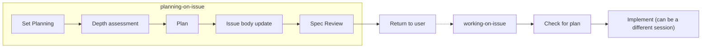

# Planning on Issue

Analyze issue requirements, create an implementation plan, and persist it to the issue body. After planning, set status to Spec Review and return control to the user. **Does not proceed to implementation.**

## When to Use

- **All issues** — plan depth scales with issue content complexity
- When `working-on-issue` detects an issue without a plan
- When the user explicitly requests a plan



## Plan Depth Levels

Plan depth is determined by **issue content complexity**, not by Size.

| Level | Content | Examples |
|-------|---------|----------|
| Lightweight | 1-2 line approach + confirmation | Typo fix, config change, simple bug fix |
| Standard | Approach + target files + task breakdown | New feature, refactoring, moderate fix |
| Detailed | Multi-option comparison + risk analysis + test strategy | Architecture change, breaking change, multi-system integration |

### Depth Assessment Criteria

AI assesses from issue title/body/type/comments:

| Criteria | Lightweight | Standard | Detailed |
|----------|-------------|----------|----------|
| Estimated files changed | 1-2 | 3-5 | 6+ |
| Design decisions | None | Present | Multiple options |
| Impact on existing behavior | None | Limited | Widespread |
| Test impact | Existing sufficient | Additions needed | Strategy review needed |

If any criterion matches a higher level, use that level.

## Workflow

### Step 1: Fetch Issue

```bash
shirokuma-docs issues show {number}
```

Review title, body, type, priority, size, labels, and comments.

### Step 1b: Set Status to Planning

If the issue status is Backlog, transition to Planning to record the planning start.

```bash
shirokuma-docs issues update {number} --field-status "Planning"
```

Skip if already Planning or Spec Review.

### Step 2: Codebase Investigation

Investigate code related to the issue requirements.

1. **Existing implementation**: Use Grep/Glob to identify related files
2. **Dependencies**: Identify modules and tests affected by changes
3. **Patterns**: Check for similar implementations in the codebase

Use Task (Explore agent) for broad investigation to minimize context consumption.

### Step 3: Create Plan

Assess the plan depth level from issue content and investigation results, then create a plan matching that level.

#### Lightweight Plan

```markdown
## Plan

### Approach
{1-2 line description of the approach}
```

#### Standard Plan

```markdown
## Plan

### Approach
{Selected approach and rationale}

### Target Files
- `path/to/file.ts` - {Summary of changes}

### Task Breakdown
- [ ] Task 1
- [ ] Task 2
```

#### Detailed Plan

```markdown
## Plan

### Approach
{Multi-option comparison and selection rationale}

### Target Files
- `path/to/file.ts` - {Summary of changes}

### Task Breakdown
- [ ] Task 1
- [ ] Task 2

### Risks / Concerns
- {Breaking changes, performance, security, etc.}
```

### Step 4: Plan Review (Fresh Context)

Reviewing in the same context that wrote the plan cannot catch blind spots. Delegate review to a fresh-context agent via the Task tool.

#### Launching the Reviewer

Embed the full issue body (including plan section) directly in the prompt. Do not depend on the reviewer having CLI access.

```
Task(subagent_type: "general-purpose", prompt: """
You are a plan reviewer. Review the plan for the following issue.

## Issue #{number}: {title}

{full issue body}

## Review Criteria

| Criterion | Description | Examples |
|-----------|-------------|----------|
| Requirements coverage | Are all requirements from overview/tasks covered by the plan? | Deliverables have corresponding tasks |
| Target file validity | Any missing or unnecessary files? | Overlooked dependent modules |
| Task granularity | Appropriate breakdown (~1 task ≈ ~1 commit)? | Too coarse or too fine |
| Risks | Any overlooked risks? | Breaking changes, performance impact |
| Issue description sufficiency | Can the plan be understood and evaluated from the issue body alone? | Are technical constraints documented? Are dependencies on existing code explained? |

## Output Format

Return results in the following format:

## Plan Review Result
**Status:** {PASS | NEEDS_REVISION}
**Issues:**
- [{Plan | Issue description}] {description of the problem}
**Suggestions:**
- {improvement suggestion}

Include Suggestions even for PASS if applicable.
""")
```

#### Processing Review Results

| Result | Action |
|--------|--------|
| PASS | Proceed to Step 5 |
| NEEDS_REVISION | Follow "On Failure" below to fix and re-review |

#### On Failure

When NEEDS_REVISION is returned:

1. Classify issues into **[Plan]** and **[Issue description]**
2. **[Issue description]** issues → Fix the relevant sections in the issue body (overview, background, tasks, etc.)
3. **[Plan]** issues → Fix the plan section
4. After fixes, re-run the review via Task (same prompt template)
5. **Max retries: 2** (initial review + up to 2 fix-and-review cycles)
6. On 3rd NEEDS_REVISION → Stop the loop, report to user for their judgment

```
Plan → Review → NEEDS_REVISION → Fix → Re-review → PASS → Step 5
                                              ↓ (failed twice)
                                        Report to user
```

### Step 5: Update Issue Body with Plan

Follow the comment-first workflow (see `project-items` rule, "Workflow Order" section) in this order:

#### 5a: Post Decision Rationale as Comment

Post the planning decision rationale as a **primary record** in a comment. Record the decision process that would only exist in comments, not a summary of the body.

```bash
shirokuma-docs issues comment {number} --body "## Plan Decision Rationale

### Selected Approach
{The chosen approach and why it was selected}

### Alternatives Considered
{Approaches considered but rejected, with reasons. If none: 'No alternatives (single clear approach)'}

### Constraints Discovered
{Technical constraints or dependencies found during codebase investigation. Omit if none}
"
```

**Template intent**: The comment records "why this approach was chosen". The body's plan section documents "what will be done" in a structured format, so comments and body serve distinct roles.

#### 5b: Append Plan Section to Issue Body

Append a `## Plan` section to the existing issue body. Use the template from the depth level determined in Step 3.

```bash
shirokuma-docs issues update {number} --body "{existing body + plan section}"
```

**Important**: Preserve the existing body (overview, tasks, deliverables). **Append** the `## Plan` section. If an existing `## Tasks` section exists, the plan's `### Task Breakdown` coexists as more specific implementation steps.

### Step 6: Update Status

```bash
shirokuma-docs issues update {number} --field-status "Spec Review"
```

### Step 7: Return to User

Display a plan summary and request approval. **Do not proceed to implementation.**

Show a summary matching the plan depth level:

#### For Lightweight Plans

```markdown
## Plan Complete: #{number} {title}

**Status:** Spec Review (awaiting approval)
**Level:** Lightweight

### Plan Summary
- **Approach:** {one-line summary}

If approved, run `/working-on-issue #{number}` to start implementation.
```

#### For Standard/Detailed Plans

```markdown
## Plan Complete: #{number} {title}

**Status:** Spec Review (awaiting approval)
**Level:** {Standard | Detailed}

### Plan Summary
- **Approach:** {one-line summary}
- **Target files:** {N} files
- **Tasks:** {N} steps

Review the plan. If approved, run `/working-on-issue #{number}` to start implementation.
If changes are needed, provide feedback.
```

## Arguments

| Format | Example | Behavior |
|--------|---------|----------|
| Issue number | `#42` | Fetch issue and start planning |
| No argument | — | Ask for issue number via AskUserQuestion |

## Edge Cases

| Situation | Action |
|-----------|--------|
| `## Plan` section already exists | Ask whether to overwrite (AskUserQuestion) |
| Issue is Done/Released | Show warning |
| Issue body is empty | Create body with plan section only |
| Status is already Planning | Continue planning, skip status update |
| Status is already Spec Review | Update plan, keep status |

## Rule References

| Rule | Usage |
|------|-------|
| `project-items` | Spec Review status workflow |
| `branch-workflow` | Branch naming reference (for plan documentation) |

## Tool Usage

| Tool | When |
|------|------|
| Bash | `shirokuma-docs issues show/update` |
| Read/Grep/Glob | Codebase investigation |
| Task (Explore) | Broad code investigation |
| Task (general-purpose) | Step 4: Fresh-context plan review |
| AskUserQuestion | Overwrite confirmation, issue number prompt |
| TodoWrite | Planning step progress tracking |

## Notes

- **Does not implement** — planning only. Implementation is `working-on-issue`'s responsibility
- Plans are persisted in the issue body — available across sessions
- `Spec Review` is the user approval gate — AI must not self-approve and proceed
- Use Explore agent during investigation to minimize context consumption
