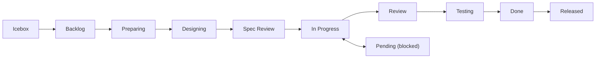

# GitHub Operations Reference

Shared reference for all session/GitHub skills. Single source of truth for CLI commands, workflows, and conventions.

## Contents

- Architecture: Issues + Projects Hybrid
- Prerequisites
- DraftIssue vs Issue
- shirokuma-docs CLI Reference
- `--from-file` vs `--body-file` Usage Guide
- Status Workflow
- Labels Convention
- Common Error Handling

## Architecture: Issues + Projects Hybrid

| Component | Purpose |
|-----------|---------|
| **Issues** | Task management, `#123` references, history |
| **Projects** | Status/Priority/Size field management |
| **Labels** | Supplementary area classification (`area:cli`, `area:plugin`, etc.) |
| **Discussions** | Handovers, Specs, Decisions, Q&A |

**Status is managed via Projects fields** (not Labels).

Project naming convention: Project name = repository name (e.g., `blogcms` repo → `blogcms` project).

## Prerequisites

- `gh` CLI installed and authenticated
- GitHub Project configured (run `/setting-up-project` if not)
- Discussions enabled with categories: Handovers, Ideas, Q&A (optional)

## DraftIssue vs Issue

| Feature | DraftIssue | Issue |
|---------|-----------|-------|
| `#number` | No | Yes (`#123`) |
| External reference | No | Yes |
| Comments | No | Yes |
| Use case | Lightweight memo | Full task |

**Recommendation**: Use `items add issue` by default for `#number` support.

## shirokuma-docs CLI Reference

Prefer shirokuma-docs CLI over direct `gh` commands. Config in `shirokuma-docs.config.yaml`.

### Issues (Primary Interface)

```bash
shirokuma-docs items list                          # Open issues
shirokuma-docs items list --all                    # Include closed
shirokuma-docs items list --status "In Progress"   # Filter by status
shirokuma-docs items pull {number}                   # Fetch details and cache (→ Read .shirokuma/github/{number}.md)
shirokuma-docs items add issue --file /tmp/shirokuma-docs/new-issue.md  # Metadata + body in one file
shirokuma-docs items push {number}                                       # Update (edit cache frontmatter then push)
# Add/remove labels: items pull → edit frontmatter labels field → items push {number}
# Add/remove assignees: items pull → edit frontmatter assignees field → items push {number}
shirokuma-docs items add comment {number} --file /tmp/shirokuma-docs/{number}-comment.md
shirokuma-docs items comments {number}                 # List comments
shirokuma-docs items push {number} {comment-id}         # Edit comment (cache-edit → push)
shirokuma-docs items close {number}
shirokuma-docs items cancel {number}
shirokuma-docs items reopen {number}
```

### Pull Requests

```bash
shirokuma-docs items pr create --from-file /tmp/shirokuma-docs/pr.md             # Metadata + body in one file
shirokuma-docs items pr create --base main --head develop --title "release: v0.2.0"  # Release workflow (metadata only)
shirokuma-docs items pr list                                      # PR list (default: open)
shirokuma-docs items pr list --state merged --limit 5            # Filtering
shirokuma-docs items pr list --head {branch-name}                # Resolve PR from branch name
shirokuma-docs items pr show {number}                             # PR details (body, diff stats, linked issues)
shirokuma-docs items pr comments {number}                         # Review comments and threads
shirokuma-docs items pr merge {number} --squash                   # Merge + status update
shirokuma-docs items pr reply {number} --reply-to {id} --body-file - <<'EOF'
Reply content
EOF
shirokuma-docs items pr resolve {number} --thread-id {id}        # Resolve thread
```

### Projects (Item Operations)

```bash
shirokuma-docs items projects update {number} --field-status "Done"  # Field update (only way)
shirokuma-docs items projects add-issue {number}                     # Add issue to project
shirokuma-docs items projects delete PVTI_xxx                        # Delete item
```

### Discussions

```bash
shirokuma-docs items discussions list --category Handovers --limit 5
shirokuma-docs items discussions search "keyword"            # Discussion search
shirokuma-docs items search --type discussions "keyword"     # Via items search
shirokuma-docs items pull {number}   # Fetch details and cache (→ Read .shirokuma/github/{number}.md)
shirokuma-docs items add discussion --file /tmp/shirokuma-docs/discussion.md  # Metadata + body in one file
```

### Cross-search

```bash
shirokuma-docs items search "keyword"                          # Issues / PR search (default)
shirokuma-docs items search --type discussions "keyword"       # Discussions only
shirokuma-docs items search --type issues,discussions "keyword" # Issues + Discussions cross-search
```

### Repository

```bash
shirokuma-docs repo info
shirokuma-docs repo labels
```

### Cross-repo Operations

```bash
shirokuma-docs items list --repo docs
shirokuma-docs items add issue --repo docs --file /tmp/shirokuma-docs/new-issue.md
```

### gh Fallback (CLI unsupported only)

```bash
# Label management
gh label list
gh label create "name" --color "0E8A16" --description "Desc"

# Authentication
gh auth login
gh auth status

```

## `--from-file` vs `--body-file` Usage Guide

| Pattern | Commands | Reason |
|---------|----------|--------|
| `items add` recommended | `items add issue`, `items add discussion` | Metadata + body in one file, prevents flag combination errors |
| `--body-file` kept | `items pr reply`, `session end` | Body only, no metadata needed |
| `items push` recommended | Status/body/title/labels/assignees/state/issue-type/parent update | Cache-edit → push consistent workflow |

### `--from-file` Frontmatter Format

```markdown
---
title: Issue Title
type: Feature
priority: Medium
size: M
labels: [area:cli]
---

Body content goes here.
```

Safe frontmatter fields vary by command:

| Command | Safe Fields |
|---------|-------------|
| `items add issue` / `items push` | `title`, `type`, `priority`, `size`, `labels`, `state`, `state_reason`, `parent` |
| `items pr create` | `title`, `base`, `head` |
| `items add discussion` | `title`, `category` |

CLI flags take precedence when set. `--from-file` and `--body-file` are mutually exclusive (error if both specified).

### `--body-file` Tier Guide

| Tier | Pattern | Usage |
|------|---------|-------|
| Tier 1 (stdin) | `--body-file - <<'EOF'...EOF` | Comments, replies, short reasons |
| Tier 2 (file) | Write → `--body-file /tmp/shirokuma-docs/xxx.md` | Body updates, handovers |

Use `<<'EOF'` as heredoc delimiter (single quotes prevent variable expansion). When iteratively updating bodies via Tier 2, apply the Write/Edit pattern (initial Write → subsequent Edit for diff-only updates). See the "File-Based Body Editing" section in `item-maintenance.md` for details.

## Status Workflow



| Status | Description |
|--------|-------------|
| Icebox | Low priority, not yet planned |
| Backlog | Planned for future work |
| Preparing | Plan being created |
| Designing | Design being created |
| Spec Review | Requirements being reviewed |
| In Progress | Currently working on |
| Pending | Blocked (document reason) |
| Review | Code review |
| Testing | QA testing |
| Done | Completed |
| Released | Deployed to production |

## Labels Convention

Work type classification is primarily handled by **Issue Types** (Organization-level Type field). Labels indicate the **affected area** as a supplementary mechanism:

| Mechanism | Role | Example |
|-----------|------|---------|
| Issue Types | **What** kind of work | Feature, Bug, Chore, Docs, Research, Evolution |
| Area labels | **Where** the work applies | `area:cli`, `area:plugin` |
| Operational labels | Triage / lifecycle | `duplicate`, `invalid`, `wontfix` |

Labels are added manually based on project structure. Status is managed via Projects fields.

## Common Error Handling

| Error | Action |
|-------|--------|
| `shirokuma-docs: command not found` | Install: `npm i -g @shirokuma-library/shirokuma-docs` |
| `gh: command not found` | Install: `brew install gh` or `sudo apt install gh` |
| `not logged in` / `not authenticated` | Run: `gh auth login` |
| No project found | Run `/setting-up-project` to create one |
| Discussions disabled/category not found | Use local file fallback |
| `HTTP 404` | Check repository name and permissions |
| API rate limit | Show cached/partial data |
