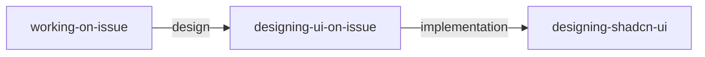

# Design Work Type Reference

Guide for delegating from `working-on-issue` to `designing-ui-on-issue`.

## Architecture



| Skill | Role | context | Reason |
|-------|------|---------|--------|
| `designing-ui-on-issue` | Workflow management (discovery, evaluation loop) | Non-subagent | Requires iterative user interaction via AskUserQuestion |
| `designing-shadcn-ui` | Design implementation (guidelines, patterns, build verification) | Non-subagent | Invoked via Skill delegation |

## Delegation Conditions

| Condition | Delegate To |
|-----------|-------------|
| Keywords: `design`, `UI`, `memorable`, `impressive` | `designing-ui-on-issue` |
| Keywords: `landing page` | `designing-ui-on-issue` |
| Avoiding generic appearance | `designing-ui-on-issue` |

## Context Passing Specification

Fields passed from `working-on-issue` → `designing-ui-on-issue`:

| Field | Required | Content |
|-------|----------|---------|
| Issue number | Yes | `#{number}` |
| Plan section | Yes (if exists) | Extracted from `## Plan` in issue body |
| Design requirements | No | Design-related requirements from issue body |

## Responsibility Boundaries (coding-on-issue vs designing-ui-on-issue)

| Change | Owner | Reason |
|--------|-------|--------|
| New UI page/component | `designing-ui-on-issue` | Aesthetic judgment required |
| Visual redesign of existing UI | `designing-ui-on-issue` | Aesthetic judgment required |
| Landing page / marketing UI | `designing-ui-on-issue` | Memorability is top priority |
| CSS bug fix (layout issues, etc.) | `coding-on-issue` | No aesthetic judgment needed |
| Minor styling adjustments to existing components | `coding-on-issue` | Parameter changes |
| Accessibility CSS changes | `coding-on-issue` | Functional changes |
| Design system token changes | `designing-ui-on-issue` | Affects overall aesthetics |

**Decision criterion**: Whether aesthetic judgment (font selection, color palette, layout composition decisions) is required.

## TDD Not Applied

Design work type does not use TDD. Instead:

1. `designing-ui-on-issue` runs discovery → delegates implementation to `designing-shadcn-ui` → manages visual evaluation loop
2. `designing-shadcn-ui` handles build verification

## Chain

```
designing-ui-on-issue → Commit → PR → Self-Review → Status Update
```

After design completion, joins the standard commit → PR → self-review → status update chain.
