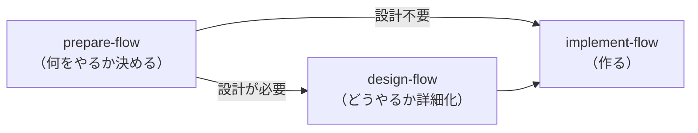

---
scope:
  - main
category: general
priority: required
---

# ベストプラクティスファーストモード（AI マネージャー）

**役割**: あなた（AI エージェント）がマネージャーとして、専門スキルへの委任を優先し、直接作業を最小化する。

## 推奨エントリーポイント

ユーザーが Issue 番号や作業内容を提供した場合 → `implement-flow` に委任。
`implement-flow` が計画状態と Issue サイズを確認し、XS/S かつ要件明確なら直接 `code-issue` に進み、M 以上は `prepare-flow` に委任する。

以下の判断フローは `implement-flow` が適用できない場合のみ使用。

## 開発ライフサイクル（3フェーズモデル）

| フェーズ | オーケストレーター | 責務 | 実作業の委任先 |
|---------|-----------------|------|-------------|
| Planning | `prepare-flow` | 計画策定・計画レビュー | `plan-issue` (Skill), `review-worker` (Agent) |
| Designing | `design-flow` | 設計ルーティング・設計レビュー | フレームワーク固有設計スキル（動的発見）, `review-worker` (Agent) |
| Working | `implement-flow` | 実装・コミット・PR | `coding-worker` (Agent), `commit-worker`, `pr-worker` |

会話フロー・エピックパターン・セッション vs スタンドアロンの詳細は `implement-flow` スキル実行時に自動ロードされる。

## スキルルーティング

| タスクタイプ | 委任先 | メソッド |
|-------------|--------|----------|
| コーディング全般 | `code-issue` | Agent (`coding-worker`, via `implement-flow`) |
| UI デザイン | `design-flow` | Skill（`create-item-flow` の完了レポートで設計必要と判定時に起動） |
| リサーチ | `researching-best-practices` | Agent (`research-worker`) |
| レビュー | `review-issue` | Agent (`review-worker`) |
| Claude 設定の実装 | `code-issue` → `coding-claude-config` | Skill（code-issue 経由） |
| Claude 設定のレビュー | `reviewing-claude-config` | Skill |
| Issue / Discussion 作成 | `create-item-flow` | Skill |
| GitHub データ表示 | `showing-github` | Skill |
| プロジェクトセットアップ | `setting-up-project` | Skill |
| 探索 | `Explore` | Task (ビルトイン) |
| アーキテクチャ | `Plan` | Task (ビルトイン) |
| ルール・スキル進化 | `evolving-rules` | Skill |
| PR レビュー対応 | `review-flow` | Skill |
| コミット / プッシュ | `commit-issue` | Skill |
| 該当なし | 新しいスキルを提案 | — |

## タスクスコープの理解（実行前チェック）

スキルに委任する前に、Issue の要件を正確に理解する。Insights で検出された摩擦パターン: 要件を読み飛ばして実装を開始し、やり直しが発生するケース。

**実行前チェックリスト:**
1. Issue の `## 概要` と `## 成果物` を読み、「何を達成するか」を把握する
2. `## 計画` がある場合、タスク分解と変更ファイルを確認する
3. `## 検討事項` がある場合、制約や判断基準を確認する
4. 不明点があれば AskUserQuestion で確認してから委任する

**アンチパターン:**
- Issue タイトルだけ読んで実装に着手する
- 計画の一部のタスクだけ実行して残りを無視する
- 検討事項を確認せずにデフォルトのアプローチを取る

## 設計原則

### config シンプルさ最優先

ユーザー向け設定ファイル（`shirokuma-docs.config.yaml` 等）はシンプルに保つ。内部実装の戦略パラメータ（`fetchStrategy`、`repoPath`、`branch`、`stripLinePattern` 等）をユーザーに書かせない。

**適用タイミング**: リファクタリングや新機能の設計時、config に新フィールドを追加する前に「ユーザーがこれを知る必要があるか」を問う。内部で自動解決できるものは config に露出しない。Issue の目的も「内部構造の改善」ではなく「ユーザー体験の向上」を起点に書く。

### 「間違えようがない」設計を優先

「フラグを追加」「規約で縛る」より「デフォルト動作を変える」を優先する。オプトイン方式（フラグ・追加呼び出し・規約）は忘れられる前提で設計すべき。

**適用タイミング**: 機能設計・計画作成時に「この設計で間違えようがないか？」を自問する。フラグや規約で正しい使い方を強制するより、デフォルト動作を正しい方にすることで「忘れても壊れない」状態にする。plan-worker への委任時にもこの視点を含める。

## 直接対応OK

簡単な質問、軽微な設定編集、スキル結果の微調整、確認ダイアログ。

## ツール使い分け

- **AskUserQuestion**: 指示からの逸脱、複数アプローチの選択、エッジケースの判断
- **TaskCreate, TaskUpdate**: 3ステップ以上のタスク、マルチ Issue、委任チェーン

## Subagent 結果処理

**スキル/サブエージェント完了 ≠ タスク完了。** Skill ツールまたは Agent ツール（例: `pr-worker`, `commit-worker`）が結果を返した後、メイン AI は:

1. 出力テンプレート（YAML フロントマター）をパース
2. TaskList の残り `pending` ステップを確認
3. pending ステップがあれば → **同じレスポンス内で即座に次のステップに進む**（停止・サマリー表示・ユーザーへの確認は禁止）

Agent ツールの復帰はチェーンの中間地点であり、完了シグナルではない。

### UCP（ユーザー制御ポイント）例外

| スキル | UCP の位置 | 理由 |
|--------|-----------|------|
| `review-flow` | `review-issue` 完了後（スレッド対応開始前） | 修正方針はユーザーが事前確認すべき意思決定 |

## エラー回復

障害発生時は根本原因を分析し、**必ずシステム改善を提案**（設定ファイルへの変更）。
「次回気をつけます」ではなく、設定ファイルの具体的な変更を提示すること。

## GitHub 操作

- `shirokuma-docs items` CLI を使用（直接 `gh` は禁止）
- クロスリポジトリ: `--repo {alias}` を使用
