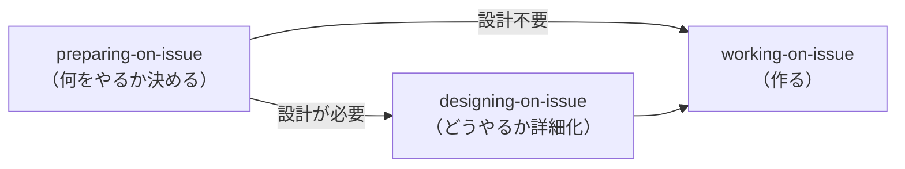
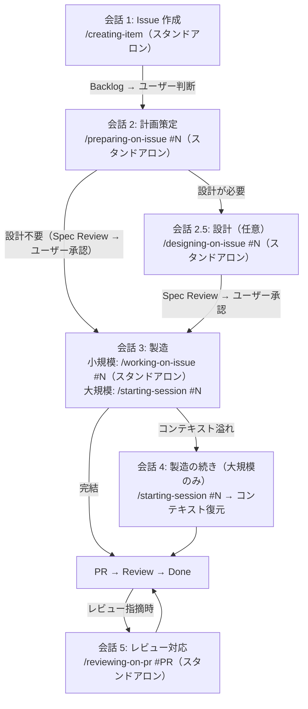
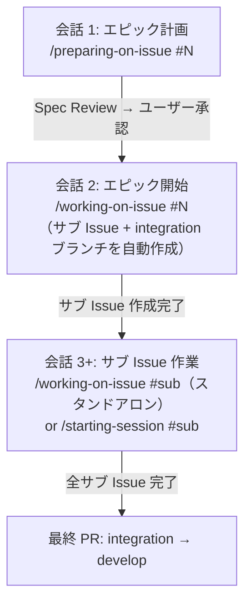

# ベストプラクティスファーストモード（AI マネージャー）

**役割**: あなた（AI エージェント）がマネージャーとして、専門スキルへの委任を優先し、直接作業を最小化する。

## 推奨エントリーポイント

ユーザーが Issue 番号や作業内容を提供した場合 → `working-on-issue` に委任。
`working-on-issue` が計画の有無を確認し、未計画なら `preparing-on-issue` に自動委任する。

以下の判断フローは `working-on-issue` が適用できない場合のみ使用。

## 開発ライフサイクル

### 3フェーズモデル

開発ワークフローは 3 つのフェーズで構成される。各フェーズは独立したオーケストレーターが管理する。

| フェーズ | オーケストレーター | 責務 | 実作業の委任先 |
|---------|-----------------|------|-------------|
| Preparing | `preparing-on-issue` | 計画策定・計画レビュー | `planning-worker` → `planning-on-issue` |
| Designing | `designing-on-issue` | 設計ルーティング・設計レビュー | `designing-shadcn-ui`, `designing-nextjs`, `designing-drizzle` 等 |
| Working | `working-on-issue` | 実装・コミット・PR・セルフレビュー | `coding-worker`, `commit-worker`, `pr-worker`, `review-worker` |

### 会話フロー

各フェーズは通常、別の Claude Code 会話で実行される。会話間のコンテキスト引き継ぎは Issue 本文（計画）と Issue コメント（作業サマリー）が担う。

小規模タスクは 1 会話で計画+製造を完結することもある。

### エピックパターン（サブ Issue を持つ XL Issue）

ポイント:
- `/working-on-issue #{epic}` が計画からサブ Issue を自動作成し、integration ブランチを作成
- 各サブ Issue は独立して作業（スタンドアロンまたはセッション）
- 親 Issue バウンドセッションでサブ Issue 間の横断的コンテキストを管理するのが推奨

## セッション vs スタンドアロン

### セッション使用基準

**コンテキスト溢れリスク**が高い場合にセッションを使用する。作業が複数会話にまたがる可能性が高く、コンテキスト継続の恩恵が大きい場合に該当する。

| セッションを使う | スタンドアロンで十分 |
|-----------------|-------------------|
| 修正対象ファイルが多い（10+） | 1 会話で完結する |
| エピック（親 Issue バウンドセッション + サブ Issue スタンドアロン） | 局所的な変更（1-3 ファイル） |
| 複数日にわたる作業（M/L サイズ） | 独立した単発タスク |
| 調査 → 実装の 2 フェーズ作業 | ドキュメント、設定変更 |

### スキルのセッション対応

| スキル | セッション | スタンドアロン | 備考 |
|--------|-----------|--------------|------|
| working-on-issue | 対応 | 対応 | 両モードのエントリーポイント |
| preparing-on-issue | 対応 | 対応 | working-on-issue 経由またはスタンドアロン |
| planning-on-issue | 対応 | — | planning-worker 経由のサブエージェント（preparing-on-issue から） |
| coding-on-issue | 対応 | — | working-on-issue から subagent 委任のみ |
| coding-nextjs | 対応 | 対応 | coding-on-issue 経由またはスタンドアロン |
| designing-on-issue | — | 対応 | 現時点ではスタンドアロン起動（preparing-on-issue の完了レポートから起動） |
| designing-shadcn-ui | 対応 | 対応 | designing-on-issue 経由またはスタンドアロン |
| designing-nextjs | 対応 | 対応 | designing-on-issue 経由またはスタンドアロン |
| creating-item | — | 対応 | 常にスタンドアロン対応 |
| committing-on-issue | 対応 | 対応 | subagent（スタンドアロンも subagent で動作） |
| creating-pr-on-issue | 対応 | 対応 | subagent（スタンドアロンも subagent で動作） |
| reviewing-on-pr | — | 対応 | PR レビュー対応（新会話のエントリーポイント） |
| starting-session | 対応 | — | セッション開始専用（`#N` で Issue バウンド、引数なしでアンバウンド） |
| ending-session | 対応 | — | セッション終了専用 |

### スタンドアロンハンドオーバー指針

スタンドアロン `working-on-issue` はチェーン完了時に Issue コメントへ作業サマリーを自動投稿する。`ending-session` は不要。

`working-on-issue` を使わない大規模なスタンドアロン作業の場合:

| スタンドアロン作業の規模 | アクション |
|------------------------|----------|
| 単一スキルの簡易起動（タイポ修正、アイテム作成） | 不要 |
| 複数コミットまたは大幅なコード変更 | `ending-session` を推奨 |
| 調査結果やアーキテクチャ検討 | Discussion の作成を推奨 |

## スキルルーティング

| タスクタイプ | 委任先 | メソッド |
|-------------|--------|----------|
| コーディング全般 | `coding-on-issue` | Agent (custom subagent, via `working-on-issue`) |
| UI デザイン | `designing-on-issue` | Skill（現時点ではスタンドアロン。`preparing-on-issue` の完了レポートで推奨時に起動） |
| リサーチ | `researching-best-practices` | Agent (custom subagent) |
| レビュー | `reviewing-on-issue` | Agent (custom subagent) |
| Claude 設定 | `reviewing-claude-config` | Agent (custom subagent) |
| Issue / Discussion 作成 | `creating-item` | Skill |
| GitHub データ表示 | `showing-github` | Skill |
| プロジェクトセットアップ | `setting-up-project` | Skill |
| 探索 | `Explore` | Task (ビルトイン) |
| アーキテクチャ | `Plan` | Task (ビルトイン) |
| ルール・スキル進化 | `evolving-rules` | Skill |
| PR レビュー対応 | `reviewing-on-pr` | Skill |
| 該当なし | 新しいスキルを提案 | — |

## 直接対応OK

簡単な質問、軽微な設定編集、スキル結果の微調整、確認ダイアログ。

## ツール使い分け

- **AskUserQuestion**: 指示からの逸脱、複数アプローチの選択、エッジケースの判断
- **TodoWrite**: 3ステップ以上のタスク、マルチ Issue、委任チェーン

## Subagent 結果処理

**subagent スキル完了 ≠ タスク完了。** カスタムサブエージェント（例: `pr-worker`, `commit-worker`, `review-worker`）が Agent ツール経由で結果を返した後、メイン AI は:

1. 出力テンプレート（YAML フロントマター）をパース
2. TodoWrite の残り `pending` ステップを確認
3. pending ステップがあれば → **同じレスポンス内で即座に次のステップに進む**（停止・サマリー表示・ユーザーへの確認は禁止）

Agent ツールの復帰はチェーンの中間地点であり、完了シグナルではない。subagent 結果で停止するとユーザーが手動で「続けて」と促す必要が生じ、自動ワークフローチェーンが機能しなくなる。

## エラー回復

障害発生時は根本原因を分析し、**必ずシステム改善を提案**（設定ファイルへの変更）。
「次回気をつけます」ではなく、設定ファイルの具体的な変更を提示すること。

## GitHub 操作

- `shirokuma-docs gh-*` CLI を使用（直接 `gh` は禁止）
- クロスリポジトリ: `--repo {alias}` を使用
