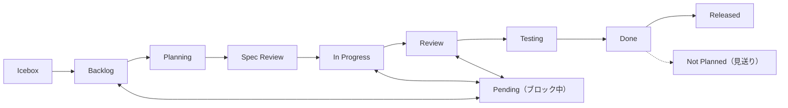

# プロジェクトアイテムルール

## 必須フィールド

| フィールド | 必須 | オプション |
|-----------|------|-----------|
| Status | はい | 下記ワークフロー参照 |
| Priority | はい | Critical / High / Medium / Low |
| Size | 推奨 | XS / S / M / L / XL |
| Type | はい | Organization Issue Types で管理（手動セットアップ） |

## ステータスワークフロー



アイデアは Issue ではなく **Discussions** から始める。実装決定後に Issue (Backlog) へ。

## ステータス更新トリガー

| トリガー | アクション | 責任者 | コマンド |
|---------|----------|--------|---------|
| 計画策定開始 | → Planning + アサイン | `planning-on-issue` | `issues update {n} --field-status "Planning"` + `gh issue edit {n} --add-assignee @me` |
| 計画策定完了 | → Spec Review | `planning-on-issue` | `issues update {n} --field-status "Spec Review"` |
| ユーザーが計画承認、実装開始 | → In Progress + ブランチ | `working-on-issue` | `issues update {n} --field-status "In Progress"` |
| セルフレビュー完了 | → Review | `creating-pr-on-issue` | `issues update {n} --field-status "Review"`（セルフレビュー**中**は In Progress を維持。Review への遷移はセルフレビュー完了後のみ） |
| マージ | → Done | `committing-on-issue` (via `issues merge`) | 自動更新 |
| ブロック | → Pending | 手動 | `issues update {n} --field-status "Pending"` + 理由 |
| 完了（PR不要） | → Done | `ending-session` | `session end --done {n}` |
| キャンセル | → Not Planned | `issues cancel` | `issues cancel {n}` |
| セッション終了 | → Review or Done | `ending-session`（セーフティネット） | `session end --review/--done {n}` |

### Planning の運用

`planning-on-issue` スキルが計画を開始するとき、Backlog → Planning に遷移する。

- **目的**: 計画策定中であることの可視化、計画開始タイムスタンプの記録
- **入口**: `planning-on-issue` が Issue を取得後、計画開始時に設定
- **出口**: 計画完了後 → Spec Review（`planning-on-issue` が設定）
- **pre-work ステータス**: `WORK_STARTED_STATUSES` に含まれない（Spec Review と同様）

### Spec Review の運用

`planning-on-issue` スキルが計画を Issue 本文に書いた後、Planning → Spec Review に移行する。

- **目的**: ユーザーが計画を確認・承認するゲート
- **入口**: `planning-on-issue` が `## 計画` セクションを追記後に設定
- **出口**: ユーザーが承認し `working-on-issue` で実装を開始 → In Progress
- **適用**: 全 Issue で計画を実施（深さは内容に応じて軽量/標準/詳細）

### ルール

1. **同時に In Progress は1つ**（例外: バッチモードでは複数 Issue が同時に In Progress 可。`batch-workflow` ルール参照）
2. **Issue ごとにブランチ**（`branch-workflow` 参照。例外: バッチモードは1ブランチを共有。`batch-workflow` ルール参照）
3. **イベント駆動**: Status 変更はイベント発生時に即座に実行する（`creating-pr-on-issue` がセルフレビュー完了時に Review、`issues merge` が Done）
4. **セッション終了時**に `ending-session` が取りこぼしを補完（セーフティネット）
5. **Pending は理由必須**
6. **冪等性**: 既に正しい Status なら更新をスキップ（エラーにしない）

## ビルトイン自動化

推奨ワークフロー（GitHub UI で有効化、API 未対応）:
- **Item closed** → Done
- **Pull request merged** → Done

CLI と冪等に協調動作。確認: `shirokuma-docs projects workflows`

**注意**: 「Item closed → Done」自動化が有効な場合、`issues cancel`（Not Planned 設定）と競合する可能性がある。CLI は close 後に Status を Not Planned に設定するため、通常は CLI の更新が優先されるが、タイミングによっては自動化が上書きする場合がある。`session check --fix` で整合性を検出・修正可能。

## ラベル

ラベルは**どこ**に影響するかを示す横断的属性。作業種別は Issue Types（Type フィールド）で分類する。

| ラベル種別 | 役割 | 例 |
|-----------|------|-----|
| エリアラベル | 影響範囲 | `area:cli`, `area:plugin` |
| 運用ラベル | トリアージ | `duplicate`, `invalid`, `wontfix` |

## アイテム本文メンテナンス（Issues / Discussions / PRs 共通）

**本文はソースオブトゥルース。** コメントは経緯・履歴、本文は常に最新の統合版。詳細手順は `managing-github-items/reference/item-maintenance.md` を参照。

> **コメントファースト**: 本文更新前に必ずコメントを投稿する。コメントは作業の一次記録として独立した価値を持つこと。

コメント操作の CLI コマンド:

| 操作 | コマンド | 備考 |
|------|---------|------|
| コメント追加 | `issues comment {number}` | Issue/PR 両対応 |
| コメント一覧 | `issues comments {number}` | JSON 出力 |
| コメント編集 | `issues comment-edit {comment-id}` | Issue/PR 両対応、`--body` でファイル/stdin 指定 |

## 本文テンプレート

```markdown
## 目的
{誰}が{何}できるようにする。{なぜ}。

## 概要
{内容}

## 背景
{現状の問題、関連する制約や依存関係}

## タスク
- [ ] タスク 1

## 成果物
{"完了" の定義}
```

> 種別ごとの詳細テンプレート（bug の再現手順、research の調査項目等）は `create-item` リファレンスを参照。

## アイテム作成

全必須フィールドを即時設定。XL は分割。デフォルト Status は Backlog（`--field-status` でオーバーライド可）。
