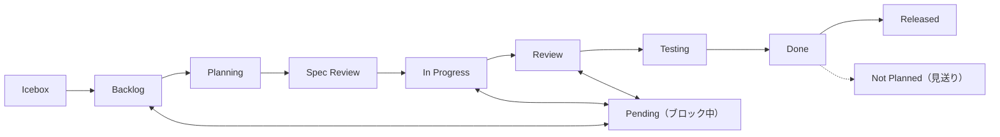

# プロジェクトアイテムルール

## 必須フィールド

| フィールド | 必須 | オプション |
|-----------|------|-----------|
| Status | はい | 下記ワークフロー参照 |
| Priority | はい | Critical / High / Medium / Low |
| Size | 推奨 | XS / S / M / L / XL |
| Type | はい | Organization Issue Types で管理（手動セットアップ） |

## ステータスワークフロー



アイデアは Issue ではなく **Discussions** から始める。実装決定後に Issue (Backlog) へ。

## ステータス更新トリガー

| トリガー | アクション | 責任者 | コマンド |
|---------|----------|--------|---------|
| 計画策定開始 | → Planning | `planning-on-issue` | `issues update {n} --field-status "Planning"` |
| 計画策定完了 | → Spec Review | `planning-on-issue` | `issues update {n} --field-status "Spec Review"` |
| ユーザーが計画承認、実装開始 | → In Progress + ブランチ | `working-on-issue` | `issues update {n} --field-status "In Progress"` |
| PR作成 | → Review | `creating-pr-on-issue` | `issues update {n} --field-status "Review"` |
| マージ | → Done | `committing-on-issue` (via `issues merge`) | 自動更新 |
| ブロック | → Pending | 手動 | `issues update {n} --field-status "Pending"` + 理由 |
| 完了（PR不要） | → Done | `ending-session` | `session end --done {n}` |
| キャンセル | → Not Planned | `issues cancel` | `issues cancel {n}` |
| セッション終了 | → Review or Done | `ending-session`（セーフティネット） | `session end --review/--done {n}` |

### Planning の運用

`planning-on-issue` スキルが計画を開始するとき、Backlog → Planning に遷移する。

- **目的**: 計画策定中であることの可視化、計画開始タイムスタンプの記録
- **入口**: `planning-on-issue` が Issue を取得後、計画開始時に設定
- **出口**: 計画完了後 → Spec Review（`planning-on-issue` が設定）
- **pre-work ステータス**: `WORK_STARTED_STATUSES` に含まれない（Spec Review と同様）

### Spec Review の運用

`planning-on-issue` スキルが計画を Issue 本文に書いた後、Planning → Spec Review に移行する。

- **目的**: ユーザーが計画を確認・承認するゲート
- **入口**: `planning-on-issue` が `## 計画` セクションを追記後に設定
- **出口**: ユーザーが承認し `working-on-issue` で実装を開始 → In Progress
- **適用**: 全 Issue で計画を実施（深さは内容に応じて軽量/標準/詳細）

### ルール

1. **同時に In Progress は1つ**
2. **Issue ごとにブランチ**（`branch-workflow` 参照）
3. **イベント駆動**: Status 変更はイベント発生時に即座に実行する（`creating-pr-on-issue` が Review、`issues merge` が Done）
4. **セッション終了時**に `ending-session` が取りこぼしを補完（セーフティネット）
5. **Pending は理由必須**
6. **冪等性**: 既に正しい Status なら更新をスキップ（エラーにしない）

## ビルトイン自動化

推奨ワークフロー（GitHub UI で有効化、API 未対応）:
- **Item closed** → Done
- **Pull request merged** → Done

CLI と冪等に協調動作。確認: `shirokuma-docs projects workflows`

**注意**: 「Item closed → Done」自動化が有効な場合、`issues cancel`（Not Planned 設定）と競合する可能性がある。CLI は close 後に Status を Not Planned に設定するため、通常は CLI の更新が優先されるが、タイミングによっては自動化が上書きする場合がある。`session check --fix` で整合性を検出・修正可能。

## ラベル

ラベルは**どこ**に影響するかを示す横断的属性。作業種別は Issue Types（Type フィールド）で分類する。

| ラベル種別 | 役割 | 例 |
|-----------|------|-----|
| エリアラベル | 影響範囲 | `area:cli`, `area:plugin` |
| 運用ラベル | トリアージ | `duplicate`, `invalid`, `wontfix` |

## アイテム本文メンテナンス（Issues / Discussions / PRs 共通）

**本文はソースオブトゥルース。** コメントは議論の経緯・履歴として残し、本文は常に最新の統合版を維持する。「このアイテムの最新状態を知りたければ本文だけ読めばいい」状態を保つこと。

### 更新タイミング

| トリガー | アクション |
|---------|----------|
| コメントで新しい知見・訂正を追加 | 本文に統合 |
| 調査結果をコメントで投稿 | 本文の該当セクションに反映 |
| 要件がコメントで変更 | 本文のタスク・成果物セクションを更新 |
| 決定事項がコメントで発生 | 本文に記録 |
| コメント3件以上蓄積 | 本文に統合 |

### 更新方法

```bash
# Issues（Write ツールでファイル作成後）
shirokuma-docs issues update {number} --body /tmp/body.md

# Discussions（Write ツールでファイル作成後）
shirokuma-docs discussions update {number} --body /tmp/body.md
```

### ワークフロー順序（コメントファースト）

本文を更新する際は、必ず以下の順序で行う:

1. **コメントを投稿** — 変更内容・知見・訂正をコメントとして記録する
2. **本文に統合** — コメントの内容を本文の該当セクションに反映する

この順序により、コメント履歴に「何を変えたか」の経緯が残り、AI の判断ミスやハルシネーションの検出・改善が可能になる。

**禁止**: 本文を直接更新してからコメントを後付けする（逆順）。コメントなしで本文を更新する。

### 実質的遵守

形式的にコメント→本文の順序を守るだけでは不十分。コメントが**作業の一次記録**として独立した価値を持つ必要がある。

**判定ヒューリスティック**: コメントを削除しても、本文にない情報が失われないなら、そのコメントは実質的ではない。

| 悪い例（形式的遵守） | 良い例（実質的遵守） |
|---------------------|---------------------|
| 「計画を策定しました。詳細は本文参照。」 | 「アプローチ A を選定。B 案（〇〇）も検討したが、△△の理由で却下。」 |
| 「Issue 本文を更新しました。」 | 「調査の結果、X モジュールにも影響があることが判明。タスクに追加。」 |
| 「レビュー結果を反映しました。」 | 「レビューで N 件の問題を検出: {具体的な所見の要約}」 |

**コメントが一次記録であるべき内容**:
- 判断の根拠・検討した代替案
- 調査で発見した事実
- レビュー所見の要約
- 要件変更の理由

**本文への統合時**: コメントの内容を構造化して該当セクションにマージする。コメントはそのまま履歴として残る。

### ガイドライン

1. **構造保持** — 元のテンプレートセクションを維持
2. **タスクチェック更新** — 完了項目をチェック、新規タスクを追加
3. **要約して重複排除** — コメントスレッドを簡潔に統合
4. **コメントファースト遵守** — 本文更新前に必ずコメントを投稿する（ワークフロー順序セクション参照）

## 本文テンプレート

```markdown
## 概要
{内容}

## タスク
- [ ] タスク 1

## 成果物
{"完了" の定義}
```

## アイテム作成

全必須フィールドを即時設定。XL は分割。デフォルト Status は Backlog（`--field-status` でオーバーライド可）。
