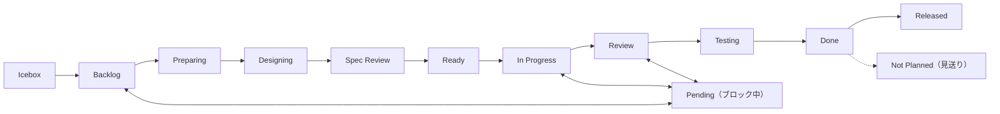

# プロジェクトアイテムルール

## 必須フィールド

| フィールド | 必須 | オプション |
|-----------|------|-----------|
| Status | はい | 下記ワークフロー参照 |
| Priority | はい | Critical / High / Medium / Low |
| Size | 推奨 | XS / S / M / L / XL |
| Type | はい | Organization Issue Types で管理（手動セットアップ） |

## ステータスワークフロー


```mermaid
graph LR
  Icebox --> Backlog --> Preparing --> Designing --> SpecReview[Spec Review]
  SpecReview --> Ready --> InProgress[In Progress] --> Review --> Testing --> Done --> Released
  InProgress <--> Pending["Pending（ブロック中）"]
  Review <--> Pending
  Backlog <--> Pending
  Done -.-> NotPlanned["Not Planned（見送り）"]
```

| ステータス | 説明 |
|-----------|------|
| Icebox | 優先度低、保留。後で Backlog に昇格する可能性あり |
| Backlog | 計画済みの作業。要件の精緻化が必要な場合あり |
| Preparing | `preparing-on-issue` が計画を策定中（pre-work ステータス） |
| Designing | `designing-on-issue` が設計中（pre-work ステータス） |
| Spec Review | 作業開始前の要件レビューゲート |
| Ready | 着手可能。計画承認済みで実装待ちの状態 |
| In Progress | 作業中 |
| Pending | ブロック中（理由を記録） |
| Review | コードレビュー |
| Testing | QA テスト |
| Done | 完了 |
| Not Planned | 明示的に見送り（`issues cancel` で設定） |
| Released | 本番デプロイ済み |

### アイデア → Issue フロー

アイデアや提案は **Discussions**（Research または Knowledge カテゴリ）から始める。Issue ではない。

| 段階 | 場所 | 移行条件 |
|------|------|---------|
| アイデア / 探索 | Discussion | アイデアが最初に挙がったとき |
| 実装決定 | Issue (Backlog) | チームが実装に合意したとき |
| 要件確定 | Issue (Spec Review) | 要件の正式レビューが必要なとき |

## サイズ見積もり

| サイズ | 目安時間 | 例 |
|--------|---------|-----|
| XS | ~1時間 | タイポ修正、設定変更 |
| S | ~4時間 | 小規模機能、バグ修正 |
| M | ~1日 | 中規模機能 |
| L | ~3日 | 大規模機能 |
| XL | 3日以上 | エピック（分割すべき） |

## 本文テンプレート

```markdown
## 目的
{誰}が{何}できるようにする。{なぜ}。

## 概要
{内容}

## 背景
{現状の問題、関連する制約や依存関係}

## 検討事項
- {計画策定時に考慮すべき視点・制約}

## 成果物
{"完了" の定義}
```

> 種別ごとの詳細テンプレート（bug の再現手順、research の調査項目等）は `create-item` リファレンスを参照。

## ステータス更新トリガー

AI は以下のタイミングで Issue ステータスを更新する必要がある:

| トリガー | アクション | 責任者 | コマンド |
|---------|----------|--------|---------|
| 計画策定開始 | → Preparing + アサイン | `preparing-on-issue` | `issues update {n} --field-status "Preparing" --add-assignee @me` |
| 計画策定完了 | → Spec Review | `preparing-on-issue` | `issues update {n} --field-status "Spec Review"` |
| ユーザーが計画承認、実装開始 | → In Progress + ブランチ | `working-on-issue` | `issues update {n} --field-status "In Progress"` |
| PR 作成完了 | → Review | `open-pr-issue` | `issues update {n} --field-status "Review"` |
| マージ | → Done | `commit-issue` (via `pr merge`) | 自動更新 |
| ブロック | → Pending | 手動 | `issues update {n} --field-status "Pending"` + 理由 |
| 完了（PR不要） | → Done | `ending-session` | `session end --done {n}` |
| キャンセル | → Not Planned | `issues cancel` | `issues cancel {n}` |
| セッション終了 | → Review or Done | `ending-session`（セーフティネット） | `session end --review/--done {n}` |

### Preparing の運用

- **目的**: 計画策定中であることの可視化、計画開始タイムスタンプの記録
- **入口**: `preparing-on-issue` が `plan-issue` に委任する前に設定
- **出口**: 計画完了後 → Designing（設計が必要な場合）または Spec Review

### Designing の運用

- **目的**: 設計作業中であることの可視化
- **入口**: `preparing-on-issue` が設計フェーズ必要と判断時に設定
- **出口**: 設計完了 → Spec Review

### Spec Review の運用

- **目的**: ユーザーが計画を確認・承認するゲート
- **入口**: `preparing-on-issue` が計画レビュー通過後に設定
- **出口**: ユーザーが承認し `working-on-issue` で実装を開始 → In Progress

### Ready の運用

- **目的**: 計画承認後、実装着手可能な状態の可視化
- **入口**: Spec Review でユーザーが計画を承認、または手動設定
- **出口**: `working-on-issue` で実装開始 → In Progress

### ルール

1. **同時に In Progress は1つ** — 新しい作業を始める前に前のアイテムを移動する（例外: バッチモード、エピック）
2. **Issue ごとにブランチ** — 作業開始時にフィーチャーブランチを作成（例外: バッチ・エピック）
3. **イベント駆動**: Status 変更はイベント発生時に即座に実行する
4. **セッション終了時**に `ending-session` が取りこぼしを補完（セーフティネット）
5. **Pending は理由必須** — ブロッカーを説明するコメントを追加
6. **冪等性**: 既に正しい Status なら更新をスキップ（エラーにしない）

エピックのステータス管理・ビルトイン自動化・ラベル詳細・アイテム本文メンテナンス・アイテム作成ガイドラインは `managing-github-items/reference/project-items-details.md` を参照。
