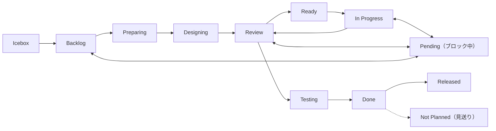

# プロジェクトアイテムルール

## 必須フィールド

| フィールド | 必須 | オプション |
|-----------|------|-----------|
| Status | はい | 下記ワークフロー参照 |
| Priority | はい | Critical / High / Medium / Low |
| Size | 推奨 | XS / S / M / L / XL |
| Type | はい | Organization Issue Types で管理（手動セットアップ） |

## ステータスワークフロー


```mermaid
graph LR
  Icebox --> Backlog --> Preparing --> Designing --> Review
  Review --> Ready --> InProgress[In Progress] --> Review --> Testing --> Done --> Released
  InProgress <--> Pending["Pending（ブロック中）"]
  Review <--> Pending
  Backlog <--> Pending
  Done -.-> NotPlanned["Not Planned（見送り）"]
```

| ステータス | 説明 |
|-----------|------|
| Icebox | 優先度低、保留。後で Backlog に昇格する可能性あり |
| Backlog | 計画済みの作業。要件の精緻化が必要な場合あり |
| Preparing | `prepare-flow` が計画を策定中（pre-work ステータス） |
| Designing | `design-flow` が設計中（pre-work ステータス） |
| Ready | 着手可能。計画承認済みで実装待ちの状態 |
| In Progress | 作業中 |
| Pending | ブロック中（理由を記録） |
| Review | AI 作業完了・人間レビュー可能（計画承認ゲートまたはコードレビュー待ち） |
| Testing | QA テスト |
| Done | 完了 |
| Not Planned | 明示的に見送り（`items cancel` で設定） |
| Released | 本番デプロイ済み |

### PR のステータスワークフロー

PR は Issue と同じ Status フィールドを使用し、Issue ワークフローのサブセットで運用する。レビュー状態の詳細は GitHub PR ネイティブの `review_decision`（APPROVED / CHANGES_REQUESTED / REVIEW_REQUIRED）で管理する。

| Status | 説明 | 遷移トリガー |
|--------|------|-------------|
| In Progress | PR 作成直後 | `open-pr-issue` が PR を Projects に追加時に設定 |
| Review | レビュー依頼後 | `implement-flow` チェーン末尾で Issue と同時に設定 |
| Done | マージ後 | `items pr merge` で自動設定 |

**使用しないステータス**: Backlog, Preparing, Designing, Ready, Icebox, Testing, Released, Pending, Not Planned は PR には適用しない。

> `items integrity` は PR ステータスの不整合を検出する（OPEN PR が Done、MERGED/CLOSED PR がアクティブステータス、Issue 専用ステータスの使用）。

### 2 階層ステータスモデル（エピック / サブ Issue）

エピック Issue のステータスはサブ Issue の状態から**自動導出**される。手動更新は原則不要。

| サブ Issue の状態 | 親 Issue への影響 |
|----------------|----------------|
| 全サブ Issue が Done | 親を Done に自動遷移 |
| 一部が In Progress / Review | 親を In Progress に維持 |
| 一部が Done + 残りが Backlog / Preparing | 親を In Progress に維持（進行中とみなす） |
| 全サブ Issue が Not Planned | 親を Backlog に自動戻し |

**リアクティブ自動導出**: CLI が `items push`、`items close`（`items cancel` 含む）、`items update-status`、`items pr merge` 実行時にサブ Issue のステータス変更を検出し、親のステータスを自動的に導出・更新する。明示的な `items integrity --fix` の実行は不要（バッチ整合性チェックとしては引き続き利用可能）。

### 計画リセットフロー

エピックの計画を白紙に戻す場合（サブ Issue が作成済みの場合）:

1. 全サブ Issue を `items cancel {sub-numbers}` で Not Planned に変更（CLI が自動的に親を Backlog に遷移）
2. `prepare-flow` で再計画

### アイデア → Issue フロー

アイデアや提案は **Discussions**（Research または Knowledge カテゴリ）から始める。Issue ではない。

| 段階 | 場所 | 移行条件 |
|------|------|---------|
| アイデア / 探索 | Discussion | アイデアが最初に挙がったとき |
| 実装決定 | Issue (Backlog) | チームが実装に合意したとき |
| 要件確定 | Issue (Review) | 要件の正式レビューが必要なとき |

## サイズ見積もり

| サイズ | 目安時間 | 例 |
|--------|---------|-----|
| XS | ~1時間 | タイポ修正、設定変更 |
| S | ~4時間 | 小規模機能、バグ修正 |
| M | ~1日 | 中規模機能 |
| L | ~3日 | 大規模機能 |
| XL | 3日以上 | エピック（分割すべき） |

## 本文テンプレート

```markdown
## 目的
{誰}が{何}できるようにする。{なぜ}。

## 概要
{内容}

## 背景
{現状の問題、関連する制約や依存関係}

## 検討事項
- {計画策定時に考慮すべき視点・制約}

## 成果物
{"完了" の定義}
```

> 種別ごとの詳細テンプレート（bug の再現手順、research の調査項目等）は `create-item` リファレンスを参照。

## ステータス更新トリガー

AI は以下のタイミングで Issue ステータスを更新する必要がある:

| トリガー | アクション | 責任者 | コマンド |
|---------|----------|--------|---------|
| 計画策定開始 | → Preparing + アサイン | `prepare-flow` | `items pull {n}` → frontmatter の `status` + `assignees` 編集 → `items push {n}` |
| 計画策定完了 | → Review | `prepare-flow` | frontmatter `status: "Review"` → `items push {n}` |
| ユーザーが計画承認、実装開始 | → In Progress + ブランチ | `implement-flow` | frontmatter `status: "In Progress"` → `items push {n}` |
| implement-flow 全工程完了 | → Review | `implement-flow` | frontmatter `status: "Review"` → `items push {n}`（PR 作成・simplify・security-review・作業サマリー後） |
| マージ | → Done | `commit-issue` (via `pr merge`) | 自動更新 |
| ブロック | → Pending | 手動 | frontmatter `status: "Pending"` → `items push {n}` + 理由 |
| 完了（PR不要） | → Done | 手動 | `items update-status --done {n}` |
| キャンセル | → Not Planned | `items cancel` | `items cancel {n}` |
| 計画承認 | → Done（計画 Issue） | `implement-flow` | frontmatter `status: "Done"` → `items push {plan-n}` |

> **GitHub Projects 組み込み自動化**: `Pull request linked to issue` ワークフローを有効化すると、PR が Issue にリンクされた時点で Issue と PR が自動的に Project に追加される。また PR の日時フィールド（Start DATE / Review Start DATE / End DATE）は `items integrity` が自動で設定する。ワークフロー有効化手順は `github-commands.md` の「GitHub Projects ワークフロー設定」セクションを参照。

### Preparing の運用

- **目的**: 計画策定中であることの可視化、計画開始タイムスタンプの記録
- **入口**: `prepare-flow` が `plan-issue` に委任する前に設定
- **出口**: 計画完了後 → Designing（設計が必要な場合）または Review

### Designing の運用

- **目的**: 設計作業中であることの可視化
- **入口**: `prepare-flow` が設計フェーズ必要と判断時に設定
- **出口**: 設計完了 → Review

### Review の運用（AI 作業完了・人間レビュー可能）

Review は「AI の作業が完了し、人間がレビュー可能な状態」を意味する統一ステータス。2 つの文脈で使用される:

**1. 計画承認ゲート（計画 Issue / 通常 Issue）**
- **入口**: `prepare-flow` が計画レビュー通過後に設定
- **出口**: ユーザーが承認し `implement-flow` で実装を開始 → In Progress

**2. コードレビュー待ち（実装完了後）**
- **入口**: `implement-flow` チェーン全工程（実装・テスト・PR 作成・simplify・security-review・作業サマリー）完了後に設定
- **出口**: レビュー完了 → Testing または Done

> **重要**: PR 作成時点では Review に遷移しない。PR 作成後も `/simplify` やセキュリティレビューなどの AI 工程が残っているため、全工程完了後に遷移する。

### Ready の運用

- **目的**: 計画承認後、実装着手可能な状態の可視化
- **入口**: Review でユーザーが計画を承認、または手動設定
- **出口**: `implement-flow` で実装開始 → In Progress

### ルール

1. **同時に In Progress は1つ** — 新しい作業を始める前に前のアイテムを移動する（例外: バッチモード、エピック）
2. **Issue ごとにブランチ** — 作業開始時にフィーチャーブランチを作成（例外: バッチ・エピック）
3. **イベント駆動**: Status 変更はイベント発生時に即座に実行する
4. **Pending は理由必須** — ブロッカーを説明するコメントを追加
5. **冪等性**: 既に正しい Status なら更新をスキップ（エラーにしない）

## 計画 Issue 方式

計画は親 Issue の子 Issue（タイトルが「計画:」で始まる Issue）として作成される。これにより計画が独立した Issue として管理され、GitHub Projects 上でフェーズ進捗を可視化できる。

### 計画 Issue の構造

- **タイトル**: `計画: {親 Issue のタイトル}`
- **ステータス**: `Review`
- **ラベル**: `area:plan`
- **本文**: 計画の全内容（アプローチ・変更ファイル・タスク分解・リスク等）

### 計画 Issue のステータス遷移

計画 Issue は実作業の進捗には関与せず、計画自体のライフサイクルを表す。

| Status | 説明 | 遷移トリガー |
|--------|------|-------------|
| Review | 計画策定完了、レビュー待ち / コードレビュー待ち | `prepare-flow` が計画作成後に設定（計画 Issue）または `implement-flow` チェーン末尾（PR） |
| Done | 計画承認済み | `implement-flow` が実装開始時、または手動承認時 |

**`items integrity` の集計除外**: 親 Issue のステータス自動導出時、`area:plan` ラベルの計画 Issue はサブ Issue ステータス集計から除外する。これにより、計画 Issue が Review のまま残っていても親の In Progress 導出に影響しない。

> `classifyParentStatusInconsistencies` は `area:plan` ラベルの計画 Issue をサブ Issue ステータス集計から除外する。`syncParentStatus`（リアクティブ導出）も同様に除外する。

### 計画 Issue の参照

`subIssuesSummary` からタイトルが「計画:」で始まる子 Issue を特定し、`items pull {plan-issue-number}` で本文を取得する。

```bash
shirokuma-docs items pull {parent-number}
# → subIssuesSummary からタイトルが「計画:」で始まる子 Issue を特定
shirokuma-docs items pull {plan-issue-number}
# → .shirokuma/github/{org}/{repo}/issues/{plan-issue-number}/body.md を Read ツールで読み込む
```

> **後方互換**: 計画 Issue が存在せず Issue 本文に `## 計画` セクションがある場合（旧方式）は、フォールバックとして使用する。

## 計画と実装の乖離時の Issue 本文更新

Issue 本文はレビュワーにとっての一次情報源である。実装が計画から逸脱した場合、Issue 本文を実態に合わせて更新する。

### 更新が必要なケース

| 判定基準 | 更新が必要 | 更新不要 |
|---------|----------|---------|
| ファイル構成 | 計画にないファイルを追加/削除した | 計画通りのファイルを変更した |
| アプローチ | 計画と異なる実装方針を採用した | 計画通りの方針で実装した |
| スコープ | タスクを追加/削除/分割した | 計画通りのタスクを完了した |

### 更新内容

1. **タスクチェックリスト**: `## 計画` の `### タスク分解` にある `- [ ]` を完了分について `- [x]` に更新する
2. **計画変更の注記**: 変更箇所に取り消し線と変更理由を追記する

```markdown
### アプローチ

~~フラットファイルに要約・統合する~~
→ サブディレクトリにコピーする（実装時に変更: 知識欠落リスクを回避するため）
```

### タイミング

チェーンの一部として自動化しない。以下のタイミングで AI が判断して実行する:

- 実装中に方針変更が確定した時点
- PR 作成後のセルフレビュー時
- レビュワーから指摘を受けた時点

コメントファースト原則に従い、乖離の理由をコメントとして記録してから本文を更新する。コメントは判断根拠・検討した代替案など「なぜそうしたか」を含む一次記録であること。

### コマンド

```bash
shirokuma-docs items push {number}
```

エピックのステータス管理・ビルトイン自動化・ラベル詳細・アイテム本文メンテナンス・アイテム作成ガイドラインの詳細は `managing-github-items` スキル実行時に自動ロードされる。

## Issue/PR/Discussion 確認時のコメント取得規約

### `items pull` vs サブコマンド直接呼び出しの使い分け

| コマンド | 返却内容 | 用途 |
|---------|---------|------|
| `shirokuma-docs items pull {number}` | 本文 + コメント全件（キャッシュ） | Issue/PR/Discussion の内容確認、レビュー、実装前調査 |
| `shirokuma-docs items pull {number}` | 本文のみ | フィールド値（Status/Priority 等）の確認のみ |
| `shirokuma-docs items pr show {number}` | 本文のみ | PR メタデータ（ブランチ、変更数等）の確認のみ |
| `shirokuma-docs items discussions show {number}` | 本文のみ | Discussion 本文の確認のみ |

### コメント全件読み込みを前提とするワークフロー

AI が Issue/PR/Discussion の内容を確認する場合は、**`shirokuma-docs items pull {number}` を使いコメントをキャッシュし、`.shirokuma/github/{org}/{repo}/issues/{number}/body.md` を Read ツールで読み込む**。これにより、以下の情報を把握できる:

- Issue: 本文 + 全コメント（計画詳細、議論の経緯、ブロッカー情報）
- PR: 本文 + レビューコメント + レビュースレッド + 通常コメント
- Discussion: 本文 + 全コメント + 返信（スレッド構造）

### コメントの書き方規約

| 目的 | コメントに含める内容 |
|------|-------------------|
| 計画の判断根拠 | 選定アプローチの理由・検討した代替案・調査で判明した制約（計画 Issue へのコメントとして投稿） |
| 実装中の方針変更 | 変更理由・検討した代替案・「なぜそうしたか」の一次記録 |
| ブロッカー通知 | ブロッカーの内容・影響範囲・解除条件 |
| レビュー指摘への返答 | 対応内容・変更箇所・残課題 |

コメントは「なぜ」を含む一次記録であること。単なる「何をした」の記録は避ける。

### 本文更新のトリガー

コメントで記録した内容が Issue/PR の最終状態と乖離する場合は本文を更新する。ただし**コメントファースト原則**を守り、先にコメントで記録してから本文を更新する。

| 更新が必要 | 更新不要 |
|-----------|---------|
| 計画と異なる実装方針を採用した | 計画通りの実装が完了した |
| スコープ（タスク・ファイル）が変更された | 細部の実装詳細のみ変更された |
| 成果物の定義が変わった | バグ修正・微調整レベルの変更 |
