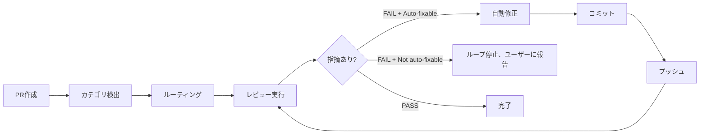

# プルリクエスト作成

フィーチャーブランチから `develop` への PR を作成する。

## ワークフロー

### ステップ 1: ブランチ状態確認

```bash
git branch --show-current
git status --short
git log --oneline develop..HEAD
```

**事前チェック:**
- フィーチャーブランチにいること（`develop` や `main` ではない）
- 変更がコミット済み
- `develop` より先にコミットあり

`develop` または `main` にいる場合、先にフィーチャーブランチを作成するよう案内する。

### ステップ 2: プッシュ

```bash
git push -u origin {branch-name}
```

### ステップ 3: 変更分析

```bash
git log --oneline develop..HEAD
git diff --stat develop..HEAD
```

最新コミットだけでなく全コミットを把握。

### ステップ 4: PR作成

```bash
gh pr create --base develop --title "{title}" --body "$(cat <<'EOF'
## 概要
- {箇条書き}

## 関連 Issue
{Closes #N or Refs #N}

## テスト計画
- [ ] {テスト項目}
EOF
)"
```

**タイトルルール**: 70文字以内、プレフィックス(`feat:` 等)は英語、**それ以降は日本語**で記述する。Issue番号はタイトルに入れない。

### ステップ 5: 完了レポート

PR URL、ブランチ、コミット数、概要、リンクされた Issue を表示。

### ステップ 6: セルフレビューチェーン

PR 作成後、セルフレビューを**常に自動実行**する。

> **⚠️ Status 変更禁止**: セルフレビュー中（ステップ 6 実行中）は Issue の Status を変更してはならない。Status は **In Progress を維持**する。Review への遷移はステップ 7 でのみ行う。

#### 6a. ファイルカテゴリ検出

`git diff --name-only develop..HEAD` で変更ファイルを取得し、カテゴリを判定：

| カテゴリ | 判定条件 |
|---------|---------|
| config | `.claude/skills/`, `.claude/rules/`, `.claude/agents/`, `.claude/output-styles/`, `.claude/commands/`, `plugin/` 配下 |
| code | `.ts`, `.tsx`, `.js`, `.jsx` ファイル |
| docs | `.md` ファイル（上記 config パス配下を除く） |

**ルーティング:**

| ファイル構成 | レビュー方法 |
|-------------|-------------|
| config のみ | `reviewing-claude-config` のみ起動 |
| code/docs のみ（config なし） | `reviewing-on-issue` のみ起動（従来通り） |
| 混在（config + code/docs） | `reviewing-on-issue` → `reviewing-claude-config` 順次起動 → 結果統合 |

**混在時の結果統合ルール:**
- Status: いずれかが FAIL → FAIL
- Critical/Warning: 両方の合計
- Files with issues: マージ
- Auto-fixable: いずれかが no → no

#### 6b. セルフレビューループ



**ループ上限**: 最大3イテレーション（初回レビュー + 最大2回の修正・再レビュー）

**手順:**

1. カテゴリ検出して適切なスキルを起動（PR 番号をコンテキストとして渡す）
2. レビュー結果の Self-Review Result を確認し、PR コメントとしてレビューレポートが投稿済みであることも確認する。未投稿の場合は `shirokuma-docs issues comment {PR#} --body /tmp/review-summary.md` で手動投稿する：
   - **PASS**: ループ終了、完了報告
   - **FAIL + Auto-fixable: yes**: 指摘に基づき自動修正 → `git add` → `git commit` → `git push` → 再レビュー
   - **FAIL + Auto-fixable: no**: ループ停止、手動対応が必要な指摘を報告
3. 3イテレーションでも FAIL の場合はループ停止、残りの指摘を報告

**安全策:**
- イテレーション間で issue 数が増加した場合（修正が新たな問題を生んだ場合）、ループを停止して報告
- 各イテレーションのフィードバックを蓄積（`reviewing-on-issue` のフィードバック蓄積機能）

**進捗報告:**

```text
セルフレビュー [1/3]: カテゴリ検出 → config + code（混在）
  reviewing-on-issue 実行中...
  reviewing-claude-config 実行中...
  → 統合結果: 2 件の critical issue 検出、自動修正中...
  → 修正完了、コミット・プッシュ

セルフレビュー [2/3]: 再レビュー実行中...
  → 問題なし。セルフレビュー完了。
```

#### 6c. レビュー結果の本文反映

セルフレビューループ完了後（PASS またはループ停止）、レビュー指摘により Issue 本文の更新が必要な場合（タスクリストの追加、セキュリティ修正メモ等）:

1. **追加コメント不要**: `reviewing-on-issue` のレビューコメント自体がコメントファーストの「コメント」に該当する。新たなコメント投稿は不要で、レビューコメントが一次記録として機能する（`item-maintenance.md` 参照）。
2. **本文への統合**: レビュー指摘に基づき、Issue 本文の該当セクション（タスクリスト、成果物等）を更新する。具体的な手順パターンは `item-maintenance.md` の「レビュー結果からの本文更新」セクションを参照。

**条件付き実行**: レビューが PASS で指摘がない場合、本文更新は不要のためこのステップをスキップ。

### ステップ 7: Status 更新

> **前提条件**: ステップ 6（セルフレビューチェーン）が完全に完了していること。セルフレビュー実行中にこのステップを先行実行してはならない。

セルフレビューチェーン完了後（PASS またはループ停止）、Issue 番号ありで起動された場合に Status を Review に更新する:

```bash
shirokuma-docs issues update {number} --field-status "Review"
```

Issue 番号なしの場合はこのステップをスキップ（`ending-session` のセーフティネットでカバー）。

## バッチモード

バッチブランチ上、またはバッチコンテキスト（複数 Issue 番号）が渡された場合:

### バッチ PR 本文

バッチブランチのコミットログから Issue 番号を抽出し、Issue 別変更サマリーを生成:

```bash
git log --oneline develop..HEAD
```

**PR 本文フォーマット:**

```markdown
## 概要
{バッチ全体の説明}

## Issue 別変更内容

### #{N1}: {タイトル}
- {コミットからの変更サマリー}

### #{N2}: {タイトル}
- {コミットからの変更サマリー}

## 関連 Issue
Closes #{N1}, #{N2}, #{N3}

## テスト計画
- [ ] {検証項目}
```

### バッチ Status 更新（ステップ 7）

リンクされた全 Issue の Status を Review に更新:

```bash
shirokuma-docs issues update {n} --field-status "Review"
# (各 Issue に対して繰り返し)
```

## 引数

Issue 番号付きで起動された場合（例: `/creating-pr-on-issue 39`）：
- PR 本文に `Closes #39` を含める
- Issue のコンテキストから PR タイトルを生成

## 言語

PR のタイトルと本文は日本語で記述する。Conventional commit プレフィックス (`feat:`, `fix:` 等) は常に英語。

セルフレビューで起動される `reviewing-on-issue` のレポート出力言語も `output-language` ルールに準拠すること。

**NGタイトル例（日本語設定なのに英語）:**

```
feat: add branch workflow rules          ← 日本語設定では不正
docs: update CLAUDE.md command table     ← 日本語設定では不正
```

## エッジケース

| 状況 | アクション |
|------|----------|
| develop/main にいる | フィーチャーブランチ必要 |
| 未コミット変更あり | 先にコミットを提案 |
| コミットなし | PR作成不可 |
| 既存PRあり | URL表示 |
| プッシュ失敗 | エラー表示、`git pull --rebase` を提案 |

## 次のステップ（スタンドアロン起動時のみ）

`working-on-issue` チェーンから呼ばれた場合はセルフレビュー完了後にチェーンが自動続行するため、このセクションは適用されない。スタンドアロンで起動された場合のみ、次のワークフローステップを提案：

```
PR を作成しました。次のステップ:
→ `/ending-session` で引き継ぎを保存し Issue ステータスを更新
```

## 注意事項

- PR作成前に必ずプッシュ
- `develop` や `main` から PR を作成しない
- 日常作業は `develop` ターゲット（`main` はホットフィックスのみ）
- `main` への直接 PR 禁止（ホットフィックスのみ例外）
- ブランチ未作成・未コミット時は AskUserQuestion でコミットまたはブランチ作成を提案
- Issue 参照を含めて自動リンクを有効にする
- PR 本文は簡潔かつ情報量を確保
- セルフレビューは常に自動実行
- PR 本文に AI 署名（`🤖 Generated with Claude Code` 等）を含めない
