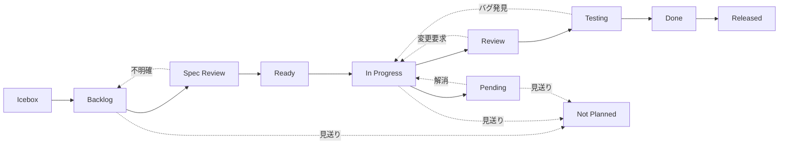

# ステータスオプションリファレンス

## ワークフロー図

## ステータス定義

| ステータス | 色 | 用途 | 次のステータス |
|-----------|-----|------|--------------|
| Icebox | Gray | 将来検討するアイデア | Backlog |
| Backlog | Blue | 優先順位付き作業項目 | Spec Review |
| Spec Review | Pink | 要件・仕様レビュー中 | Ready / Backlog |
| Ready | Green | 開始可能、依存関係解決済み | In Progress |
| In Progress | Yellow | 作業中（1人1つまで） | Review / Pending |
| Pending | Red | 一時的にブロック中（理由必須） | 元のステータス |
| Review | Purple | PR レビュー待ち | Testing / In Progress |
| Testing | Orange | QA・テスト中 | Done / In Progress |
| Done | Green | 完了・マージ済み | Released |
| Released | Green | 本番デプロイ済み | - |
| Not Planned | Gray | 見送り・対応不要。Issue close 時に stateReason=NOT_PLANNED で自動設定。 | - |

## 使用例

### Icebox

| 使用タイミング | 例 |
|-------------|-----|
| アイデアを思いついた | 「ダークモード対応したい」 |
| 将来検討 | 「v2.0 で検討」 |
| 低優先度 | 「あれば良い機能」 |

### Pending

| 使用タイミング | 例 |
|-------------|-----|
| 他タスク/PR 待ち | 「#123 のマージ待ち」 |
| 外部レスポンス待ち | 「クライアント確認待ち」 |
| 技術的ブロッカー | 「ライブラリのバグを報告済み」 |

**重要**: ブロック理由は必ずコメントに記録すること。

### Not Planned

| 使用タイミング | 例 |
|-------------|-----|
| 要件が不要になった | 「仕様変更により対応不要」 |
| 別 Issue で対応済み | 「#456 で解決済み」 |
| 見送り判断 | 「ROI が合わないため見送り」 |

**重要**: Issue を close する際に `stateReason=NOT_PLANNED` を指定すると自動設定される。
