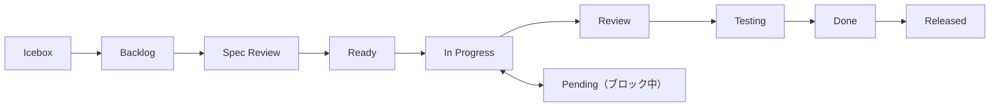

# GitHub 操作リファレンス

セッション/GitHub スキル共通リファレンス。CLI コマンド、ワークフロー、規約の単一情報源。

## アーキテクチャ: Issues + Projects ハイブリッド

| コンポーネント | 用途 |
|-------------|------|
| **Issues** | タスク管理、`#123` 参照、履歴 |
| **Projects** | Status/Priority/Size フィールド管理 |
| **Labels** | 影響範囲の補助分類（`area:cli`, `area:plugin` 等） |
| **Discussions** | 引き継ぎ、仕様、決定事項、Q&A |

**ステータスは Projects フィールドで管理**（ラベルではない）。

Project 命名規約: Project 名 = リポジトリ名（例: `blogcms` リポ → `blogcms` プロジェクト）。

## 前提条件

- `gh` CLI インストール・認証済み
- GitHub Project 設定済み（未設定なら `/setting-up-project` を実行）
- Discussions 有効化（カテゴリ: Handovers, Ideas, Q&A）（任意）

## DraftIssue vs Issue

| 機能 | DraftIssue | Issue |
|------|-----------|-------|
| `#number` | なし | あり（`#123`） |
| 外部参照 | 不可 | 可 |
| コメント | 不可 | 可 |
| 作成コマンド | `projects create` | `issues create` |
| ユースケース | 軽量メモ | 完全なタスク |

**推奨**: `#number` サポートのため `issues create` をデフォルトで使用。

## shirokuma-docs CLI リファレンス

直接の `gh` コマンドより shirokuma-docs CLI を優先。設定は `shirokuma-docs.config.yaml`。

### Issues（主要インターフェース）

```bash
shirokuma-docs issues list                          # オープン Issue 一覧
shirokuma-docs issues list --all                    # クローズ含む
shirokuma-docs issues list --status "In Progress"   # ステータスフィルタ
shirokuma-docs issues show {number}                  # 詳細
shirokuma-docs issues create \
  --title "Title" --body /tmp/body.md \
  --labels "area:cli" \
  --field-status "Backlog" --priority "Medium" --size "M"
shirokuma-docs issues update {number} --field-status "In Progress"
shirokuma-docs issues update {number} --add-label "area:cli"       # ラベル追加
shirokuma-docs issues update {number} --remove-label "area:docs"   # ラベル削除
shirokuma-docs issues comment {number} --body - <<'EOF'
コメント内容
EOF
shirokuma-docs issues comments {number}                 # コメント一覧
shirokuma-docs issues close {number}
shirokuma-docs issues reopen {number}
```

### Issues — Pull Requests

```bash
shirokuma-docs issues pr-list                               # PR 一覧（デフォルト: open）
shirokuma-docs issues pr-list --state merged --limit 5     # フィルタリング
shirokuma-docs issues pr-show {number}                      # PR 詳細（body, diff stats, linked issues）
shirokuma-docs issues pr-comments {number}                  # レビューコメント・スレッド
shirokuma-docs issues merge {number} --squash               # マージ + ステータス更新
shirokuma-docs issues pr-reply {number} --reply-to {id} --body - <<'EOF'
返信内容
EOF
shirokuma-docs issues resolve {number} --thread-id {id}    # スレッド解決
```

### Projects（低レベルアクセス）

```bash
shirokuma-docs projects list                        # プロジェクトアイテム一覧
shirokuma-docs projects fields                      # フィールドオプション表示
shirokuma-docs projects add-issue {number}          # Issue をプロジェクトに追加
shirokuma-docs projects create \
  --title "Title" --body /tmp/body.md \
  --field-status "Backlog" --priority "Medium"               # DraftIssue
shirokuma-docs projects get PVTI_xxx                # アイテム ID で取得
shirokuma-docs projects update {number} --field-status "Done"
```

### Discussions

```bash
shirokuma-docs discussions list --category Handovers --limit 5
shirokuma-docs discussions show {number}
shirokuma-docs discussions create \
  --category Handovers \
  --title "$(date +%Y-%m-%d) - Summary" \
  --body /tmp/body.md
```

### Repository

```bash
shirokuma-docs repo info
shirokuma-docs repo labels
```

### クロスリポジトリ操作

```bash
shirokuma-docs issues list --repo docs
shirokuma-docs issues create --repo docs --title "Title" --body /tmp/body.md
```

### gh フォールバック（CLI 未対応の操作のみ）

```bash
# ラベル管理
gh label list
gh label create "name" --color "0E8A16" --description "Desc"

# リポジトリ情報
gh repo view --json nameWithOwner -q '.nameWithOwner'

# 認証
gh auth login
gh auth status

# PR 作成（shirokuma-docs CLI 未対応 — 単一操作で完結するため gh 直接使用を許容）
gh pr create --base develop --title "feat: タイトル (#42)" --body "$(cat /tmp/body.md)"
```

## `--body` 使い分け

| Tier | パターン | 用途 |
|------|---------|------|
| Tier 1 (stdin) | `--body - <<'EOF'...EOF` | コメント、返信、短い理由 |
| Tier 2 (file) | Write → `--body /tmp/xxx.md` | Issue/Discussion 本文、引き継ぎ |

heredoc delimiter は `<<'EOF'`（シングルクォートで変数展開防止）。

## ステータスワークフロー



| ステータス | 説明 |
|-----------|------|
| Icebox | 低優先度、未計画 |
| Backlog | 将来の作業として計画済み |
| Spec Review | 要件レビュー中 |
| Ready | 開始可能 |
| In Progress | 作業中 |
| Pending | ブロック中（理由を記録） |
| Review | コードレビュー中 |
| Testing | QA テスト中 |
| Done | 完了 |
| Released | 本番デプロイ済み |

## ラベル規約

作業種別の分類は **Issue Types**（Organization レベルの Type フィールド）が主な手段。ラベルは作業の**影響範囲**を示す補助的な仕組み:

| 仕組み | 役割 | 例 |
|--------|------|-----|
| Issue Types | 作業の**種類** | Feature, Bug, Chore, Docs, Research |
| エリアラベル | 作業の**影響範囲** | `area:cli`, `area:plugin` |
| 運用ラベル | トリアージ・ライフサイクル | `duplicate`, `invalid`, `wontfix` |

ラベルはプロジェクト構造に合わせて手動追加。ステータスは Projects フィールドで管理。

## よくあるエラー対処

| エラー | 対処 |
|-------|------|
| `shirokuma-docs: command not found` | インストール: `npm i -g @shirokuma-library/shirokuma-docs` |
| `gh: command not found` | インストール: `brew install gh` or `sudo apt install gh` |
| `not logged in` / `not authenticated` | 実行: `gh auth login` |
| No project found | `/setting-up-project` を実行してプロジェクト作成 |
| Discussions disabled/category not found | ローカルファイルにフォールバック |
| `HTTP 404` | リポジトリ名と権限を確認 |
| API rate limit | キャッシュ済み/部分データを表示 |
