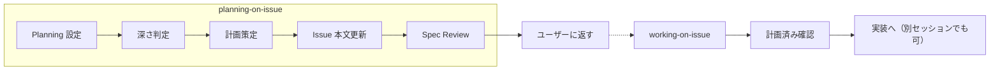

# Issue の計画

Issue の要件を分析し、実装計画を策定して Issue 本文に永続化する。計画完了後はステータスを Spec Review に変更し、ユーザー承認を待つ。**実装には進まない。**

## いつ使うか

- **全 Issue で実施** — 計画の深さを Issue の内容に応じて調整する
- `working-on-issue` が計画未済の Issue を検出した場合
- ユーザーが明示的に計画を求めた場合



## 計画レベル

Issue の内容に応じて計画の深さを調整する。サイズではなく、**内容の複雑度・不確実性**で判定。

| レベル | 内容 | 例 |
|--------|------|-----|
| 軽量 | アプローチ1-2行 + 確認 | タイポ修正、設定変更、単純なバグ修正 |
| 標準 | アプローチ + 変更ファイル + タスク分解 | 新機能、リファクタリング、中程度の修正 |
| 詳細 | 複数案比較 + リスク分析 + テスト戦略 | アーキテクチャ変更、破壊的変更、複数システム連携 |

### 深さの判定基準

AI が Issue の title/body/type/comments から以下を判断:

| 基準 | 軽量 | 標準 | 詳細 |
|------|------|------|------|
| 変更ファイル数（推定） | 1-2 | 3-5 | 6+ |
| 設計判断の有無 | なし | あり | 複数案あり |
| 既存動作への影響 | なし | 限定的 | 広範囲 |
| テスト影響 | 既存で十分 | 追加必要 | 戦略検討必要 |

1つでも上位レベルの基準に該当すれば、そのレベルを採用する。

## ワークフロー

### ステップ 1: Issue 取得

```bash
shirokuma-docs issues show {number}
```

title, body, type, priority, size, labels, コメントを確認。

### ステップ 1b: ステータスを Planning に更新 + アサイン

Issue のステータスが Backlog の場合、Planning に遷移して計画開始を記録する。同時にユーザーを自動アサインする。

```bash
shirokuma-docs issues update {number} --field-status "Planning"
gh issue edit {number} --add-assignee @me
```

既に Planning / Spec Review の場合はステータス更新をスキップ。アサインは冪等なので常に実行する。

### ステップ 2: コードベース調査

Issue の要件に関連するコードを調査する。

1. **既存実装の確認**: Grep/Glob で関連ファイルを特定
2. **依存関係の把握**: 変更が影響するモジュール・テストを確認
3. **パターンの確認**: 類似の実装がコードベースにあるか確認

調査には Task（Explore エージェント）を活用し、コンテキスト消費を抑える。

### ステップ 3: 計画策定

Issue の内容と調査結果から計画レベルを判定し、レベルに応じた計画を作成する。

#### 軽量計画

```markdown
## 計画

### アプローチ
{1-2行で方針を記載}
```

#### 標準計画

```markdown
## 計画

### アプローチ
{選択したアプローチと理由}

### 変更対象ファイル
- `path/to/file.ts` - {変更内容の要約}

### タスク分解
- [ ] タスク 1
- [ ] タスク 2
```

#### 詳細計画

```markdown
## 計画

### アプローチ
{複数案の比較と選定理由}

### 変更対象ファイル
- `path/to/file.ts` - {変更内容の要約}

### タスク分解
- [ ] タスク 1
- [ ] タスク 2

### リスク・懸念
- {破壊的変更、パフォーマンス、セキュリティ等}
```

### ステップ 4: 計画レビュー（まっさらコンテキスト）

計画策定と同じエージェントがレビューしても盲点に気づけない。Task ツールでまっさらなコンテキストのエージェントにレビューを委任する。

#### レビュアーの起動

Issue 本文全体（計画セクション含む）を prompt に直接埋め込む。レビュアーが CLI を持つ前提に依存しない。

```
Task(subagent_type: "general-purpose", prompt: """
あなたは計画レビュアーです。以下の Issue の計画をレビューしてください。

## Issue #{number}: {title}

{Issue 本文全体}

## レビュー観点

| 観点 | 説明 | 具体例 |
|------|------|--------|
| 目的セクションの妥当性 | `## 目的` が「誰が・何を・なぜ」を明確に述べているか | ロールが具体的か、「なぜ」が省略されていないか |
| 要件カバレッジ | 概要・タスクの全要件が計画で漏れなくカバーされているか | 成果物に対応するタスクがあるか |
| 言語・スタイル準拠 | 計画内容が `output-language` ルール（出力言語）と `github-writing-style` ルール（箇条書きガイドライン）に準拠しているか | 日本語設定なのに英語で書かれた計画、箇条書きが適切な箇所での散文的記述 |
| 変更ファイルの妥当性 | 漏れや余分なファイルはないか | 依存するモジュールの見落とし |
| タスク粒度 | 適切な分解か（1タスク ≈ 1コミット） | 粗すぎ or 細かすぎの検出 |
| リスク | 見落としているリスクはないか | 破壊的変更、パフォーマンス影響 |
| Issue 記述の十分性 | Issue 本文だけで計画を理解・評価できるか | 技術的制約が明記されているか、既存コードへの依存が説明されているか |

## 出力形式

以下の形式で結果を返してください:

## Plan Review Result
**Status:** {PASS | NEEDS_REVISION}
**Issues:**
- [{計画 | Issue記述}] {問題点の説明}
**Suggestions:**
- {改善提案}

PASS の場合も Suggestions があれば記載してください。
""")
```

#### レビュー結果の処理

| 結果 | アクション |
|------|----------|
| PASS | ステップ 5 へ進む |
| NEEDS_REVISION | 下記「不合格時の動作」に従い修正・再レビュー |

#### 不合格時の動作

NEEDS_REVISION が返された場合:

1. Issues を **[計画]** と **[Issue記述]** に分類
2. **[Issue記述]** の問題 → Issue 本文の該当セクション（概要、背景、タスク等）を修正
3. **[計画]** の問題 → 計画セクションを修正
4. 修正後に Task で再レビュー（同じ prompt テンプレートで再実行）
5. **最大再試行: 2回**（初回レビュー + 最大2回の修正・再レビュー）
6. 3回目の NEEDS_REVISION → ループ停止、ユーザーに報告して判断を委ねる

```
計画策定 → レビュー → NEEDS_REVISION → 修正 → 再レビュー → PASS → ステップ 5
                                                    ↓ (2回失敗)
                                              ユーザーに報告
```

### ステップ 5: Issue 本文に計画を追記

コメントファーストワークフロー（`project-items` ルールの「ワークフロー順序」参照）に従い、以下の順序で実行する:

#### 5a: コメントで計画の判断根拠を投稿

計画の判断根拠を**一次記録**としてコメントに投稿する。本文の要約ではなく、コメントでしか残らない判断プロセスを記録する。

```bash
shirokuma-docs issues comment {number} --body - <<'EOF'
## 計画の判断根拠

### 選定アプローチ
{選定したアプローチとその理由}

### 検討した代替案
{検討して却下した案とその理由。なければ「代替案なし（明確な単一アプローチ）」}

### 調査で判明した制約
{コードベース調査で発見した技術的制約や依存関係。なければ省略}
EOF
```

**テンプレートの意図**: コメントが「なぜこのアプローチを選んだか」の記録になる。本文の計画セクションは「何をするか」を構造化して記載するため、コメントと本文で役割が分かれる。

> コメントの言語・スタイルは `output-language` ルールと `github-writing-style` ルールに準拠すること。

#### 5b: Issue 本文に計画セクションを追記

既存の Issue 本文の末尾に `## 計画` セクションを追加する。ステップ 3 で判定したレベルに応じたテンプレートを使用。

```bash
shirokuma-docs issues update {number} --body /tmp/body.md
```

**重要**: 既存の本文（概要、タスク、成果物等）は保持し、`## 計画` セクションを**追加**する。既存の `## タスク` セクションがある場合、計画の `### タスク分解` はより具体的な実装ステップとして共存する。

> 計画セクションの見出し・内容は `output-language` ルールに準拠すること。`github-writing-style` ルールの箇条書きガイドラインにも従う。

### ステップ 6: ステータス更新

```bash
shirokuma-docs issues update {number} --field-status "Spec Review"
```

### ステップ 7: ユーザーに返す

計画のサマリーを表示し、承認を求める。**実装には進まない。**

計画レベルに応じたサマリーを表示:

#### 軽量計画の場合

```markdown
## 計画完了: #{number} {title}

**ステータス:** Spec Review（承認待ち）
**レベル:** 軽量

### 計画サマリー
- **アプローチ:** {1行要約}

問題なければ `/working-on-issue #{number}` で実装を開始してください。
```

#### 標準/詳細計画の場合

```markdown
## 計画完了: #{number} {title}

**ステータス:** Spec Review（承認待ち）
**レベル:** {標準 | 詳細}

### 計画サマリー
- **アプローチ:** {1行要約}
- **変更ファイル数:** {N}件
- **タスク数:** {N}ステップ

計画を確認し、問題なければ `/working-on-issue #{number}` で実装を開始してください。
修正が必要な場合はフィードバックをお願いします。
```

## GitHub 書き込みルール

Issue のコメント・本文への書き込みは `output-language` ルールと `github-writing-style` ルールに準拠すること。

**NG例（日本語設定なのに英語）:**

```
### Approach
Add GitHub writing rule references to each skill...  ← 日本語設定では不正
```

**OK例:**

```
### アプローチ
各スキルに GitHub 書き込みルールの参照を追加し...
```

## 引数

| 形式 | 例 | 動作 |
|------|---|------|
| Issue 番号 | `#42` | Issue を取得して計画開始 |
| 引数なし | — | AskUserQuestion で Issue 番号を確認 |

## エッジケース

| 状況 | アクション |
|------|----------|
| 既に `## 計画` セクションがある | 上書きするか確認（AskUserQuestion） |
| Issue が Done/Released | 警告を表示 |
| Issue の body が空 | 計画セクションのみで本文を作成 |
| ステータスが既に Planning | 計画続行、ステータス更新をスキップ |
| ステータスが既に Spec Review | 計画を更新し、ステータスはそのまま |

## ルール参照

| ルール | 用途 |
|--------|------|
| `project-items` | Spec Review ステータスの運用 |
| `branch-workflow` | ブランチ命名の参照（計画に記載するため） |
| `output-language` | Issue コメント・本文の出力言語 |
| `github-writing-style` | 箇条書き vs 散文のガイドライン |

## ツール使用

| ツール | タイミング |
|--------|-----------|
| Bash | `shirokuma-docs issues show/update` |
| Read/Grep/Glob | コードベース調査 |
| Task (Explore) | 広範なコード調査 |
| Task (general-purpose) | ステップ 4: まっさらコンテキストでの計画レビュー |
| AskUserQuestion | 既存計画の上書き確認、Issue 番号の確認 |
| TodoWrite | 計画ステップの進捗トラッキング |

## 注意事項

- **実装には進まない** — 計画のみ。実装は `working-on-issue` の責務
- 計画は Issue 本文に永続化される — セッションをまたいでも参照可能
- `Spec Review` はユーザー承認のゲート — AI が勝手に承認して進めない
- 調査フェーズではコンテキスト消費を抑えるため Explore エージェントを活用
