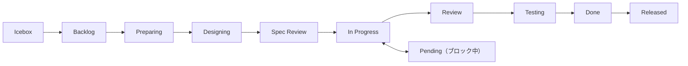

# GitHub 操作リファレンス

セッション/GitHub スキル共通リファレンス。CLI コマンド、ワークフロー、規約の単一情報源。

## 目次

- アーキテクチャ: Issues + Projects ハイブリッド
- 前提条件
- DraftIssue vs Issue
- shirokuma-docs CLI リファレンス
- `--from-file` vs `--body-file` 使い分け
- ステータスワークフロー
- ラベル規約
- よくあるエラー対処

## アーキテクチャ: Issues + Projects ハイブリッド

| コンポーネント | 用途 |
|-------------|------|
| **Issues** | タスク管理、`#123` 参照、履歴 |
| **Projects** | Status/Priority/Size フィールド管理 |
| **Labels** | 影響範囲の補助分類（`area:cli`, `area:plugin` 等） |
| **Discussions** | 引き継ぎ、仕様、決定事項、Q&A |

**ステータスは Projects フィールドで管理**（ラベルではない）。

Project 命名規約: Project 名 = リポジトリ名（例: `blogcms` リポ → `blogcms` プロジェクト）。

## 前提条件

- `gh` CLI インストール・認証済み
- GitHub Project 設定済み（未設定なら `/setting-up-project` を実行）
- Discussions 有効化（カテゴリ: Handovers, Ideas, Q&A）（任意）

## DraftIssue vs Issue

| 機能 | DraftIssue | Issue |
|------|-----------|-------|
| `#number` | なし | あり（`#123`） |
| 外部参照 | 不可 | 可 |
| コメント | 不可 | 可 |
| ユースケース | 軽量メモ | 完全なタスク |

**推奨**: `#number` サポートのため `items add issue` をデフォルトで使用。

## shirokuma-docs CLI リファレンス

直接の `gh` コマンドより shirokuma-docs CLI を優先。設定は `shirokuma-docs.config.yaml`。

### Issues（主要インターフェース）

```bash
shirokuma-docs items list                          # オープン Issue 一覧
shirokuma-docs items list --all                    # クローズ含む
shirokuma-docs items list --status "In Progress"   # ステータスフィルタ
shirokuma-docs items pull {number}                   # 詳細取得・キャッシュ（→ .shirokuma/github/{org}/{repo}/issues/{number}/body.md を Read ツールで読み込む）
shirokuma-docs items add issue --file /tmp/shirokuma-docs/new-issue.md  # メタデータ+本文を一括入力
# Status 更新: .shirokuma/github/{org}/{repo}/issues/{number}/body.md の status を変更してから items push {number}
# ラベル追加・削除: items pull → frontmatter の labels フィールド編集 → items push {number}
# 担当者追加・削除: items pull → frontmatter の assignees フィールド編集 → items push {number}
# コメント追加: ファイルに書き出してから items add comment で投稿
shirokuma-docs items add comment {number} --file /tmp/shirokuma-docs/{number}-comment.md
shirokuma-docs items comments {number}                 # コメント一覧
shirokuma-docs items push {number} {comment-id}         # コメント編集（キャッシュ編集 → push）
shirokuma-docs items close {number}
shirokuma-docs items cancel {number}
shirokuma-docs items reopen {number}
```

### Pull Requests

```bash
shirokuma-docs items pr create --from-file /tmp/shirokuma-docs/pr.md             # メタデータ+本文を一括入力
shirokuma-docs items pr create --base main --head develop --title "release: v0.2.0"  # リリースワークフロー（メタデータのみ）
shirokuma-docs items pr list                                      # PR 一覧（デフォルト: open）
shirokuma-docs items pr list --state merged --limit 5            # フィルタリング
shirokuma-docs items pr list --head {branch-name}                # ブランチから PR を逆引き
shirokuma-docs items pr show {number}                             # PR 詳細（body, diff stats, linked issues）
shirokuma-docs items pr comments {number}                         # レビューコメント・スレッド
shirokuma-docs items pr merge {number} --squash                   # マージ + ステータス更新
shirokuma-docs items pr reply {number} --reply-to {id} --body-file - <<'EOF'
返信内容
EOF
shirokuma-docs items pr resolve {number} --thread-id {id}        # スレッド解決
```

### Projects（アイテム操作）

```bash
shirokuma-docs items projects update {number} --field-status "Done"  # フィールド更新（唯一の手段）
shirokuma-docs items projects add-issue {number}                     # Issue をプロジェクトに追加
shirokuma-docs items projects delete PVTI_xxx                        # アイテム削除
```

### Discussions

```bash
shirokuma-docs items discussions list --category Handovers --limit 5
shirokuma-docs items discussions search "キーワード"         # Discussions 検索
shirokuma-docs items search --type discussions "キーワード"  # items search 経由でも可
shirokuma-docs items pull {number}   # 詳細取得・キャッシュ（→ .shirokuma/github/{org}/{repo}/issues/{number}/body.md を Read ツールで読み込む）
shirokuma-docs items add discussion --file /tmp/shirokuma-docs/discussion.md  # メタデータ+本文を一括入力
```

### 横断検索

```bash
shirokuma-docs items search "キーワード"                          # Issues / PR 検索（デフォルト）
shirokuma-docs items search --type discussions "キーワード"       # Discussions のみ
shirokuma-docs items search --type issues,discussions "キーワード" # Issues + Discussions 横断
```

### Repository

```bash
shirokuma-docs repo info
shirokuma-docs repo labels
```

### クロスリポジトリ操作

```bash
shirokuma-docs items list --repo docs
shirokuma-docs items add issue --repo docs --file /tmp/shirokuma-docs/new-issue.md
```

### gh フォールバック（CLI 未対応の操作のみ）

```bash
# ラベル管理
gh label list
gh label create "name" --color "0E8A16" --description "Desc"

# 認証
gh auth login
gh auth status

```

## `--from-file` vs `--body-file` 使い分け

| パターン | 使用コマンド | 理由 |
|---------|-------------|------|
| `items add` 推奨 | `items add issue`, `items add discussion` | メタデータ+本文を1ファイルに集約、フラグ組み合わせミス防止 |
| `items add comment` 推奨 | Issue/Discussion へのコメント追加 | キャッシュへの自動保存 + `comment_url` 返却 |
| `items push` 推奨 | Status/body/title/labels/assignees 更新 | キャッシュ編集 → push の一貫したワークフロー |
| `--body-file` 維持 | `items pr reply`, `session end` | 本文のみでメタデータ不要な操作 |
| `items push` で統一 | title/state/issueType を含む全フィールド更新 | frontmatter 編集 → push のワークフロー |

### `--from-file` フロントマター形式

```markdown
---
title: Issue タイトル
type: Feature
priority: Medium
size: M
labels: [area:cli]
---

本文をここに記述する。
```

フロントマターの安全フィールドはコマンド種別で異なる:

| コマンド | 安全フィールド |
|---------|--------------|
| `items add issue` / `items push` | `title`, `type`, `priority`, `size`, `labels`, `state`, `state_reason`, `parent` |
| `items pr create` | `title`, `base`, `head` |
| `items add discussion` | `title`, `category` |

CLI フラグが設定済みの場合はフラグを優先。`--from-file` と `--body-file` は排他（同時指定でエラー）。

### `--body-file` Tier ガイド

| Tier | パターン | 用途 |
|------|---------|------|
| Tier 1 (stdin) | `--body-file - <<'EOF'...EOF` | コメント、返信、短い理由 |
| Tier 2 (file) | Write → `--body-file /tmp/shirokuma-docs/xxx.md` | 本文更新、引き継ぎ |

heredoc delimiter は `<<'EOF'`（シングルクォートで変数展開防止）。Tier 2 で本文を反復更新する場合は Write/Edit パターン（初回 Write → 以降 Edit で差分更新）を適用する。詳細は `item-maintenance.md` の「ファイルベース本文編集」セクション参照。

## ステータスワークフロー



| ステータス | 説明 |
|-----------|------|
| Icebox | 低優先度、未計画 |
| Backlog | 将来の作業として計画済み |
| Preparing | 計画策定中 |
| Designing | 設計中 |
| Spec Review | 要件レビュー中 |
| In Progress | 作業中 |
| Pending | ブロック中（理由を記録） |
| Review | コードレビュー中 |
| Testing | QA テスト中 |
| Done | 完了 |
| Released | 本番デプロイ済み |

## ラベル規約

作業種別の分類は **Issue Types**（Organization レベルの Type フィールド）が主な手段。ラベルは作業の**影響範囲**を示す補助的な仕組み:

| 仕組み | 役割 | 例 |
|--------|------|-----|
| Issue Types | 作業の**種類** | Feature, Bug, Chore, Docs, Research, Evolution |
| エリアラベル | 作業の**影響範囲** | `area:cli`, `area:plugin` |
| 運用ラベル | トリアージ・ライフサイクル | `duplicate`, `invalid`, `wontfix` |

ラベルはプロジェクト構造に合わせて手動追加。ステータスは Projects フィールドで管理。

## よくあるエラー対処

| エラー | 対処 |
|-------|------|
| `shirokuma-docs: command not found` | インストール: `npm i -g @shirokuma-library/shirokuma-docs` |
| `gh: command not found` | インストール: `brew install gh` or `sudo apt install gh` |
| `not logged in` / `not authenticated` | 実行: `gh auth login` |
| No project found | `/setting-up-project` を実行してプロジェクト作成 |
| Discussions disabled/category not found | ローカルファイルにフォールバック |
| `HTTP 404` | リポジトリ名と権限を確認 |
| API rate limit | キャッシュ済み/部分データを表示 |
