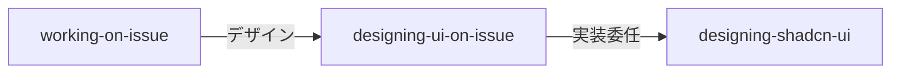

# デザインワークタイプ リファレンス

`working-on-issue` から `designing-ui-on-issue` に委任する際のガイド。

## アーキテクチャ



| スキル | 役割 | context | 理由 |
|--------|------|---------|------|
| `designing-ui-on-issue` | ワークフロー管理（ディスカバリー、評価ループ） | 非 fork | AskUserQuestion による反復的ユーザー対話が必要 |
| `designing-shadcn-ui` | デザイン実装（ガイドライン、パターン、ビルド検証） | 非 fork | Skill 委任で呼び出し |

## 委任タイミング

| 判定条件 | 委任先 |
|---------|--------|
| キーワード: `デザイン`, `UI`, `印象的`, `design` | `designing-ui-on-issue` |
| キーワード: `ランディングページ`, `landing page` | `designing-ui-on-issue` |
| ジェネリックな見た目を避けたい場合 | `designing-ui-on-issue` |

## コンテキスト渡し仕様

`working-on-issue` → `designing-ui-on-issue` に渡すフィールド:

| フィールド | 必須 | 内容 |
|-----------|------|------|
| Issue 番号 | はい | `#{number}` |
| 計画セクション | はい（存在する場合） | Issue 本文の `## 計画` から抽出 |
| デザイン要件 | いいえ | Issue 本文からのデザイン関連要件 |

## 責務境界（coding-on-issue vs designing-ui-on-issue）

| 変更内容 | 担当 | 理由 |
|---------|------|------|
| 新規 UI ページ/コンポーネント | `designing-ui-on-issue` | 美学的判断が必要 |
| 既存 UI のビジュアルリデザイン | `designing-ui-on-issue` | 美学的判断が必要 |
| ランディングページ / マーケティング UI | `designing-ui-on-issue` | 印象性が最重要 |
| CSS バグ修正（レイアウト崩れ等） | `coding-on-issue` | 美学的判断不要 |
| 既存コンポーネントのスタイリング微調整 | `coding-on-issue` | パラメータ変更 |
| アクセシビリティ対応の CSS 変更 | `coding-on-issue` | 機能的変更 |
| デザインシステムトークンの変更 | `designing-ui-on-issue` | 全体の美学に影響 |

**判定基準**: 美学的判断（フォント選択、カラーパレット、レイアウト構成の決定）が必要かどうか。

## TDD 非適用

デザインワークタイプでは TDD は適用しない。代わりに:

1. `designing-ui-on-issue` がディスカバリー → `designing-shadcn-ui` に実装委任 → 視覚評価ループを管理
2. `designing-shadcn-ui` がビルド検証を実施

## チェーン

```
designing-ui-on-issue → Commit → PR → Self-Review → Status Update
```

デザイン完了後は通常のコミット→PR→セルフレビュー→ステータス更新チェーンに合流する。
