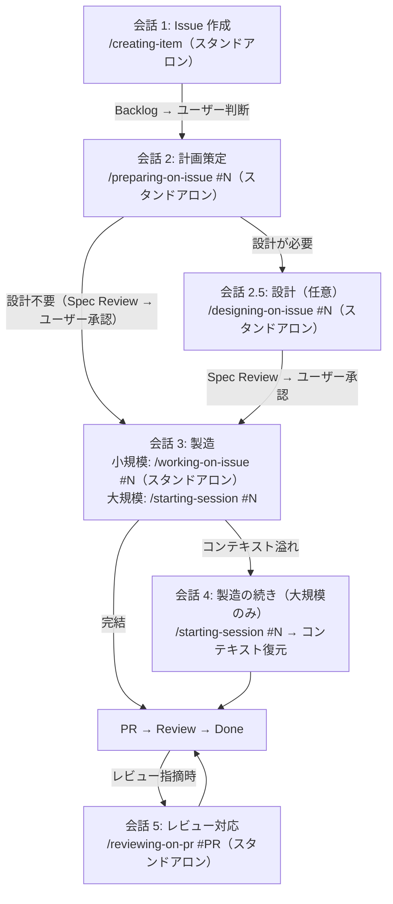
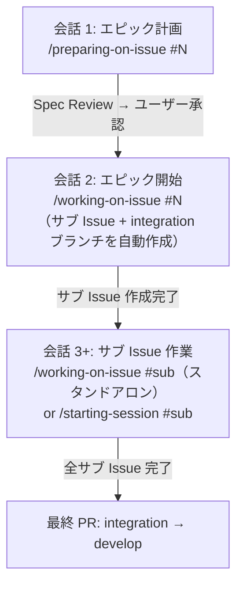

# ワークフロー詳細

`best-practices-first` ルールの補足詳細。会話フロー・エピックパターン・セッション vs スタンドアロンの詳細を記載する。

## 会話フロー

各フェーズは通常、別の Claude Code 会話で実行される。会話間のコンテキスト引き継ぎは Issue 本文（計画）と Issue コメント（作業サマリー）が担う。

小規模タスクは 1 会話で計画+製造を完結することもある。

## エピックパターン（サブ Issue を持つ XL Issue）

ポイント:
- `/working-on-issue #{epic}` が計画からサブ Issue を自動作成し、integration ブランチを作成
- 各サブ Issue は独立して作業（スタンドアロンまたはセッション）
- 親 Issue バウンドセッションでサブ Issue 間の横断的コンテキストを管理するのが推奨

## セッション vs スタンドアロン

### セッション使用基準

**コンテキスト溢れリスク**が高い場合にセッションを使用する。作業が複数会話にまたがる可能性が高く、コンテキスト継続の恩恵が大きい場合に該当する。

| セッションを使う | スタンドアロンで十分 |
|-----------------|-------------------|
| 修正対象ファイルが多い（10+） | 1 会話で完結する |
| エピック（親 Issue バウンドセッション + サブ Issue スタンドアロン） | 局所的な変更（1-3 ファイル） |
| 複数日にわたる作業（M/L サイズ） | 独立した単発タスク |
| 調査 → 実装の 2 フェーズ作業 | ドキュメント、設定変更 |

### スキルのセッション対応

| スキル | セッション | スタンドアロン | 備考 |
|--------|-----------|--------------|------|
| working-on-issue | 対応 | 対応 | 両モードのエントリーポイント |
| preparing-on-issue | 対応 | 対応 | working-on-issue 経由またはスタンドアロン |
| plan-issue | 対応 | — | planning-worker 経由のサブエージェント（preparing-on-issue から） |
| code-issue | 対応 | — | working-on-issue から subagent 委任のみ |
| coding-nextjs | 対応 | 対応 | code-issue 経由またはスタンドアロン |
| designing-on-issue | — | 対応 | 現時点ではスタンドアロン起動（preparing-on-issue の完了レポートから起動） |
| designing-shadcn-ui | 対応 | 対応 | designing-on-issue 経由またはスタンドアロン |
| designing-nextjs | 対応 | 対応 | designing-on-issue 経由またはスタンドアロン |
| creating-item | — | 対応 | 常にスタンドアロン対応 |
| commit-issue | 対応 | 対応 | subagent（スタンドアロンも subagent で動作） |
| open-pr-issue | 対応 | 対応 | subagent（スタンドアロンも subagent で動作） |
| reviewing-on-pr | — | 対応 | PR レビュー対応（新会話のエントリーポイント） |
| starting-session | 対応 | — | セッション開始専用（`#N` で Issue バウンド、引数なしでアンバウンド） |
| ending-session | 対応 | — | セッション終了専用 |

### スタンドアロンハンドオーバー指針

スタンドアロン `working-on-issue` はチェーン完了時に Issue コメントへ作業サマリーを自動投稿する。`ending-session` は不要。

`working-on-issue` を使わない大規模なスタンドアロン作業の場合:

| スタンドアロン作業の規模 | アクション |
|------------------------|----------|
| 単一スキルの簡易起動（タイポ修正、アイテム作成） | 不要 |
| 複数コミットまたは大幅なコード変更 | `ending-session` を推奨 |
| 調査結果やアーキテクチャ検討 | Discussion の作成を推奨 |
