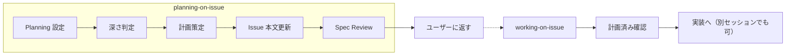

# planning-on-issue 設計メモ

スキル管理用メタデータ。実行時には読み込まれない。

## コンセプト

全 Issue で計画を実施（深さは内容の複雑度・不確実性で調整）。計画完了後は Spec Review に遷移し、ユーザー承認を待つ。**実装には進まない。**

## トリガーキーワード

SKILL.md の frontmatter `description` フィールドに定義。スキル選択はこのフィールドでマッチングされる。

- "計画して", "plan", "設計して"
- "#42 の計画" のような Issue 番号指定
- `working-on-issue` が計画未済の Issue を検出した場合に自動委任
