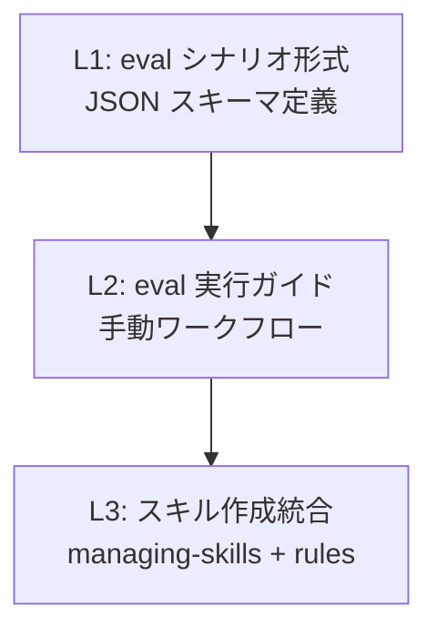
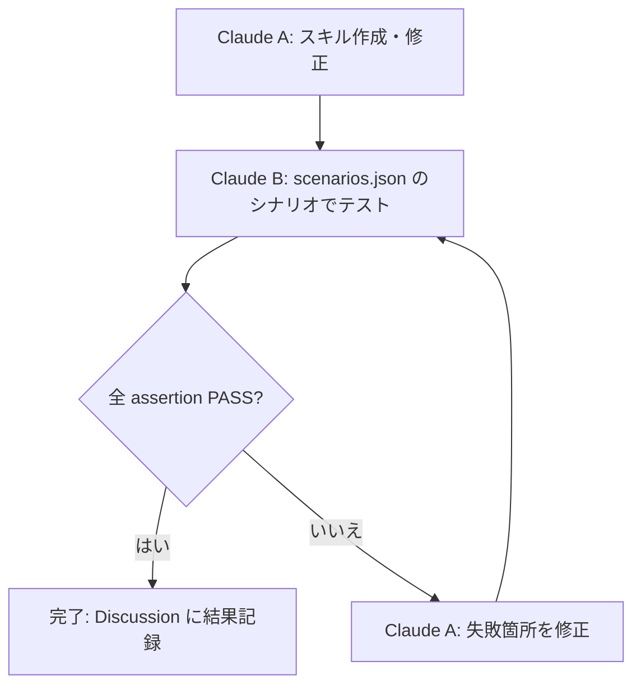

# eval フレームワーク設計メモ

スキル管理用メタデータ。実行時には読み込まれない。

## 目的

shirokuma-skills のスキル品質を客観的に評価・改善するための評価駆動開発（Evaluation-Driven Development）フレームワーク。Anthropic 公式 `skill-creator` の eval 手法を shirokuma-skills の制約に合わせて軽量適応する。

## 3 レイヤー構成



- **L1: eval シナリオ形式** — `scenarios.json` の JSON スキーマ。trigger eval（description 精度）と quality eval（ワークフロー遵守度）の 2 種
- **L2: eval 実行ガイド** — Two-Instance 方式（Claude A: 開発、Claude B: テスト）の手順書。手動実行を前提
- **L3: スキル作成統合** — `managing-skills` の Step 10 に eval フレームワークを統合。`skill-authoring-quality.md` のチェックリストに eval 項目を追加

## 公式 skill-creator との差分

| 公式 skill-creator | shirokuma 適応 | 理由 |
|-------------------|---------------|------|
| Python スクリプト (`generate_review.py`) | なし（手動ワークフロー） | プラグインに Python 依存を入れない |
| HTML eval-viewer | なし（Discussion に記録） | 既存の GitHub ワークフローに統合 |
| `evals.json` + `grading.json` | `scenarios.json`（統合形式） | 自動グレーディングは段階的に導入 |
| Description optimization loop (20 queries) | 簡易版（5 should-trigger + 5 should-not-trigger） | 実行コストの現実性 |
| Benchmark aggregation | Discussion (Knowledge) に記録 | 定量データは手動記録で十分 |

## eval シナリオ配置

```
plugin/specs/skills/{skill-name}/
├── DESIGN.md          # 既存: 設計メタ情報
└── evals/
    └── scenarios.json # eval シナリオ
```

`plugin/specs/skills/` は実行時に読み込まれないため、eval データの配置先として適切。リリース除外対象（`repoPairs` exclude）にも含まれている。

## eval シナリオ JSON スキーマ

### トップレベル構造

```json
{
  "skill_name": "string（スキル名、SKILL.md の name フィールドと一致）",
  "version": "string（スキルバージョン、semver 形式）",
  "scenarios": ["array（eval シナリオの配列）"]
}
```

### シナリオ種別

#### trigger eval（description 精度テスト）

スキルの `description` フィールドが正しいプロンプトで起動され、無関係なプロンプトで起動されないことを検証する。

```json
{
  "id": "trigger-{NN}",
  "type": "trigger",
  "prompt": "string（ユーザーの入力プロンプト）",
  "expected": "should_trigger | should_not_trigger",
  "rationale": "string（期待値の根拠）"
}
```

- **should_trigger**: このプロンプトでスキルが起動されるべき
- **should_not_trigger**: このプロンプトでスキルが起動されるべきではない（別スキルの責務）

**必須件数**: 5 件以上（should_trigger と should_not_trigger を混在）

#### quality eval（ワークフロー遵守度テスト）

スキルが正しいワークフローで動作し、期待される成果物を生成することを検証する。

```json
{
  "id": "quality-{NN}",
  "type": "quality",
  "prompt": "string（ユーザーの入力プロンプト）",
  "context": {
    "issue_state": "string（Issue のステータス。任意）",
    "has_plan": "boolean（計画の有無。任意）",
    "size": "string（Issue サイズ。任意）",
    "labels": ["string（ラベル一覧。任意）"]
  },
  "assertions": [
    {
      "text": "string（観測可能な行動の記述）",
      "category": "workflow | convention | tooling | output"
    }
  ]
}
```

**assertions のカテゴリ**:

| カテゴリ | 検証対象 | 例 |
|---------|---------|-----|
| `workflow` | ステータス遷移、ステップ順序 | 「Issue ステータスを In Progress に更新する」 |
| `convention` | 命名規約、フォーマット | 「ブランチ名が branch-workflow ルールに準拠する」 |
| `tooling` | ツール使用 | 「TodoWrite でチェーンステップを登録する」 |
| `output` | 出力形式、成果物 | 「出力テンプレート形式で結果を返す」 |

**必須件数**: 3 件以上。assertions は**観測可能な行動**に限定する（Anthropic 指針: "objectively verifiable, not subjective"）。

## eval 実行ワークフロー（Two-Instance 方式）



1. **Claude A**（開発インスタンス）がスキルを作成・修正する
2. **Claude B**（テストインスタンス）が `scenarios.json` のシナリオでテストする
   - trigger eval: 各プロンプトでスキルが起動/非起動を確認
   - quality eval: 各プロンプトでワークフローを実行し、assertions を検証
3. 全 assertion が PASS なら完了。FAIL があれば Claude A が修正して再テスト
4. 結果を Discussion (Knowledge) に記録する

### グレーディング基準

| グレード | 条件 |
|---------|------|
| PASS | assertion の条件を満たす |
| PARTIAL | 一部条件を満たすが不完全 |
| FAIL | 条件を満たさない |

trigger eval は PASS/FAIL の二値。quality eval は assertion ごとに PASS/PARTIAL/FAIL を判定する。

## eval シナリオの維持

- `scenarios.json` の `version` フィールドでスキルバージョンとのドリフトを検出
- スキル更新時に `scenarios.json` も更新が必要かを確認（`skill-authoring-quality.md` のチェックリストに含む）
- ドリフト検出時は `evolving-rules` のシグナルとして記録可能

## 対象スキル

### 必須（主要スキル）

`scenarios.json` の作成が必須:

- `working-on-issue`
- `plan-issue`
- `code-issue`

### 推奨（新規スキル）

新規作成するスキルは `scenarios.json` の作成を推奨。`managing-skills` の Step 10 で案内する。

### 段階的拡大

既存スキルへの eval シナリオ追加は段階的に進める。Evolution シグナルで品質問題が検出されたスキルを優先する。

## 関連

- Discussion #1160（公式 skill-creator 調査結果）
- `managing-skills` スキル（Step 10: テスト）
- `skill-authoring-quality.md`（バリデーションチェックリスト）
- `evolving-rules` スキル（Evolution シグナル）
